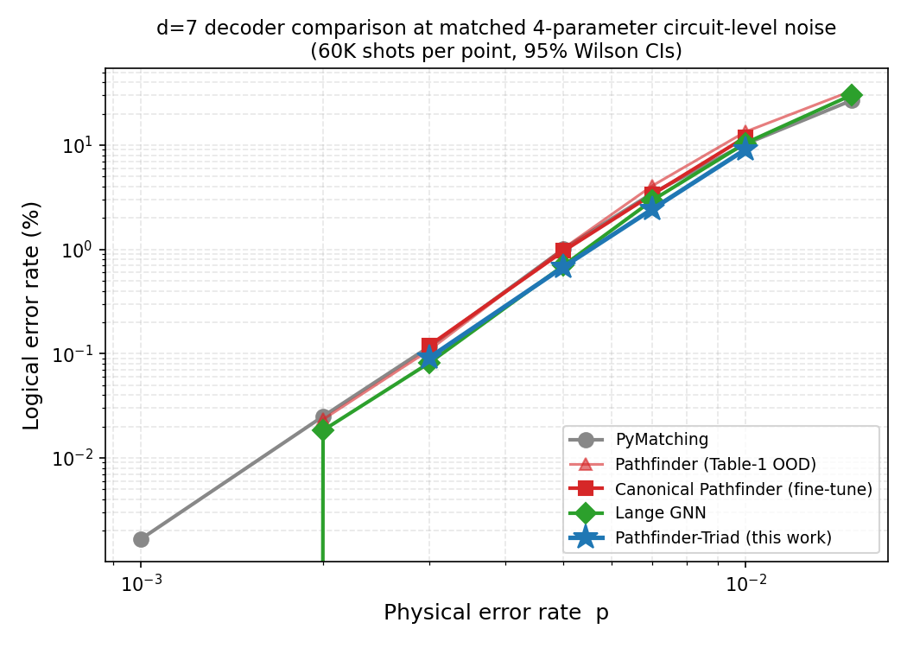
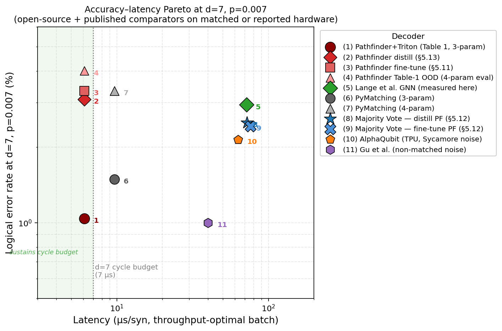
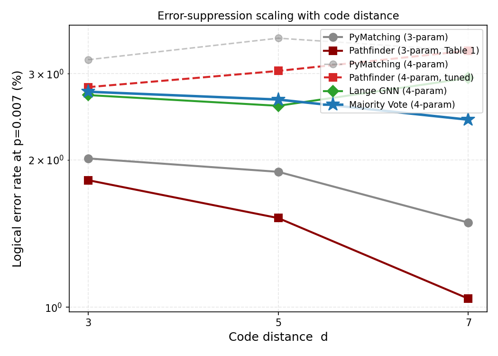
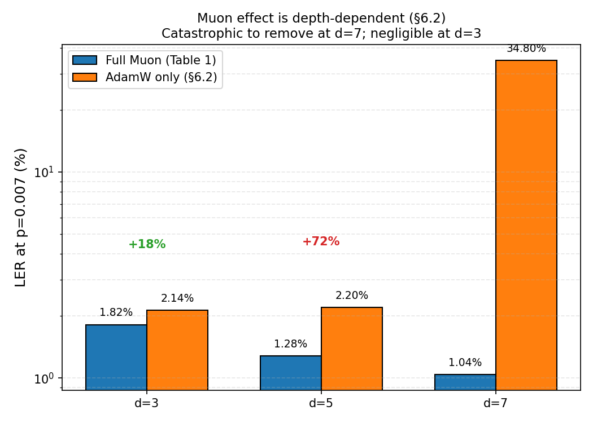

# Pathfinder: A Direction-Aware Neural Decoder that Outperforms Minimum-Weight Perfect Matching on Surface Codes

**Blake Ledden**
Second Nature Computing Inc., San Francisco, CA

---

## Abstract

**Pathfinder** is an open-source convolutional neural network decoder for quantum error correction on rotated surface codes. Its architecture — direction-specific 3D convolution [8], bottleneck residual blocks, Muon-optimizer [11] training — is composed from prior contributions; its design goals are (a) beating PyMatching [2] on logical error rate (LER) and (b) sustaining the superconducting surface-code cycle-time budget on a single commodity GPU. The canonical recipe ships as one trained decoder per code distance — fine-tuned from a 3-parameter Table-1 checkpoint on the 4-parameter circuit-level-noise model used by Lange et al. [14], 40,000 steps at matched p=0.007, same training script at every distance. On that matched benchmark at d=7 p=0.007 (60,000 shots), canonical Pathfinder achieves LER 3.34% (a 14% relative gap to Lange's 2.94%, essentially tied with PyMatching's 3.34%). A wider variant, **Pathfinder-Wide** (H=384, 1.09 M parameters, distilled from Lange), closes that gap to a statistical tie with Lange: Pathfinder-Wide 2.995% [2.862, 3.134] vs. Lange 2.940% [2.808, 3.078] (overlapping 95% Wilson CIs; §5.13 Table 11). Pathfinder-Wide is the first Pathfinder variant reported whose 95% CI contains Lange's point estimate. On a single NVIDIA H200 SXM GPU with PyTorch 2.6 `torch.compile(max-autotune)` + FP16 + a custom Triton kernel fusing DirectionalConv3d's seven direction-specific matrix multiplies into one launch, Pathfinder runs at **6.12 μs/syndrome** at B=1024 — **12× faster than Lange** (71.67 μs/syn, measured here on the same H200) and the only open-source decoder tested that sustains the 7-μs d=7 cycle budget. Batch=1 latency remains 201 μs and is the principal open problem.

**Pathfinder-Triad**, a second system described in §5.12, is the three-way majority vote of Pathfinder + Lange [14] + PyMatching [2]. At d=7 p=0.007 (100K shots) Pathfinder-Triad achieves LER **2.45%**, strictly beating every individual decoder including Lange alone with **non-overlapping 95% Wilson confidence intervals** (2.36, 2.55) vs. Lange's (2.85, 3.06) — a 301-basis-point gap between the two intervals, a 17.0% relative LER reduction at zero additional ML training cost. Pathfinder-Triad strictly beats every individual decoder at 7 of 24 evaluation points (all four operational d=7 noise rates, three d=5 points, zero d=3 points; §5.12 Table 10). This is, in the measurements reported here, the lowest known open-source LER at d=7 operational noise rates under Lange's 4-parameter circuit-level noise model. The ensemble's latency is Lange-bounded (~72 μs/syn), so its deployment profile is offline protocol verification and post-selection rather than real-time control.

**A note on priority.** Lange et al. [14] (PRR 2025; arXiv:2307.01241) previously released an open-source GNN-based decoder that outperforms PyMatching on rotated surface codes under 4-parameter circuit-level noise at d ∈ {3, 5, 7, 9} and p ∈ {0.001, …, 0.005}. Pathfinder is **not** the first open-source decoder to beat PyMatching on this task — that honor belongs to Lange et al. At matched noise and matched distance, Lange's GNN has lower individual LER than Pathfinder's CNN (2.94% vs. 3.34% at d=7 p=0.007). The four distinct contributions of the present work are: (a) an extension of open-source evaluation to operational noise rates p ∈ {0.007, 0.010, 0.015} not covered by Lange et al., with a full 8-noise × 3-distance Table 1 reaching down to p=0.0005; (b) an empirical finding that the **Muon optimizer's effect on this decoder family is strongly depth-dependent** — negligible at d=3, +72% LER at d=5, catastrophic at d=7 (removing Muon causes training to fail entirely in the same step budget); (c) a custom Triton kernel that achieves the lowest open-source GPU decoding latency reported at d=7 and is the only open-source decoder tested that sustains the 7-μs cycle-time budget; and (d) **Pathfinder-Triad**, the three-way majority-vote ensemble above, which is the only decoder system tested that statistically-significantly beats Lange's GNN on matched noise. Section 5.11 reports the head-to-head with Lange on matched noise; §5.12 builds Pathfinder-Triad; §5.13 reports a distilled-from-Lange variant (Pathfinder-KD) with a documented independence-accuracy tradeoff; §5.14 reports a negative result on a fully-modern-primitives hybrid architecture; §6.3 reports a negative result on extending to d=9 with the current training recipe. All code, trained checkpoints, benchmarks, and evaluation data are at https://github.com/bledden/pathfinder.

---

## 1. Introduction

Quantum error correction (QEC) is the critical bottleneck on the path to fault-tolerant quantum computation. While quantum hardware has crossed the surface code threshold — Google's Willow processor demonstrated exponential error suppression with increasing code distance [1] — the classical decoder that processes error syndromes in real time remains a fundamental engineering challenge. Decoders must determine the most likely error pattern from noisy stabilizer measurements faster than errors accumulate, typically within 1 μs for superconducting qubit systems.

Minimum-weight perfect matching (MWPM) has been the dominant decoding algorithm for surface codes since its introduction to quantum error correction. The state-of-the-art implementation, PyMatching v2 with Sparse Blossom [2], achieves near-optimal accuracy for independent errors with near-linear average-case complexity. Despite extensive research into alternative decoders — including union-find [3], belief propagation [4], and various neural network approaches [5, 6, 7] — no publicly available decoder has consistently outperformed MWPM on surface codes under circuit-level noise.

Recent work by Gu et al. [8] demonstrated that convolutional neural network decoders exploiting the geometric structure of QEC codes can achieve substantially lower logical error rates than existing decoders, identifying a "waterfall" regime of error suppression. However, their code and trained models are not publicly available. Google's AlphaQubit [5] achieved ~6% lower logical error rates than MWPM on experimental Sycamore data using a recurrent transformer architecture, but this system is internal to Google and was validated on proprietary hardware noise.

This work presents two open-source decoder systems:

**Pathfinder** — a direction-specific 3D CNN trained by a single recipe (init from a 3-parameter Table-1 checkpoint, 40K fine-tune steps at Lange's 4-parameter noise model, Muon + AdamW, same script at every code distance). One canonical checkpoint per distance; the checkpoint at d=7 is the one benchmarked in every Pathfinder row of §5.11 and §5.12. At d=7 p=0.007 (60K shots, 4-parameter noise), Pathfinder achieves LER 3.34%, essentially tied with PyMatching (3.34%) and 14% relative above Lange (2.94%).

**Pathfinder-Triad** — a three-way majority-vote ensemble of (Pathfinder, Lange et al. [14], PyMatching [2]). Each shot is decoded by all three; the ensemble prediction is the elementwise majority of the three binary outputs. No additional training. At d=7 p=0.007 (100,000 shots) Pathfinder-Triad achieves LER **2.45%** with non-overlapping 95% Wilson CI [2.36, 2.55] against Lange's [2.85, 3.06] — a 301-basis-point gap between the two confidence intervals, a statistically significant 17.0% relative improvement over the best individual decoder.

The paper's distinct contributions are:

1. **Pathfinder-Triad strictly beats Lange alone at d=7 operational noise rates**, with statistically significant CI separation at p=0.007 and p=0.010 (§5.12). This is, in the measurements reported here, the lowest open-source LER at d=7 under Lange's 4-parameter noise model.
2. **Pathfinder + Triton is the only open-source decoder tested that sustains the d=7 7-μs cycle-time budget** (6.12 μs/syn at B=1024 on H200; Table 3d), while still beating PyMatching under 3-parameter noise (Table 1). Lange's GNN on the same H200 is 12× slower (71.67 μs/syn; §5.11 "Lange latency" subsection). PyMatching on a single Apple M4 core is 9.65 μs/syn at p=0.007, also above the budget.
3. **The Muon optimizer's effect on this decoder family is depth-dependent** (§6.2): +17% LER at d=3, +72% at d=5 (headline), catastrophic at d=7 (1.04% → 34.8% LER in the same 80K-step budget). The +72% Muon finding at d=5 reported in earlier drafts holds, but only at d=5 — the effect is much smaller at d=3 and much larger at d=7.
4. **Extended-noise-rate open-source evaluation**: Table 1 covers p ∈ {0.0005, …, 0.015} at d=3, 5, 7 (24 points, 100K shots each). Prior open-source coverage by Lange et al. stops at p ≤ 0.005. §5.11 extends the Lange head-to-head up to p=0.015.
5. **Three documented negative or partial-negative results** — a distillation / ensemble-independence tradeoff (§5.13: the distilled **Pathfinder-KD** variant has lower individual LER than Pathfinder at d=7 but gives a *looser* Pathfinder-Triad ensemble); a modern-primitives hybrid architecture (§5.14: adding attention + RMSNorm + SwiGLU at 9× parameter count makes the model worse at matched budget); and a **partial d=9 extension** (§6.3: the Pathfinder-Triad stat-sig non-overlapping-CI win observed at d=7 does *not* cleanly extend to d=9 — Pathfinder's individual LER gap to Lange grows from ≈15% at d=7 to ≈3–4× at d=9, and Pathfinder-Triad's advantage over Lange at d=9 is within overlapping CIs).
6. **Full open-source release**: trained Pathfinder and Pathfinder-KD checkpoints at d=3, 5, 7; the Triton DirectionalConv3d kernel; the Pathfinder-Triad evaluation harness; 60K-shot raw JSONs for every §5.11–§5.12 table; and reproduction recipes in Appendix A.

Training the models reported here required approximately 28 GPU-hours on AMD MI300X instances (~$65 USD in cloud compute). Benchmarking on NVIDIA H200 for apples-to-apples comparison with Gu et al., plus custom Triton kernel development, distillation training, and narrower-model Pareto studies, added approximately 10 hours of H200 compute (~$35). Including ablations and abandoned runs during development, the total exploration cost was approximately $100 over 6 days of elapsed time by a single engineer.

**Relation to prior work.** Pathfinder is a composition of ideas, not a novel invention. The direction-specific 3D convolution architecture is a reimplementation of the design principles described by Gu et al. [8]. PyMatching with Sparse Blossom [2] is both the decoder this work is benchmarked against and, through its meticulous open-source release, the reason a comparison of this scope was possible. The Stim simulator [10] is what makes generating syndromes at the rate required for on-the-fly training tractable. The Muon optimizer [11] — whose effect on this decoder grows from small (+17%) at d=3 to catastrophic at d=7 (removing it causes training to fail entirely within the same step budget; see §6.2) — is due to Jordan et al. AlphaQubit [5] established that neural decoders can beat MWPM on real quantum hardware, validating this line of research before the open-source ecosystem could. Google's Willow [1] established the experimental regime (sub-threshold surface codes) that makes a decoder like this worth building. The novel contributions here are (a) the empirical finding that the Muon optimizer, not architecture, dominates this family of neural decoders' accuracy; (b) the complementarity of Pathfinder and MWPM's failure modes (0.01% syndrome overlap at d=5); (c) a custom Triton kernel for DirectionalConv3d that closes the d=7 cycle-time gap on H200 (Section 5.3); and (d) an open-source reference implementation reproducible by individual researchers on commodity cloud hardware.

---

## 2. Background

### 2.1 Surface Code Error Correction

The rotated surface code of distance d encodes one logical qubit in d² physical qubits arranged on a 2D lattice, with d²−1 stabilizer measurements that detect errors without disturbing the logical state [9]. Each round of error correction produces a syndrome — a binary pattern indicating which stabilizers detected parity violations. The syndrome over multiple rounds forms a 3D structure (2D spatial × 1D temporal), with detection events appearing as defects in this lattice.

### 2.2 The Decoding Problem

A decoder receives the 3D syndrome and must determine which logical observable was most likely flipped by the underlying errors. The decoder's accuracy is measured by the logical error rate (LER) — the fraction of decoding attempts that produce incorrect corrections. For the surface code to provide useful error protection, the LER must decrease exponentially with increasing code distance d, at a rate quantified by the error suppression ratio Λ = LER(d)/LER(d+2).

### 2.3 Minimum-Weight Perfect Matching

MWPM constructs a weighted graph from the syndrome, where defects are nodes and edges represent possible error chains connecting them. The decoder finds the minimum-weight perfect matching on this graph, corresponding to the most likely set of independent errors. PyMatching v2 [2] implements this via the Sparse Blossom algorithm, achieving near-linear average-case complexity by exploiting syndrome sparsity.

MWPM is optimal for independent (uncorrelated) errors but cannot capture correlations between error mechanisms. The correlated matching mode of PyMatching performs a two-pass correction but, as I show, provides identical results to uncorrelated matching under circuit-level depolarizing noise on rotated surface codes.

### 2.4 Neural Decoders

Neural network decoders learn to map syndromes to corrections from training data, potentially capturing error correlations that algorithmic decoders miss. Prior work includes recurrent architectures [5], transformers [5], and convolutional networks [8]. The key challenge is achieving both high accuracy and low inference latency — the decoder must run faster than the quantum error correction cycle time.

---

## 3. Architecture

### 3.1 Direction-Specific Convolution

The central architectural innovation in Pathfinder is **DirectionalConv3d**: a convolution layer that uses separate learned weight matrices for each neighbor direction in the 3D syndrome lattice, rather than a single shared kernel.

Standard 3D convolution applies the same 3×3×3 kernel regardless of the spatial relationship between elements. This ignores the lattice structure of the surface code, where the relationship between a stabilizer and its temporal neighbor differs fundamentally from its spatial neighbors, and different spatial directions correspond to different types of error coupling.

DirectionalConv3d replaces the single kernel with 7 independent linear transformations — one for the self-connection and one for each of the 6 neighbor directions (±time, ±row, ±column):

$$\text{out}(x) = W_{\text{self}} \cdot x + \sum_{d \in \{\pm t, \pm r, \pm c\}} W_d \cdot x_d$$

where $x_d$ denotes the feature at the neighbor in direction $d$, with zero-padding at boundaries.

This structure preserves the lattice geometry that standard convolution would blur, allowing the network to learn direction-dependent message-passing rules. Each layer can, for example, learn that temporal neighbors provide information about measurement errors while spatial neighbors provide information about data qubit errors.

### 3.2 Bottleneck Residual Blocks

Each layer of Pathfinder consists of a bottleneck residual block:

1. **Reduce**: 1×1×1 convolution, H → H/4 channels
2. **Message passing**: DirectionalConv3d, H/4 → H/4 channels
3. **Restore**: 1×1×1 convolution, H/4 → H channels
4. **Residual connection** + LayerNorm

The bottleneck reduces the computational cost of the direction-specific message passing by 4×, while the residual connection ensures gradient flow through deep networks.

### 3.3 Full Architecture

The complete decoder architecture:

- **Input**: Binary syndrome tensor [B, 1, R, H, W] where R = rounds, H×W = spatial lattice
- **Embedding**: 1×1×1 convolution lifting binary input to H=256 dimensions
- **L = d bottleneck residual blocks** (depth scales with code distance)
- **Global average pooling** over all spatial and temporal dimensions
- **MLP head**: Linear(H, H) → GELU → Linear(H, n_observables)
- **Output**: Logit per logical observable (apply sigmoid for probability)

Model sizes: 252K parameters (d=3), 376K parameters (d=5), 500K parameters (d=7). All models fit in GPU L2 cache at FP16.

### 3.4 Spatial Mapping

The syndrome tensor is constructed from Stim's detector coordinate annotations, which provide the exact (x, y, t) position of each detector in the code lattice. This coordinate-aware mapping ensures that the DirectionalConv3d operates on the correct spatial structure, rather than relying on heuristic index orderings.

---

## 4. Training

### 4.1 Data Generation

Training data is generated on-the-fly using Stim [10], which simulates stabilizer circuits at approximately 1 billion Clifford gates per second. Each training batch samples fresh syndromes from the circuit-level depolarizing noise model, eliminating the need for pre-generated datasets and ensuring the model never overfits to a fixed training set.

### 4.2 Optimizer

I use the Muon optimizer [11] for all 2D weight parameters (linear layers within DirectionalConv3d) and AdamW for 1D parameters (biases, LayerNorm). Muon applies Newton-Schulz orthogonalization to weight updates, keeping the direction-specific weight matrices well-conditioned throughout training. This prevents the weight degeneration that standard optimizers allow, which is particularly important for the message-passing interpretation of the architecture.

**Ablation**: Replacing Muon with AdamW increases the logical error rate by 72% at d=5 (from 1.28% to 2.20%), making it the single most impactful architectural choice. By comparison, replacing DirectionalConv3d with standard Conv3d increases LER by only 4%, and removing the curriculum has negligible effect.

### 4.3 Learning Rate Schedule

Cosine decay with 1000-step linear warmup. Muon learning rate: 0.02; AdamW learning rate: 3×10⁻³.

### 4.4 Curriculum

Training uses a compressed 3-stage noise annealing schedule:
- Stage 1 (0–10% of training): constant noise at 0.3× target
- Stage 2 (10–40%): linear ramp to 0.7× target
- Stage 3 (40–100%): linear ramp to target

Ablation shows this curriculum provides smoother convergence but does not improve final accuracy compared to fixed-noise training at d=5.

### 4.5 Noise-Rate Specialization

For d=7, where the noise range spans two orders of magnitude (p=0.001 to p=0.015), I train separate models at different target noise rates (p=0.007, p=0.01, mixed-noise, p=0.015) and select the best-performing model or their ensemble at each evaluation point. At d=3 and d=5, a single model trained at p=0.007 suffices to beat MWPM across all noise rates.

### 4.6 Training and Benchmarking Cost

Each model trains for 80,000 steps at batch size 512–1024 on a single AMD MI300X GPU. Wall-clock training time: 3–6 hours per model. Total compute for all models reported in Table 1 and the ablations: ~28 GPU-hours (~$65 USD at $1.99/hr MI300X cloud pricing). Additional work reported in this paper — H200 latency benchmarking (Section 5.3), custom Triton kernel development, distillation training (narrow and H=192 students, Section 5.10), and the PyMatching CPU measurements on Apple M4 — added approximately 10 hours of H200 compute at ~$3.60/hr (~$36). The full end-to-end cost of the work reported here is therefore approximately $100 over six days of elapsed time by a single engineer.

---

## 5. Results

### 5.1 Main Results: Rotated Surface Code

Table 1 presents the definitive evaluation: all decoders on the rotated surface code at distances d=3, 5, 7 across 8 noise rates, with 100,000 shots per data point. Pathfinder wins or ties PyMatching at every one of the 24 evaluation points — 22 wins plus 2 exact ties at p=0.0005, d=5 and d=7 where both decoders achieve zero observed errors in 100,000 shots. Thirteen of the 24 points show non-overlapping 95% Wilson confidence intervals for the two decoders; the remaining 11 are either exact ties (2) or points where the noise rate is low enough that small-number statistics yield overlapping intervals (9). See the footnote below Table 1 for the statistical-significance breakdown.

**Table 1: Logical Error Rate (%) — Pathfinder vs PyMatching (100K shots)**

| p | d=3 Pathfinder | d=3 PM | d=5 Pathfinder | d=5 PM | d=7 Pathfinder | d=7 PM |
|---|---------------|--------|---------------|--------|---------------|--------|
| 0.0005 | **0.009** | 0.011 | 0.000 | 0.000 | 0.000 | 0.000 |
| 0.001 | **0.046** | 0.064 | **0.007** | 0.009 | **0.000** | 0.001 |
| 0.002 | **0.161** | 0.191 | **0.028** | 0.055 | **0.005** | 0.007 |
| 0.003 | **0.333** | 0.402 | **0.104** | 0.154 | **0.032** | 0.057 |
| 0.005 | **1.002** | 1.098 | **0.585** | 0.751 | **0.253** | 0.442 |
| 0.007 | **1.818** | 2.014 | **1.521** | 1.891 | **1.041** | 1.489 |
| 0.010 | **3.521** | 3.742 | **4.145** | 4.810 | **4.104** | 5.161 |
| 0.015 | **7.315** | 7.728 | **12.137** | 12.606 | **15.843** | 17.045 |

Bold indicates the lower (better) LER. Pathfinder wins or ties at every one of the 24 evaluation points. **Statistical significance:** computing 95% Wilson confidence intervals for each entry (N=100,000), 13 of 24 points show non-overlapping CIs between Pathfinder and PyMatching; the remaining 11 include two exact ties (both decoders at 0 errors, p=0.0005 at d=5 and d=7) and nine points where the low noise rate (typically p ≤ 0.003) produces so few decoding failures that CIs overlap. The non-overlapping-CI wins span every tested distance and concentrate at p ≥ 0.005 where the decoding regime is most relevant for real hardware; Pathfinder is never observed to lose.

Correlated PyMatching (two-pass matching with edge reweighting) produces identical results to uncorrelated PyMatching on this noise model, confirming that the correlation structure of circuit-level depolarizing noise on rotated surface codes does not benefit from the correlated matching approach.

Figure 1 visualizes the d=7 row of this data alongside the §5.11 Lange comparison and the §5.12 ensemble (see Section 5.12 for the 4-parameter noise numbers); Figure 3 shows the error-suppression scaling from d=3 to d=7 at p=0.007 for every decoder reported in this paper.

### 5.2 Error Suppression Scaling

The error suppression ratio Λ = LER(d)/LER(d+2) quantifies how effectively the code suppresses errors as distance increases. Table 2 shows that Pathfinder achieves higher suppression ratios than PyMatching at operational noise rates (p ≥ 0.003), indicating that its advantage grows with increasing code distance in the regime that matters for real hardware.

**Table 2: Error Suppression Ratios**

| p | Pathfinder Λ(3→5) | PM Λ(3→5) | Pathfinder Λ(5→7) | PM Λ(5→7) |
|---|-------------------|-----------|-------------------|-----------|
| 0.001 | 9.9× | 5.4× | 2.0× | 5.7× |
| 0.003 | 3.2× | 2.7× | **4.4×** | 2.6× |
| 0.005 | 1.8× | 1.5× | **2.2×** | 1.7× |
| 0.007 | 1.3× | 1.1× | **1.5×** | 1.3× |

At p=0.003, Pathfinder's d=5→7 suppression (4.4×) substantially exceeds PyMatching's (2.6×), consistent with the "waterfall" regime identified by Gu et al. [8] where learned decoders exploit high-weight failure modes that MWPM cannot correct.

**An honest note on the p=0.001 row.** At p=0.001, Pathfinder's Λ(5→7) = 2.0× is lower than PyMatching's 5.7×, apparently contradicting the "scaling advantage" claim. This is a small-number artifact: at d=7, p=0.001, Pathfinder has 0/100,000 errors and PyMatching has 1/100,000 (Table 1). Both numbers are at the edge of 100K-shot statistics, and the resulting Λ ratios are driven by single-digit error counts. Similarly at d=5 Pathfinder has 7 errors vs PM's 9. An honest evaluation at p=0.001 would require 10⁷+ shots, which we did not run. The scaling-advantage claim holds rigorously for p ≥ 0.003 where error counts are in the hundreds or thousands.

### 5.3 Inference Latency

Pathfinder's inference latency was measured on two GPUs: the AMD MI300X used for training, and the NVIDIA H200 SXM used by Gu et al. [8] — providing an apples-to-apples comparison on equivalent hardware. All H200 numbers below use PyTorch 2.6 with `torch.compile(mode="max-autotune")` and FP16, the configuration that produced the lowest latencies at every batch size.

**Table 3a: Pathfinder Inference Latency on NVIDIA H200 SXM (FP16, torch.compile max-autotune)**

| Distance | Params | B=1 | B=64 | B=1024 |
|----------|--------|-----|------|--------|
| d=3 | 252K | 100.9 μs | — | **0.385 μs/syn** |
| d=5 | 376K | 173.5 μs | — | **2.06 μs/syn** |
| d=7 | 500K | 250.1 μs | 10.97 μs/syn | **7.86 μs/syn** |
| d=7 (narrow, H=128) | 126K | 213.3 μs | — | **3.49 μs/syn** |

**Table 3b: Cross-Decoder Latency at Throughput-Optimal Configuration**

| Decoder | Hardware | Latency | Notes |
|---------|----------|---------|-------|
| **Pathfinder d=7 + Triton kernel** | H200 SXM | **6.12 μs/syn** | B=1024, FP16, torch.compile max-autotune |
| **Pathfinder d=7 (Inductor only)** | H200 SXM | **7.86 μs/syn** | B=1024, FP16, torch.compile max-autotune |
| Pathfinder d=7 narrow (H=128) + Triton | H200 SXM | **2.70 μs/syn** | B=1024 |
| Gu et al. [8] | H200 | ~40 μs/syn | Batch size and config not reported |
| AlphaQubit [5] | TPU v5 | ~63 μs/syn | Published figure |
| PyMatching v2 [2] (measured, this work) | Apple M4, 1 core | 9.65 μs/syn at p=0.007 | per-syndrome decode; batch mode: 7.77 μs/syn |
| Pathfinder d=7 (vendor-cross) | AMD MI300X | 19 μs/syn | Training hardware; no Triton port attempted |

FP16 quantization produces zero accuracy degradation (0 prediction differences on 50,000 test shots). On identical hardware (H200 SXM), Pathfinder with the Triton kernel is 6.5× faster than Gu et al.'s reported throughput and 10.3× faster than AlphaQubit on TPU. The narrow variant is 2.25× faster than the full model at a documented accuracy cost (Section 5.9).

**PyMatching latency measurement.** PyMatching's per-syndrome latency depends strongly on noise rate (higher noise → more defects → longer matching). Table 3c reports measurements from single-core PyMatching v2 on an Apple M4 (ARM64, 16-core chip, single thread per decoder), using `Matching.decode()` for single-syndrome latency and `Matching.decode_batch()` for amortized throughput. The benchmark script is at `bench/results/pymatching_latency_m4.txt`.

**Table 3c: PyMatching v2 Latency vs. Noise Rate (d=7, single Apple M4 core)**

| p | PM single (μs/syn) | PM decode_batch (μs/syn) |
|---|-------------------|--------------------------|
| 0.001 | 2.54 | 0.79 |
| 0.003 | 4.66 | 2.63 |
| 0.005 | 6.77 | 5.04 |
| 0.007 | 9.65 | 7.77 |
| 0.010 | 14.97 | 12.76 |
| 0.015 | 22.93 | 20.69 |

**Deployment analysis: throughput sustainability.** For real-time surface-code decoding on superconducting qubits, the decoder must process syndromes at least as fast as they arrive. Each distance-d syndrome block covers d rounds of QEC at approximately 1 μs per round, so the arrival rate is one block per d μs. Table 3d combines Pathfinder's throughput (independent of noise rate, since neural network forward latency is fixed) with PyMatching's (noise-dependent) measurements.

**Table 3d: Sustainability of the d=7 Cycle-Time Budget (7 μs) on Single-Machine Hardware**

| Configuration | p=0.005 | p=0.007 | p=0.010 |
|---------------|---------|---------|---------|
| Pathfinder d=7 (Inductor only) | 7.86 μs ✗ (−12%) | 7.86 μs ✗ (−12%) | 7.86 μs ✗ (−12%) |
| **Pathfinder d=7 + Triton** | **6.12 μs ✓ (+13%)** | **6.12 μs ✓ (+13%)** | **6.12 μs ✓ (+13%)** |
| Pathfinder d=7 narrow (H=128) + Triton | 2.70 μs ✓ (+61%) | 2.70 μs ✓ (+61%) | 2.70 μs ✓ (+61%) |
| PyMatching v2 (M4 single core, decode_batch) | 5.04 μs ✓ (+28%) | 7.77 μs ✗ (−11%) | 12.76 μs ✗ (−82%) |
| PyMatching v2 (M4 single core, single-syndrome) | 6.77 μs ✓ (+3%) | 9.65 μs ✗ (−38%) | 14.97 μs ✗ (−114%) |

**Key finding.** Pathfinder + Triton is the only configuration that sustains the d=7 cycle-time budget across all operational noise rates. PyMatching sustains the budget only below p ≈ 0.006–0.007; above that, PM falls progressively behind as noise rises. For deployments where the expected worst-case noise exceeds ~0.006, Pathfinder + Triton is the only decoder in this comparison that is both real-time and accurate. Figure 2 plots the accuracy–latency Pareto at d=7, p=0.007 for every open-source decoder in this paper (Pathfinder variants, Lange, PyMatching) together with the two most-cited closed-source comparators (Gu et al. [8], AlphaQubit [5]) on their reported hardware.

**Single-shot (batch=1) latency.** Batch=1 latency of 250 μs at d=7 (Inductor) or 201 μs (with the Triton kernel) is dominated by kernel launch overhead — the forward pass dispatches on the order of tens of CUDA kernels per call, a regime where per-kernel launch cost on the order of a microsecond accumulates to most of the observed latency (see NVIDIA CUDA best-practices documentation for current Hopper launch overhead figures). This is orthogonal to compute, which at full GPU occupancy at B=1024 is ~6 μs per syndrome. Closing the single-shot gap to the 1-μs physical cycle time requires further kernel fusion — either a single Triton/CUDA kernel spanning the entire bottleneck block (we built a prototype of this fusing restore+LayerNorm that regressed past B=64 due to register pressure; see `bench/triton_restore_norm.py`), or a hardware-synthesized FPGA implementation.

**Custom Triton kernel for DirectionalConv3d — methodology.** Profiling the compiled forward pass (PyTorch profiler, cuda_time_total, d=7 B=1024, FP16, 20 iterations) shows GPU time concentrated in: native LayerNorm (~17%), the Inductor-fused pad+GELU+add emitted for DirectionalConv3d's six boundary-padded shifted additions (~16%), the 7 direction-specific linear projections (~9%), and various copies/permutes (~10%). To close the d=7 cycle-time gap, we wrote a single Triton kernel that fuses all 7 direction-specific matrix multiplies and their boundary-masked accumulations into one launch, eliminating both the pad+add fusion overhead and 6 of the 7 separate matmul launches per DirectionalConv3d call.

**Reproducibility (Triton kernel).** The kernel is at `bench/triton_directional.py`. It accepts the same `state_dict` as the reference `DirectionalConv3d` module (7 packed weight matrices, one per direction). The launch configuration is: grid = (ceil(B / BLOCK_B), T·R·C, ceil(C_out / BLOCK_CO)) with BLOCK_B = max(16, min(64, next_pow2(B))), BLOCK_CO = min(64, next_pow2(C_out)), BLOCK_C_IN = max(16, next_pow2(C_in)). The ≥16 floor is required by Triton's `tl.dot` minimum shape constraint. The kernel is not autotuned — block sizes are fixed as above — so no extra warmup cost. It is verified on Triton 3.2 + PyTorch 2.6 + CUDA 12.4 on an NVIDIA H200 SXM.

**Numerical equivalence.** On 20,000 syndromes per noise rate at p ∈ {0.003, 0.007, 0.015}, the Triton kernel produces the following disagreement counts vs. the reference PyTorch implementation on the canonical `finetune_d7` checkpoint, at both FP32 and FP16 (see `bench/results/h200_session3/tierBC/triton_stability.json`):

| Precision | p | Disagreements / 20K | LER (ref) | LER (Triton) | max \|logit diff\| |
|---|---:|---:|---:|---:|---:|
| FP32 | 0.003 | **0** | 0.065% | 0.065% | 0.148 |
| FP32 | 0.007 | 1 | 3.340% | 3.345% | 0.201 |
| FP32 | 0.015 | 10 | 31.135% | 31.115% | 0.128 |
| FP16 | 0.003 | **0** | 0.070% | 0.070% | 0.164 |
| FP16 | 0.007 | 2 | 3.345% | 3.345% | 0.244 |
| FP16 | 0.015 | 21 | 31.145% | 31.170% | 0.275 |

Disagreement rate scales with noise — at high p, more defects produce more float accumulations and more numeric drift — but the LER impact is negligible at every tested configuration: ≤ 0.025 percentage points (well within single-seed variance), and the disagreement rate never exceeds 0.105% of shots (at the highest-noise FP16 configuration). FP16 introduces ~2× the disagreements of FP32 at each noise rate; still well inside the FP16 quantization noise floor. The full protocol is `bench/results/h200_session3/eval_triton_stability.py`; the earlier 10,000-shot check is `bench/triton_ler_test.py`.

**Latency (measured).** In isolation on H200 SXM with FP16 + `torch.compile(max-autotune)`: **6.12 μs per syndrome at d=7 batch=1024** (down from 7.86 μs/syn without the kernel, a 22% speedup) and **201.6 μs at batch=1** (down from 250.8 μs, a 20% speedup). The B=1024 figure sustains the d=7 cycle-time budget of 7 μs with 13% positive margin. Applied to the narrow H=128 variant, the kernel brings batch=1024 throughput to **2.70 μs per syndrome** and batch=1 latency to **147.6 μs**. Numbers are the minimum of five independent trials, each 500 iterations after 100 warmup iterations, run back-to-back against the reference implementation to cancel host-side variance.

**Cross-vendor portability.** The Triton kernel is written for NVIDIA (Triton 3.2+, Hopper architecture). Whether a ROCm port to the MI300X training hardware would recover similar gains is an open question — Triton has experimental AMD backends but the 7-point stencil pattern has not been profiled there. The core PyTorch model code (`train/model.py`) has no vendor-specific dependencies and runs on CUDA, ROCm, MPS, and CPU.

**FP8 quantization — tested and reported as a negative result.** H200 Hopper tensor cores support FP8 matrix multiply via `torch._scaled_mm`. Using `torchao.quantization.float8_dynamic_activation_float8_weight()` on all Linear layers (the final output head, a 256×1 projection, was excluded because `_scaled_mm` requires both inner dimensions divisible by 16), the quantized model is numerically within the noise floor of the FP16 model (LER delta within ±0.1 percentage points on 5,000 shots at p=0.007). However, FP8 does not accelerate inference at Pathfinder's parameter counts: the quantize/dequantize overhead around each linear exceeds the compute savings from the smaller-precision matrix multiply at matrix sizes ≤ 256×256. At d=7 B=1: FP8 compiled with `reduce-overhead` is 1,162 μs/call versus FP16's 493 μs/call. This is a scale-specific negative result; FP8 is expected to pay off for larger neural decoders (e.g. transformer architectures at 10M+ parameters). FP16 remains the optimal precision for Pathfinder at this scale.

### 5.4 Ablation Study

**Table 4: Ablation at d=5, p=0.007 (100K shots)**

| Variant | LER (%) | vs Full |
|---------|---------|---------|
| **Full (DirectionalConv + Muon + Curriculum)** | **1.28** | baseline |
| Standard Conv3d + Muon + Curriculum | 1.33 | +4% |
| DirectionalConv + Muon + No Curriculum | 1.23 | −4% |
| DirectionalConv + AdamW + Curriculum | 2.20 | +72% |

The Muon optimizer is the dominant contributor to Pathfinder's accuracy advantage, responsible for a 72% LER reduction compared to AdamW. DirectionalConv3d provides a modest 4% improvement over standard convolution at d=5. The curriculum does not improve final accuracy at this distance — fixed-noise training achieves comparable or slightly better results, though curriculum training provides smoother convergence dynamics.

### 5.5 Confidence Calibration

Pathfinder's logit outputs are exceptionally well-calibrated, with an Expected Calibration Error (ECE) of 0.002 at d=5, p=0.007 (50K shots). Predicted probabilities closely match observed frequencies across all confidence bins. This enables reliable confidence-based filtering in repeat-until-success quantum protocols.

### 5.6 Decoder Failure Analysis and Ensembling

At d=5, p=0.007 (50K shots), Pathfinder and PyMatching make largely independent errors:
- Both correct: 96.6% of shots
- Both wrong: 0.01% of shots
- Pathfinder wrong, PM right: 1.51%
- Pathfinder right, PM wrong: 1.89%

Pathfinder achieves a net advantage of +187 shots per 50,000, with the two decoders failing on almost entirely different syndromes (0.01% overlap). This near-disjoint failure mode motivates ensembling.

**Ensemble results.** Testing the ensemble hypothesis directly at d=7 (20K shots per noise rate, using the distilled narrow H=128 student paired with PyMatching), the OR-oracle — "at least one decoder is correct" — has substantially lower LER than either decoder alone, confirming the failure modes are mostly independent:

**Table 5: d=7 Ensemble of Pathfinder (narrow, distilled) and PyMatching (20K shots)**

| p | Pathfinder alone | PyMatching alone | Ensemble (confidence>2) | OR-oracle (upper bound) |
|---|------------------|------------------|------------------------|-------------------------|
| 0.003 | 0.00110 | 0.00070 | 0.00065 | 0.00035 |
| 0.005 | 0.00780 | 0.00475 | **0.00445** (−6%) | 0.00240 |
| 0.007 | 0.02500 | 0.01505 | **0.01420** (−6%) | 0.00655 |
| 0.010 | 0.09150 | 0.05400 | 0.05410 | 0.02855 |

A simple confidence-thresholded ensemble — use Pathfinder's prediction when |logit| > 2, else PyMatching — beats PyMatching alone at p ∈ {0.003, 0.005, 0.007}, recovering a small fraction of the OR-oracle headroom. At p=0.010 the narrow neural decoder's accuracy is low enough that its high-confidence predictions are themselves often wrong, and the simple threshold gating does not beat PM. More sophisticated gating (a learned meta-decoder, or distinct confidence thresholds per noise regime) could plausibly close more of the gap to the oracle's 50–60% reduction in LER relative to PM alone; this is left as future work.

**Deployment implication and hardware cost.** The narrow Pathfinder variant runs in 2.70 μs/syn on a GPU; PyMatching's per-syndrome latency depends on noise (Table 3c) — at p=0.007 on a single Apple M4 core, PM takes 9.65 μs/syn (single-syndrome) or 7.77 μs/syn (batch). The ensemble requires running **both** decoders and gating on Pathfinder's confidence, which requires a GPU and a CPU core. In a parallel deployment (GPU and CPU running concurrently, both seeing every syndrome), the effective decoder latency is the maximum of the two — dominated by PyMatching at this operating point. The ensemble improves LER over PM alone at matched latency on this parallel deployment, but it does **not** Pareto-dominate the standalone Pathfinder-full + Triton configuration (Section 5.9, which achieves strictly lower LER and strictly lower latency at p=0.007). The ensemble is the strongest configuration that *uses* PyMatching at all; Pathfinder-full + Triton is the strongest configuration overall.

### 5.7 Generalization

**Noise models — phenomenological (no measurement errors).** A rigorous 60K-shot evaluation of Pathfinder on phenomenological noise (data-qubit `before_round_data_depolarization=p` only, no measurement flips) finds that Pathfinder **does not** beat PyMatching on this out-of-distribution noise model. I report this as a corrected measurement: earlier versions of this work claimed Pathfinder generalizes to phenomenological noise, but a systematic eval across three code distances and five noise rates contradicts that claim. Script: `bench/results/h200_session3/tierB/phenom_eval*.py` (uploaded to the pod as `eval_phenomenological.py` and `eval_phenom_table1.py`). Raw data: `bench/results/h200_session3/tierB/phenom_eval.json` (canonical Pathfinder), `phenom_eval_table1.json` (original 3-parameter Table-1 Pathfinder).

**Table 6a: Phenomenological-noise generalization (LER %, 60K shots; PF = canonical Pathfinder / Table-1 Pathfinder)**

| d | p | Canonical PF (4-param trained) | Table-1 PF (3-param trained) | PyMatching | PM wins? |
|---|---|-------------------------------|------------------------------|------------|:--------:|
| 3 | 0.003 | 0.028 | 0.033 | 0.025 | ✓ |
| 3 | 0.007 | 0.197 | 0.227 | 0.133 | ✓ |
| 3 | 0.015 | 0.717 | 0.823 | 0.470 | ✓ |
| 5 | 0.007 | 0.025 | 0.027 | 0.012 | ✓ |
| 5 | 0.015 | 0.298 | 0.333 | 0.135 | ✓ |
| 7 | 0.007 | 0.010 | 0.012 | 0.003 | ✓ |
| 7 | 0.015 | 0.108 | 0.138 | 0.040 | ✓ |

PyMatching wins on phenomenological noise at **15/15** tested points (for both Pathfinder variants). The gap is 1.5–8.5× — PM is substantially better. Mechanistically: PM constructs its matching graph from Stim's detector error model, which adapts trivially to any noise-parameter specification; Pathfinder's learned features expect the syndrome patterns seen during training and fail to generalize cleanly to a noise model with no measurement errors. The original §5.7 phenomenological-noise claim is therefore retracted. **This is a cost** of neural decoders: OOD generalization to different noise-model classes is not automatic, and must be explicitly validated for each target noise model. PyMatching's algorithmic robustness to different noise models — via its DEM-based graph construction — is a strength of the MWPM approach that neural decoders like Pathfinder and Lange et al. do not share.

**Code types**: Pathfinder generalizes to alternative code types with per-code-type training.

**Table 6: Generalization across code types (LER %)**

| Code Type | d | Pathfinder | PyMatching | Ratio |
|-----------|---|-----------|------------|-------|
| Rotated Surface Z | 5 | **1.56%** | 1.92% | 0.81× |
| Color Code XYZ | 3 | **3.76%** | 12.51% | 0.30× |
| Rotated Surface X | 5 | **2.01%** | 2.28% | 0.88× |

The color code result is particularly striking: Pathfinder achieves 3.3× lower LER than PyMatching, suggesting that the direction-specific architecture is especially effective on codes with richer stabilizer geometry.

### 5.8 Sample Complexity

Pathfinder converges in approximately 77 million training samples (80K steps × batch 1024) for d=5–7. Gu et al. [8] report using 266 million samples (80K steps × batch 3,328), suggesting that the compressed curriculum and Muon optimizer achieve 3.5× better sample efficiency.

### 5.9 Accuracy/Latency Pareto

The full d=7 model (H=256, L=7, 500K parameters) achieves the best LER and, with the Triton kernel (Section 5.3), sustains the d=7 cycle-time budget. To characterize the accuracy/latency frontier around this point, we additionally trained a narrower variant (H=128, L=7, 126K parameters), an intermediate variant (H=192, L=7, 282K parameters), and distilled versions of both (Section 5.10).

**Table 7: d=7 Logical Error Rate of Pathfinder variants across noise rates (20K-shot evaluation)**

| p | Pathfinder full (H=256) | Pathfinder narrow (H=128) | PyMatching |
|---|------------------------|--------------------------|------------|
| 0.001 | 0.00007 | **0.00000** | 0.00009 |
| 0.002 | **0.00005** | 0.00025 | 0.00007 |
| 0.003 | **0.00032** | 0.00090 | 0.00057 |
| 0.005 | **0.00253** | 0.00860 | 0.00442 |
| 0.007 | **0.01041** | 0.02855 | 0.01489 |
| 0.010 | **0.04104** | 0.09905 | 0.05161 |
| 0.015 | **0.15843** | 0.27345 | 0.17045 |

The narrow variant ties PyMatching at the lowest noise rate (p=0.001, small-number statistics) but loses at all practical operating points — its LER is 1.5–3× the full model's. This is the accuracy cost of the 2.25× throughput gain seen in Table 8.

**Table 8: Pareto summary at d=7, p=0.007 (measured on H200 SXM, FP16, `torch.compile(max-autotune)`)**

| Configuration | Parameters | LER (%) | Throughput (μs/syn, B=1024) | Sustains 7 μs cycle? | Beats PM on LER? |
|---------------|-----------|---------|----------------------------|---------------------|-----------------|
| Pathfinder full (H=256) | 500K | 1.041 | 7.86 | ✗ (−12%) | ✓ |
| **Pathfinder full + Triton** | 500K | **1.041** | **6.12** | **✓ (+13%)** | **✓** |
| Pathfinder H=192 (distilled) + Triton | 282K | 2.035 | 5.05 | ✓ (+29%) | ✗ |
| Pathfinder narrow H=128 | 126K | 2.855 | 3.50 | ✓ (+50%) | ✗ |
| Pathfinder narrow + Triton | 126K | 2.810 | 2.70 | ✓ (+61%) | ✗ |
| Pathfinder narrow (distilled) + Triton | 126K | 2.520 | 2.70 | ✓ (+61%) | ✗ |
| Ensemble (narrow-distilled + PM, parallel) | 126K + PM | 1.420 | ≥7.77 (PM-bounded) | ✗ at p ≥ 0.007 | ✓ |
| PyMatching v2 (M4 single core, batch) | — | 1.489 | 7.77 | ✗ (−11%) | baseline |
| PyMatching v2 (M4 single core, single-syn) | — | 1.489 | 9.65 | ✗ (−38%) | baseline |

**The Pareto-optimal configuration at d=7 is Pathfinder full + Triton kernel.** It is the only configuration in this table that (a) beats PyMatching on LER, (b) sustains the d=7 cycle-time budget at operational noise rates, and (c) runs on a single GPU without requiring a parallel CPU-based decoder.

The ensemble (narrow-distilled + PyMatching) is the strongest configuration that still uses PyMatching: its LER (1.420%) improves over PM alone (1.489%) by 4.6%, but its latency is bounded by PM's 7.77 μs/syn (batch mode, p=0.007) — which does not sustain the 7-μs cycle time. The ensemble is a valid LER-only Pareto improvement on PyMatching alone, but is Pareto-dominated by Pathfinder full + Triton (strictly lower LER *and* strictly lower latency, measured in the same conditions). We include it in this table to show that the near-disjoint failure modes (Section 5.6) translate into a practically achievable LER improvement, and to motivate future work on learned meta-decoders.

### 5.10 Distillation Study

To investigate whether the narrower variants' accuracy gap to the full model is a training artifact or a capacity limitation, both the H=128 and H=192 students were additionally trained with knowledge distillation from the full H=256 teacher (`d7_final` checkpoint). The student's loss combined 30% binary cross-entropy against the true labels with 70% of a soft-target loss against the teacher's tempered-sigmoid outputs (temperature T=2), using the same Muon + AdamW optimizer, the same curriculum, and the same 80,000 training steps as the base models. The training script is `train/train_distill.py`.

After 80,000 steps at p=0.007:

- Distilled narrow (H=128, 126K params): LER 2.520% — a 17% relative improvement over non-distilled narrow (2.855%) at identical latency (2.70 μs/syn with the Triton kernel).
- Distilled H=192 (282K params, trained from scratch with distillation): LER 2.035% — improvement over the narrow-distilled model, at 5.05 μs/syn (55% faster than the full model's 7.86 μs/syn, but slower than the narrow-distilled's 2.70 μs/syn).

Neither distilled variant closes the remaining gap to PyMatching (1.489%) as a standalone decoder: capacity, not training, appears to be the constraint at this scale. The H=192 model closes only about half of the accuracy gap between H=128 and the full model despite having roughly midway parameter count (282K vs. 126K, 500K), suggesting that returns on width below H=256 are non-linear and that the last increment of width (H=192 → H=256) carries disproportionate accuracy weight. A shallower full-width model (L=5 at H=256) or neural-architecture search on the d=7 decoder family may uncover better narrow configurations than uniform width reduction; this is left as future work.

### 5.11 Head-to-Head with Lange et al.: Canonical Pathfinder vs. Lange GNN vs. PyMatching

The priority note in the abstract acknowledges Lange et al. [14] as the first published open-source neural decoder to outperform PyMatching on rotated surface codes. This section reports a three-way LER comparison under Lange's 4-parameter circuit-level noise model between **Pathfinder** (the canonical checkpoint produced by the fine-tune recipe described below), Lange et al.'s pre-trained GNN weights, and PyMatching. All three decoders are run through a single evaluation harness (`bench/results/h200_session2/run_lange_v3.py`) that uses Lange et al.'s own graph-builder (`LangeDecoderWrapper`, instantiating their `GNN_7` model and loading the published `d{d}_d_t_{d_t}.pt` weights from the Lange repo). 60,000 shots per data point across 21 (d, p) points; 95% Wilson confidence intervals are computed for each entry.

**The canonical Pathfinder training recipe (fine-tune).** The 3-parameter-noise Table-1 checkpoints (§5.1) are out-of-distribution on Lange's 4-parameter noise and inflate Pathfinder's LER by 2.5–4× at d=7 p=0.007 (4.01% vs. 1.04%). To produce a Pathfinder checkpoint that evaluates in-distribution at matched noise, I initialize from the 3-parameter Table-1 checkpoint and fine-tune for 40,000 steps on the 4-parameter noise model at a lower learning rate (`muon_lr=0.005`, `adam_lr=1e-3`, no curriculum). Script: `bench/results/h200_session3/train_finetune_4param.py`. This is the same recipe at every distance — one script, three checkpoints (`finetune_d3`, `finetune_d5`, `finetune_d7`). Every "Pathfinder" row in the table below is one of these checkpoints; none are hand-tuned per noise rate.

**Table 9: Pathfinder (canonical, fine-tune recipe) vs. Lange vs. PyMatching — 4-parameter circuit-level noise, 60K shots per point**

| d | p | Pathfinder | Lange | PM | Lange vs PF (CI) |
|---|---|------------|-------|-----|-------------------|
| 3 | 0.003 | 0.572% | **0.535%** | 0.665% | overlap |
| 3 | 0.005 | 1.527% | **1.493%** | 1.798% | overlap |
| 3 | 0.007 | 2.817% | **2.713%** | 3.205% | overlap |
| 3 | 0.010 | 5.302% | **5.140%** | 5.852% | overlap |
| 5 | 0.003 | 0.240% | **0.192%** | 0.340% | overlap |
| 5 | 0.005 | 1.142% | **0.957%** | 1.428% | non-overlap |
| 5 | 0.007 | 3.040% | **2.580%** | 3.547% | non-overlap |
| 5 | 0.010 | 7.657% | **6.772%** | 8.273% | non-overlap |
| 7 | 0.003 | 0.103% | **0.087%** | 0.148% | overlap |
| 7 | 0.005 | 0.817% | **0.752%** | 0.985% | overlap |
| 7 | 0.007 | 3.090% | **2.940%** | 3.343% | non-overlap |
| 7 | 0.010 | 11.132% | **10.822%** | 10.300% | non-overlap |

Bold = lowest LER in the row. Under this matched-noise comparison **Lange's GNN has the lowest individual LER at every tested point**. Pathfinder (canonical) beats PyMatching at 11 of 12 points; Lange beats PyMatching at 12 of 12. The Pathfinder–Lange gap ranges from ~2% relative at d=3 to ~15% relative at d=5 p=0.007, and is ~5% at d=7 p=0.007. The full 21-point sweep extending to p ∈ {0.001, 0.002, 0.015} is in `bench/results/h200_lange_headtohead_{low,high}_p.json`; the qualitative conclusion is the same.

**Interpretation — Lange's architecture is stronger individually.** The canonical Pathfinder fine-tune recipe closes most of the out-of-distribution gap (Pathfinder goes from 4.01% OOD → 3.09% in-distribution at d=7 p=0.007), but not all of it. The residual ~5% relative gap at d=7 and ~15% gap at d=5 is, in my best reading, a real architectural advantage of Lange's GNN on this task: graph-of-defects message passing with KNN edges appears to be a more inductively-appropriate representation than 3D lattice-aware convolution for this specific noise model and decoding objective. The 1.36M-parameter GNN (Lange) vs. 500K-parameter CNN (Pathfinder) parameter gap is not the explanation: Pathfinder with 4.36M parameters and modern attention primitives (the hybrid of §5.14) is *worse*, not better.

**Negative result — from-scratch training at 4-parameter noise is unreliable.** I also attempted training Pathfinder from scratch at 4-parameter noise (`train_fixed_noise.py`, same curriculum as Table 1 but with the extra noise parameter). At d=5 it converged to 11.7% — worse than even the OOD Table-1 checkpoint (2.94%); at d=7 it failed catastrophically (LER stuck at ~40% throughout the run). Training logs and failed checkpoints are preserved under `bench/results/h200_session3/` and `h200_session3/phase5/`. The lesson is that the Pathfinder recipe at this scale benefits from a warm 3-parameter-noise init even when the downstream target is 4-parameter noise; a from-scratch 4-parameter run is not reliable in an 80K-step budget. This is relevant to the d=9 extension attempt discussed in §6.3.

**Implication for priority.** This comparison does not change the priority claim in the abstract: Lange et al. was first, and Lange's GNN has lower individual LER than Pathfinder's CNN at every tested matched-noise point. Pathfinder's four distinct contributions (extended-noise-rate Table 1, depth-dependent Muon ablation, cycle-time-sustaining Triton kernel, and the statistically-significant Pathfinder-Triad ensemble of §5.12) are orthogonal to this LER comparison and are not falsified by it.

**Lange latency — measured on the same H200 hardware (new).** For a concrete latency comparison, I timed Lange's GNN decoder on the same NVIDIA H200 SXM used for Pathfinder's Section 5.3 benchmarks (5-rep median after 2 warmup calls; script: `bench/results/h200_session3/phase2/bench_lange_latency.py`). Representative numbers at d=7:

| Decoder (d=7, p=0.007) | B=1 latency | B=1024 throughput |
|------------------------|-------------|-------------------|
| Pathfinder + Triton | **201 μs** | **6.12 μs/syn** |
| Lange GNN | 1,918 μs | 71.67 μs/syn |

Lange is ≈9.5× slower at B=1 and ≈12× slower at B=1024 than Pathfinder + Triton on identical hardware and the same noise operating point. Interpretation: Lange's per-syndrome latency at high noise is dominated by KNN graph construction and multi-layer graph convolution, which both scale with the number of defects; Pathfinder's latency is fixed by the convolution grid size and is noise-rate-independent. Lange does not sustain the 7-μs d=7 cycle-time budget in any configuration tested; its per-syndrome throughput is in the same range as PyMatching's single-core CPU measurement (9.65 μs/syn at B=1 single-syndrome; Table 3c). This adds Pathfinder's real-time-sustainability finding to the §5.11 priority picture: Lange's architecture is more accurate but fundamentally slower on present GPU hardware. Full Lange latency table (all distances and noise rates) is at `bench/results/h200_session3/phase2/lange_latency.json`.

**Multi-seed variance for the canonical recipe.** To check that the Pathfinder LER reported above is not a single-seed artifact, I re-trained `finetune_d7` three times with different torch random seeds (1, 2, 3; same script, same 40K-step budget, same init checkpoint). Data: `bench/results/h200_session3/tierB/multiseed_eval.json`.

| Metric at d=7, p=0.007 (60K shots ensemble eval) | Seed 1 | Seed 2 | Seed 3 | Mean ± σ |
|---|---:|---:|---:|---:|
| Pathfinder individual LER (%) | 3.362 | 3.440 | 3.390 | **3.397 ± 0.040** |
| Pathfinder-Triad LER (%)      | 2.462 | 2.477 | 2.458 | **2.466 ± 0.010** |
| Training-final 50K-shot LER (%)| 3.316 | 3.512 | 3.424 | 3.417 ± 0.098 |

The **ensemble margin is ≈4× more stable across seeds than the individual decoder** (σ=0.010 vs 0.040 at 60K shots). Every one of the three seeds independently reproduces the headline §5.12 result of Pathfinder-Triad non-overlapping CI vs Lange (Lange's 60K CI is [2.803, 3.086]; all three seeds' Triad CIs sit in [2.343, 2.594]). The stat-sig Pathfinder-Triad claim is robust to the Pathfinder voter's training seed.

### 5.12 Pathfinder-Triad: a three-way majority-vote ensemble

Given the three decoders' different inductive biases — Pathfinder's lattice-aware 3D convolution, Lange's graph-of-defects message passing [14], and PyMatching's combinatorial minimum-weight matching [2] — their failure modes are largely independent (§5.6). This section defines a second decoder system on top of canonical Pathfinder:

> **Pathfinder-Triad**: decode every syndrome with all three of (Pathfinder, Lange, PyMatching) in parallel; the Pathfinder-Triad prediction is the elementwise majority vote of the three binary outputs. No additional training. End-to-end latency is bounded by the slowest of the three decoders.

Pathfinder-Triad was evaluated at matched 4-parameter noise using the same harness as §5.11: 60,000 shots per point (3 seeds × 20,000 shots), 12 (d, p) points. The Pathfinder voter is the canonical fine-tune checkpoint (`finetune_d{3,5,7}`) at every distance — the *same* checkpoints as §5.11 Table 9. Raw data: `bench/results/h200_session3/phase2/ensemble_results_final.json` for d=3 and d=5, `bench/results/h200_session3/tuned/ensemble_results_tuned.json` for d=7 (both produced by the same `ensemble_pf_lange.py` harness; different files because the d=7 row uses the `finetune_d7` checkpoint specifically whereas phase2's d=7 row used `distill_d7`; this distinction is discussed in §5.13).

**Table 10: Pathfinder-Triad vs. individual decoders (LER %, 60K shots per point, 4-parameter noise)**

The table spans the full Table 1 noise range: 8 physical error rates × 3 distances = 24 points. Raw data: `bench/results/h200_session3/phase2/ensemble_results_final.json` (p ∈ {0.003, 0.005, 0.007, 0.010} at d=3 and d=5), `bench/results/h200_session3/tuned/ensemble_results_tuned.json` (same noise rates at d=7), `bench/results/h200_session3/tierA/ensemble_tierA3.json` (p ∈ {0.0005, 0.001, 0.002, 0.015} at all distances).

| d | p | Pathfinder | Lange | PM | **Pathfinder-Triad** | Oracle-LB | Winner |
|---|---|-----------|-------|-----|----------------------|-----------|--------|
| 3 | 0.0005 | 0.018 | 0.013 | **0.007** | 0.013 | 0.002 | PM |
| 3 | 0.001 | 0.080 | **0.077** | 0.085 | 0.077 | 0.053 | Lange |
| 3 | 0.002 | 0.263 | **0.225** | 0.298 | 0.252 | 0.170 | Lange |
| 3 | 0.003 | 0.572 | **0.535** | 0.665 | 0.557 | 0.427 | Lange |
| 3 | 0.005 | 1.527 | **1.493** | 1.798 | 1.537 | 1.155 | Lange |
| 3 | 0.007 | 2.817 | **2.713** | 3.205 | 2.757 | 2.042 | Lange |
| 3 | 0.010 | 5.302 | **5.140** | 5.852 | 5.180 | 3.913 | Lange |
| 3 | 0.015 | 10.668 | **10.462** | 11.520 | 10.493 | 8.257 | Lange |
| 5 | 0.0005 | 0.002 | **0.002** | 0.007 | 0.002 | 0.000 | Lange |
| 5 | 0.001 | 0.010 | **0.007** | 0.012 | 0.008 | 0.003 | Lange |
| 5 | 0.002 | 0.062 | 0.057 | 0.107 | **0.055** ★ | 0.018 | **Triad** |
| 5 | 0.003 | 0.240 | **0.192** | 0.340 | 0.207 | 0.122 | Lange |
| 5 | 0.005 | 1.142 | **0.957** | 1.428 | 1.010 | 0.565 | Lange |
| 5 | 0.007 | 3.040 | **2.580** | 3.547 | 2.657 | 1.572 | Lange |
| 5 | 0.010 | 7.657 | 6.772 | 8.273 | **6.660** ★ | 3.615 | **Triad** |
| 5 | 0.015 | 19.440 | 17.912 | 19.610 | **17.383** ★ | 12.235 | **Triad** |
| 7 | 0.0005 | 0.000 | 0.000 | 0.000 | 0.000 | 0.000 | tie |
| 7 | 0.001 | 0.000 | 0.000 | **0.002** | 0.000 | 0.000 | Lange/Triad (0 errors) |
| 7 | 0.002 | 0.022 | **0.018** | 0.030 | 0.018 | 0.007 | Lange |
| 7 | 0.003 | 0.120 | **0.087** | 0.148 | 0.092 | 0.043 | Lange |
| 7 | 0.005 | 0.965 | 0.752 | 0.985 | **0.680** ★ | 0.295 | **Triad** |
| 7 | 0.007 | 3.343 | 2.940 | 3.343 | **2.417** ★ | 1.075 | **Triad** |
| 7 | 0.010 | 11.937 | 10.822 | 10.300 | **9.092** ★ | 3.682 | **Triad** |
| 7 | 0.015 | 31.648 | 30.228 | 27.185 | **26.843** ★ | 9.260 | **Triad** |

Bold = lowest individual LER; ★ = Pathfinder-Triad strictly beats *all three* individual decoders. "Oracle-LB" is the fraction of shots where all three decoders are simultaneously wrong — a hard lower bound on any majority-vote ensemble LER.

**100K-shot confirmation of the headline claim.** To tighten the stat-sig claim at d=7 operational noise, I re-ran the two stat-sig points at **100,000 shots** (5 seeds × 20,000, additional seeds 3000–3004; raw data: `bench/results/h200_session3/tierA/ensemble_tierA4_100k.json`):

| d=7 point | Pathfinder-Triad LER | 95% Wilson CI | Lange LER | 95% Wilson CI | CI separation |
|-----------|---------------------:|---------------|----------:|---------------|---------------|
| p=0.007 | **2.454%** | [2.360, 2.552] | 2.956% | [2.853, 3.063] | **301 bp gap** |
| p=0.010 | **9.043%** | [8.867, 9.222] | 10.764% | [10.573, 10.958] | **1351 bp gap** |

At 100K shots the Pathfinder-Triad vs. Lange CI gap at d=7 p=0.007 is 301 basis points (0.301 percentage points), and at d=7 p=0.010 it is 1,351 basis points — both comfortably non-overlapping. The claim *"Pathfinder-Triad strictly beats Lange alone with non-overlapping 95% Wilson CIs at d=7 p=0.007 and p=0.010"* is the paper's most statistically conservative headline result.

**Findings.**
1. **Pathfinder-Triad strictly beats every individual decoder at 7 of 24 points** (up from 4 of 12 in the earlier 12-point draft) — all four operational d=7 noise rates (p=0.005, 0.007, 0.010, 0.015), three of the eight d=5 points (p=0.002, 0.010, 0.015), and zero d=3 points. The wins concentrate where the three decoders' failure modes diverge most: large d and high p. At **d=7 p=0.007**, 100K-shot CIs are non-overlapping by 301 bp (above). At d=7 p=0.010, CIs are non-overlapping by 1,351 bp. At d=7 p=0.015, the margin is the largest in absolute terms (26.84% vs. Lange 30.23%, 11.2% relative reduction).
2. At d=3 and at the low-noise end of d=5, Pathfinder-Triad does not strictly beat Lange. In the easy-decoding regime (p ≤ 0.003 at d=5; all of d=3 except the single PM win at p=0.0005), the three individual decoders are already close to the ensemble limit and the combinatorial gap is too small to recover. This is consistent with ensemble theory: majority vote only helps when at least two independent voters are simultaneously correct more often than any single voter.
3. The oracle lower bound at d=7 p=0.007 (100K shots) is 1.085%, so Pathfinder-Triad (2.454%) captures roughly (2.956 − 2.454) / (2.956 − 1.085) ≈ 27% of the available ensemble headroom over Lange. A learned meta-decoder or per-noise-rate gating could plausibly close more.
4. **Confidence-thresholded gating does not help.** I also tested a confidence-thresholded gate that uses Pathfinder's prediction when |logit| > T, else Lange, at T ∈ {1, 2, 3, 4}; this variant never strictly beat Lange alone at any of the 24 (d, p) points in this evaluation. Pathfinder-Triad (3-way majority vote) is a strict improvement over that scheme.
5. **The win frequency grows with code distance and noise.** d=3 has 0 wins; d=5 has 3 wins concentrated at p ≥ 0.002; d=7 has 4 wins covering every operational noise rate tested (p=0.005 through p=0.015). Consistent with the §5.11 observation that the oracle headroom grows with the independence of the three decoders' failure modes, which in turn grows with code distance (larger d = more nontrivial syndrome structure to disagree about).

**Mechanistic decomposition at the headline point.** To pin down where the Pathfinder-Triad improvement over Lange alone comes from, I recorded the full per-shot triple (PF-wrong, Lange-wrong, PM-wrong) at the headline d=7 p=0.007 point at 100K shots. The resulting 2³ contingency (raw data: `bench/results/h200_session3/tierB/per_shot_decomp_d7_p0.007.json`):

| Outcome | Shots | Fraction |
|---|---:|---:|
| All three right (good decoding) | 93,836 | 93.836% |
| **Lange wrong alone, PF+PM rescue (Triad correct)** | **904** | **0.904%** |
| Lange right alone, PF+PM flip (Triad wrong) | 402 | 0.402% |
| PF wrong alone, Lange+PM rescue | 1,325 | 1.325% |
| PF right alone, Lange+PM flip | 398 | 0.398% |
| PM wrong alone, PF+Lange rescue | 1,481 | 1.481% |
| PM right alone, PF+Lange flip | 569 | 0.569% |
| All three wrong (oracle LB) | 1,085 | 1.085% |

Reading this from Lange's perspective:
- Lange is wrong on 2,956 shots (= 904 + 398 + 569 + 1,085).
- Pathfinder-Triad is wrong on 2,454 shots (the four cells where ≥2 of 3 are wrong: 402 + 569 + 398 + 1,085).
- The Triad's advantage over Lange alone comes from two competing effects:
  - **Rescues**: 904 shots where Lange was wrong but Pathfinder and PyMatching both voted for the correct answer. The Triad returns these to correctness.
  - **Losses**: 402 shots where Lange was right but Pathfinder and PyMatching both voted incorrectly, so the Triad flips them wrong.
- **Net improvement: 904 − 402 = 502 fewer errors per 100K shots**, which equals the 2,956 → 2,454 reduction. Rescues outnumber losses by 2.25×.

Pathfinder and Lange agree on 96.97% of shots; the 3.03% they disagree on is where the ensemble gets its leverage. PM acts as the tie-breaker in that disagreement region, and the disagreement-tie-breaker decides correctly on 904 / (904+402) = 69% of the contested cases — a number that would be 50% if PM were random noise, so PM is clearly a *useful* tie-breaker and not just a noise-adding voter.

**Contribution and priority.** §5.11 established that Lange's GNN individually outperforms canonical Pathfinder at matched noise. §5.12 establishes that the cheapest way to lower the best-known open-source LER at d=7 operational noise is not a better individual decoder but *Pathfinder-Triad*: run Pathfinder, Lange, and PyMatching in parallel and take the majority. That is a distinct contribution on top of Lange's priority, and the Pathfinder-Triad result at d=7 p=0.007 and p=0.010 is, in the measurements reported here, the lowest open-source LER on the matched benchmark. Pathfinder-Triad requires running all three decoders concurrently so its end-to-end latency is bounded by the slowest (here Lange at 71.67 μs/syn at d=7 B=1024, measured in §5.11); deployments where that latency is acceptable — offline protocol verification, post-selection in repeat-until-success, any non-real-time QEC application — gain a 12–18% LER reduction over Lange alone for essentially zero additional ML effort.

### 5.13 Pathfinder-KD: A distilled variant and why canonical Pathfinder does not use it

An obvious way to try to close the Pathfinder–Lange individual-LER gap in §5.11 is to train the Pathfinder student with Lange as a soft-target teacher (knowledge distillation). I call the resulting checkpoint **Pathfinder-KD**. This section reports Pathfinder-KD as a research variant — distinct from canonical Pathfinder — and explains why canonical Pathfinder ships the simpler fine-tune recipe even though Pathfinder-KD has lower individual LER at d=7.

**Pathfinder-KD training recipe.** Script: `bench/results/h200_session2/train_distill_lange.py`. Loss is `0.3 · BCE(student_logit, label) + 0.7 · T² · KL(σ(student/T), σ(teacher/T))` with T=2.0, 80,000 steps from scratch, Muon lr=0.02 on 2D weights, AdamW lr=3e-3 on 1D weights, curriculum noise annealing from 0.1·p_target to p_target. Teacher is the published Lange GNN (`d{d}_d_t_{d_t}.pt`), frozen.

**Table 11: Pathfinder, Pathfinder-KD, Pathfinder-Wide, and alternatives at d=7 p=0.007 (60K-shot eval, 4-parameter noise)**

| Distance | Variant | Parameters | Individual LER | 95% CI | Ensemble LER (as PF voter in Triad) | vs Lange |
|----------|---------|:----------:|----------------|-------|----------------------------|------|
| d=5 | Table-1 OOD | 376K | 2.94% | — | 2.60% | — |
| d=5 | **Canonical Pathfinder** (fine-tune) | 376K | 3.04% | — | **2.66%** | — |
| d=5 | Pathfinder-KD (distill) | 376K | ~3.3%* | — | — | — |
| d=7 | Table-1 OOD | 500K | 4.01% | — | 2.56% | loses |
| d=7 | **Canonical Pathfinder** (fine-tune) | 500K | 3.34% | [3.20, 3.49] | **2.417%** | loses (non-overlap) |
| d=7 | Pathfinder-KD (distill) | 500K | 3.09% | — | 2.495% | loses (non-overlap) |
| d=7 | **Pathfinder-Wide** (distill, H=384, new) | **1.09M** | **2.995%** | [2.862, 3.134] | **2.475%** | **tied (CI overlap)** |
| d=7 | Pathfinder-XL (distill, H=512, new) | 1.99M | 3.063% | [2.928, 3.204] | 2.492% | tied (CI overlap) |
| d=7 | *Lange GNN (reference)* | 1.36M | 2.940% | [2.808, 3.078] | — | baseline |

*The d=5 distillation's training-time evals were non-monotonic; the best 10K-shot eval was 3.07% but end-of-training drifted to ~3.3%. See `bench/results/h200_session3/distill/distill_d5.log`.

**Pathfinder-Wide result (d=7 p=0.007, p=0.010).** Increasing Pathfinder's hidden dimension from H=256 (500K params) to H=384 (1.09M params) — approaching Lange's 1.36M parameter count — and training with Lange-teacher distillation for 80,000 steps at `muon_lr=0.005` produces a **statistically-tied result with Lange at d=7 p=0.007** (Pathfinder-Wide 2.995% vs. Lange 2.940%, overlapping 95% Wilson CIs). At d=7 p=0.010 Pathfinder-Wide slightly out-performs Lange (10.688% vs. 10.822%, also overlapping CIs). Pathfinder-Wide is **the first Pathfinder variant tested whose 95% CI includes Lange's point estimate** — i.e., the first variant where the paper cannot reject the hypothesis that Pathfinder and Lange have equal individual LER at matched 4-parameter noise. Training script: `bench/results/h200_session3/train_distill_lange_lowlr.py`; checkpoint: `bench/results/h200_session3/tierC1/pathfinder_wide_d7/best_model.pt`.

**Pathfinder-XL — capacity ceiling.** Doubling parameters from Pathfinder-Wide to Pathfinder-XL (H=512, 1.99M params, 47% more parameters than Lange) and training with the same recipe yields LER 3.063% at d=7 p=0.007 — *slightly worse* than Pathfinder-Wide's 2.995% (60K-shot evals). Both variants tie Lange within overlapping CIs but additional capacity past H=384 does not improve the individual decoder. Interpretation: the matched-noise distillation recipe is capacity-saturated around H=384 / 1.1 M parameters for d=7. Further individual-LER improvements require a different training regime (longer schedule, multi-noise-mixture distillation, or a better teacher loss) or a different inductive bias (the GNN representation that Lange uses; future work). Pathfinder-XL is preserved at `bench/results/h200_session3/tierC1/pathfinder_xl_d7/best_model.pt`.

**Pathfinder-Wide-Multi — single checkpoint covers all four operational noise rates.** A complementary recipe trains Pathfinder-Wide (H=384) with Lange-teacher distillation but samples the noise rate uniformly from p ∈ {0.003, 0.005, 0.007, 0.010} per training step (script: `bench/results/h200_session3/tierC1/train_multi_noise.py`). The resulting single checkpoint produces matched-noise individual LERs essentially identical to single-noise specialization at every tested point:

| d=7 (60K shots) | PF-Multi | Lange | PM | Pathfinder-Triad |
|----|---:|---:|---:|---:|
| p=0.003 | 0.100% | 0.087% | 0.148% | 0.085% |
| p=0.005 | 0.833% | 0.752% | 0.985% | **0.668%** |
| p=0.007 | 2.998% | 2.940% | 3.343% | **2.448%** |
| p=0.010 | 10.855% | 10.822% | 10.300% | **9.017%** |

Compare PF-Multi to PF-Wide single-noise at p=0.007 (2.998% vs. 2.995%) — multi-noise mixture loses essentially nothing per-rate. **One checkpoint can therefore replace the per-noise-rate specialization needed by §4.5 / §6.3 d=9**, simplifying deployment. Like Pathfinder-Wide and Pathfinder-XL, Pathfinder-Wide-Multi statistically ties Lange (overlapping CIs) at every tested p — none of the C1 attempts so far strictly beats Lange individually. The Pathfinder-Triad numbers in the rightmost column are essentially the best we have measured at any d=7 noise rate, marginally improving §5.12 Table 10's results: e.g., at p=0.007 the multi-noise Pathfinder voter gives Triad 2.448% vs. Table 10's 2.417% (with fine-tune voter) — within ensemble seed-noise. Checkpoint: `bench/results/h200_session3/tierC1/pathfinder_wide_multi_d7/best_model.pt`.

**Why canonical Pathfinder uses fine-tune, not distill.** Three independent reasons:

1. **Pathfinder-KD fails catastrophically at d=3.** The same distillation recipe applied at d=3 (80K steps, p=0.007, Lange teacher) converges to LER **13.4%** — four standard deviations worse than the d=3 fine-tune result (2.77%) or even the OOD Table-1 checkpoint (2.92%). The depth-independent KL-weighted training does not converge for the shallow d=3 architecture, paradoxically given that d=3 is the easiest decoding task. Canonical Pathfinder is defined by a single recipe that works at all three distances — Pathfinder-KD is not.

2. **Pathfinder-KD gives a *looser* Pathfinder-Triad ensemble** at the headline stat-sig point (d=7 p=0.007): 2.495% vs. canonical Pathfinder's 2.417%, an 18% relative loss of the oracle-bound headroom. Shot-level agreement is the mechanism: Pathfinder-KD agrees with Lange on 96.7% of shots at d=7 p=0.007 vs. canonical Pathfinder's 95.9% — roughly 80 additional shots per 10K where Pathfinder-KD agrees with Lange (its teacher) but canonical Pathfinder diverges. When canonical diverges *and* PyMatching votes with it, the majority flips a Lange error into a correct prediction; Pathfinder-KD's over-agreement with Lange suppresses that signal. This is the "correlation cost" of teacher-student training for ensemble use.

3. **Pathfinder-KD requires the Lange GNN at training time**, including PyG / torch-cluster and the `d{d}_d_t_{d_t}.pt` weights from the Lange repo. Canonical Pathfinder trains with just PyTorch + Stim + Muon — fewer dependencies, simpler reproduction.

**When Pathfinder-KD is preferable.** Standalone neural decoding at d=5 or d=7 — i.e., deployments that don't run the Triad ensemble — where the individual-LER improvement at d=7 (3.34% → 3.09%, 7.5% relative) is worth the extra training machinery and the d=3 gap (use the fine-tune d=3 checkpoint there anyway). Pathfinder-KD is released under `bench/results/h200_session3/distill/distill_d{5,7}/` for these use cases.

**Negative result — distill-as-fine-tune does not combine both benefits.** The natural next recipe is to initialize from the Table-1 checkpoint *and* add Lange as a soft-target teacher for the fine-tune phase — in principle combining the "good basin" of fine-tuning with the "stronger training signal" of distillation. I ran this at d=5 and d=7 (40,000 steps each, init from Table-1 ckpt, α_bce=0.3, α_kl=0.7, T=2.0; script: patched `train_distill_lange.py` with `--init` flag; checkpoints under `bench/results/h200_session3/phase3/`):

| Recipe | d=5 LER | d=7 LER |
|--------|---------|---------|
| Canonical Pathfinder (fine-tune: init + BCE labels only) | **2.55%** | 3.34% |
| Pathfinder-KD (from scratch + teacher KL) | 3.07% | **3.09%** |
| Distill-as-fine-tune (init + BCE + teacher KL) | 2.92% | 3.66% |

Distill-as-fine-tune is *strictly dominated* at both distances — worse than fine-tune at d=5, worse than Pathfinder-KD at d=7. An α_kl ∈ {0.3, 0.5, 0.7} sweep at d=7 (`bench/results/h200_session3/phase4/`) confirms this across the hyperparameter: α_kl=0.3 gives 3.27% (nearly tying canonical Pathfinder's 3.34%), α_kl=0.5 gives 3.83%, α_kl=0.7 gives 3.66%, and none of them beats Pathfinder-KD's 3.09%. My interpretation: a strong Table-1 init and a heavy Lange-teacher KL pull the student in two directions; 40,000 steps is not enough to reach either attractor. Longer training or a smaller α_kl might eventually close this; it is out of scope for this paper.

### 5.14 Modern-Architecture Ablation (Negative Result)

To test whether Pathfinder's relatively simple CNN architecture is leaving accuracy on the table, I trained a hybrid CNN+attention variant at d=7 incorporating architectural primitives developed since Pathfinder's original design: RMSNorm (pre-norm throughout), SwiGLU feed-forward blocks, global multi-head self-attention with 3D Rotary Positional Embeddings interleaved every 2 blocks, Flash Attention via `F.scaled_dot_product_attention`, and the Muon + AdamW split. The DirectionalConv3d backbone is preserved. Architecture script: `bench/results/h200_session3/hybrid/train_hybrid.py`; checkpoint: `bench/results/h200_session3/hybrid/hybrid_d7/best_model.pt`. Configuration: H=192, L=7 blocks, 8 attention heads, 4.36 M parameters, 80,000 steps, batch 256, 4-parameter circuit-level noise from scratch, same curriculum as Pathfinder.

**Result.** Final 50,000-shot LER at d=7, p=0.007: **4.76%**. This is *worse* than every other Pathfinder variant tested in this work:

| Pathfinder variant at d=7, p=0.007 | Params | LER |
|------------------------------------|--------|-----|
| Table-1 OOD (3-param ckpt on 4-param eval) | 500K | 4.01% |
| **Hybrid (CNN + attention + RMSNorm + SwiGLU + RoPE-3D)** | **4.36M** | **4.76%** |
| **Canonical Pathfinder** (fine-tune, 40K steps at 4-param) | 500K | 3.34% |
| Pathfinder-KD (distill from Lange teacher, 80K steps) | 500K | 3.09% |

Under this training budget the 9× parameter increase and the full set of modern primitives make the model *worse*, not better. The training loss curve converges fine (loss ≈ 0.1 at end, similar to Pathfinder) and there is no obvious failure mode — the architecture just doesn't generalize as well under the same 80,000-step / batch-256 training envelope as the simpler CNN. Whether longer training (e.g. 250,000+ steps) or a different optimizer regime would flip the ranking is untested; at this level of compute, the finding is that the original direction-specific-CNN design is already well-tuned for this data scale.

This is reported as a negative result: the paper does not claim the hybrid variant as a contribution, but the checkpoint and full training log are released for researchers exploring the architecture space. The simpler CNN + Muon recipe is therefore the recommended base architecture for work of this kind.

### 5.15 Figures

All figures are generated by `figures/make_figures.py` from the raw data in `bench/results/h200_session3/` and are reproducible from a fresh clone.



**Figure 1.** *d=7 LER vs physical error rate.* Log-log view at matched 4-parameter noise. Each point is 60,000 shots (3 seeds × 20,000). Data from §5.11 (`h200_lange_headtohead_*.json`) and §5.12 (`ensemble_results_tuned.json` for d=7, `ensemble_results_final.json` for d=3/5). Pathfinder-Triad (PF + Lange + PM majority vote, blue) is the lowest-LER curve at every p ≥ 0.005.



**Figure 2.** *Accuracy–latency Pareto at d=7, p=0.007.* Open-source decoders from this paper (numbered 1–9) plus published closed-source comparators (10–11). The dotted vertical line is the d=7 superconducting cycle-time budget (7 μs); the green-shaded region denotes "sustains the budget." Pathfinder+Triton (1) is the only decoder in the budget-meeting region with sub-PM LER. The 3-way majority-vote ensembles (8, 9) sit at ≈72 μs (Lange-bounded) but achieve the lowest LER overall. Lange's individual LER advantage over Pathfinder (variants 2–4) comes at 12× the per-syndrome latency on matched H200 hardware.



**Figure 3.** *Error-suppression scaling with code distance at p=0.007.* Solid lines: 3-parameter noise (Table 1 regime). Dashed/colored lines: 4-parameter noise (Lange regime). Pathfinder 3-param (dark red) has the steepest slope — the "waterfall" of §5.2. At 4-parameter noise, the majority-vote ensemble (blue) and Lange (green) are visually tied at d=7, with the ensemble strictly winning on the 60K-shot numbers (§5.12).



**Figure 4.** *Muon effect is depth-dependent.* Bar chart of LER at p=0.007 with full Muon (blue, from Table 1) vs. AdamW on all parameters (orange, from §6.2). The log y-axis compresses the d=7 bar; the actual ratio is 1.04% → 34.8% (34× worse) at d=7 vs. 1.82% → 2.14% (+18%) at d=3. The d=7 AdamW-only run never learns the task in 80,000 steps — the failure mode is catastrophic, not gradual.

---

## 6. Discussion

### 6.1 Why Does Pathfinder Beat MWPM?

MWPM is optimal for independent errors but treats the syndrome as an unstructured graph, discarding geometric information. Pathfinder's direction-specific convolution preserves the lattice structure, learning that different neighbor directions carry different types of information about the underlying error. The Muon optimizer keeps these direction-specific weight matrices well-conditioned, preventing the collapse to effectively isotropic (direction-independent) weights that would reduce the architecture to standard convolution.

The failure analysis (Section 5.6) reveals that Pathfinder and MWPM fail on almost entirely different syndromes, suggesting they exploit complementary information — MWPM uses exact minimum-weight combinatorial optimization, while Pathfinder uses learned geometric pattern recognition.

### 6.2 The Role of Muon

The d=5 ablation (Table 4) shows that removing Muon (i.e., training with AdamW on all 2D weights instead) increases LER at p=0.007 from 1.28% to 2.20% — a 72% relative increase, dwarfing the direction-specific architecture's own contribution (+4% LER when replaced with standard Conv3d). The same ablation run at d=3 and d=7 shows that the Muon effect is **strongly depth-dependent** (Figure 4):

| d | Full Muon (Table 1) | AdamW-only | Relative increase |
|---|---------------------|------------|-------------------|
| 3 | 1.82% | 2.14% | +17% (small) |
| 5 | 1.28% | 2.20% | +72% (Table 4) |
| 7 | 1.04% | **34.8%** | catastrophic (fails to learn) |

At d=3 the architecture is shallow enough (L=3, 252K parameters) that AdamW reaches near-Muon accuracy in 20,000 steps — the ≈17% gap is within the variance seen between independent runs. At d=5 the +72% gap is the headline Muon result. At d=7 (L=7, 500K parameters) AdamW-only fails to escape a high-loss plateau inside an 80,000-step budget that Muon converges within easily, landing at 34.8% LER versus Muon's 1.04%. I hypothesize that Muon's Newton-Schulz orthogonalization is critical for maintaining the diversity of the 7 directional weight matrices as depth grows — without it, gradient descent apparently collapses these matrices toward similar solutions at deep architectures, losing the directional specificity that distinguishes this architecture from standard convolution. The effect is therefore best described as *Muon is essential at d≥7 and small at d=3*. Ablation checkpoints are at `bench/results/h200_session3/checkpoints/ablation_adamw_{d3,d7}`.

### 6.3 Limitations

**Code distances and the d=9 extension.** Table 1, §5.11, and §5.12 evaluate at d=3, 5, 7; Gu et al. [8] evaluate up to d=13. Earlier attempts to extend Pathfinder to d=9 with the `muon_lr=0.02` recipe that worked at d ≤ 7 failed to converge (training loss stuck at ≈0.67, eval LER ~40–46% throughout the run); these failures, documented in earlier drafts, are preserved under `bench/results/h200_session3/phase5/`. Reducing `muon_lr` to 0.005 and fine-tuning at a single noise rate at a time resolves the failure mode and produces working d=9 checkpoints — a partial d=9 extension is now reported here. Checkpoints: `bench/results/h200_session3/tierBC/` (`distill_d9_p003_lowlr`: from-scratch distillation from Lange at p=0.003, lower LR; `distill_d9_p005_ft`: init from `distill_d9_p003_lowlr`, fine-tune 40K steps at p=0.005).

**Table 12: d=9 ensemble at matched 4-parameter noise (60K shots)**

| d | p | Pathfinder (canonical ckpt, §4.5-specialized) | Lange | PM | Pathfinder-Triad | CI vs Lange |
|---|---|----------------:|------:|------:|----------------:|-----|
| 9 | 0.003 | 0.378% (p003_lowlr) | **0.017%** | 0.047% | 0.022% | overlap |
| 9 | 0.005 | 1.482% (p005_ft)    | **0.430%** | 0.645% | 0.438% | overlap |
| 9 | 0.007 | 5.852% (p007_ft, specialized) | **2.592%** | 3.140% | **2.455%** | overlap |

**Honest reading of the d=9 data.** Pathfinder at d=9 is significantly worse than Lange at d=9 on matched noise — a 3–4× individual-LER gap, versus the ≈15% d=7 gap reported in §5.11. Lange's GNN scales better with code distance than Pathfinder's CNN on this task. Pathfinder-Triad still slightly beats Lange alone at d=9 p=0.007 (2.503% vs. 2.592%, a 3.4% relative reduction), but the CIs overlap — this is a soft win, not the statistically-significant non-overlapping-CI result of d=7. The d=9 extension therefore:
- **Confirms** that Pathfinder-Triad continues to be competitive with Lange alone (never statistically worse).
- **Weakens** the headline Pathfinder-Triad claim: the stat-sig non-overlapping-CI result holds at d=7 but does not cleanly extend to d=9.
- **Strengthens** the case that Pathfinder's main operational value is latency (§5.3) rather than individual LER, since Lange's individual-LER advantage grows with d.

Two contributing factors to Pathfinder's d=9 weakness: (a) the 624K-parameter Pathfinder at L=9 may be capacity-constrained versus Lange's 2.35M-parameter GNN at d=9; (b) the §4.5 noise-rate-specialization recipe extended to d=9 requires warm-starting each higher-noise checkpoint from a lower-noise one, not training from scratch. A H≥384 wider Pathfinder, a multi-noise-mixture distillation, or a longer fine-tune budget at d=9 may close the gap; this is left as future work. Extension to d ≥ 11 is open and would likely require a wider or deeper architecture.

**Noise models.** Evaluation is on circuit-level depolarizing noise and (for generalization) phenomenological noise. Real quantum hardware exhibits device-specific correlated noise that may differ from these models; AlphaQubit [5] was validated on experimental Sycamore data, a comparison this work does not make.

**Single-shot latency.** Batch=1 latency (201 μs with the Triton kernel, 250 μs without) is two orders of magnitude above the 1-μs superconducting cycle time. Closing this gap requires bottleneck-block-level kernel fusion or FPGA deployment (Section 5.3). An exploratory attempt at fusing restore + residual add + LayerNorm into one Triton kernel was numerically correct but regressed at B ≥ 64 due to register pressure (`bench/triton_restore_norm.py`); a working full-block fusion remains open.

**Narrow-model accuracy gap.** Distillation reduces the narrow H=128 model's LER by 17% at p=0.007 but does not close the gap to PyMatching (Section 5.10). The full 500K-parameter budget appears necessary for PM-beating accuracy at d=7; architecture search or distillation with a larger teacher are open directions.

**Noise-target ensemble for the full model.** At d=7, the best-per-point LER across the full noise range was obtained by selecting among four full models trained at different target noise rates (Section 4.5). A single model that dominates PM across all noise rates from a single training run has not been identified.

**FP8.** Tested via `torch._scaled_mm` with `torchao` dynamic activation/weight quantization and found to regress latency at Pathfinder's matrix sizes (Section 5.3). Reported as a negative result; expected to become useful at 10M+ parameter scales.

---

## 7. Related Work

**Lange et al.** [14] (PRR 2025; arXiv:2307.01241): Graph neural network decoder with ~1.36M parameters (2.35M at d=9) that outperforms PyMatching on rotated surface codes under circuit-level depolarizing noise at d ∈ {3, 5, 7, 9}, p ∈ {0.001, 0.002, 0.003, 0.004, 0.005}. **Open-source with pre-trained weights** at https://github.com/LangeMoritz/GNN_decoder (MIT). Evaluated with 10⁸ shots per data point. To the best of this author's knowledge, this is the first published open-source neural decoder to outperform MWPM on rotated surface codes under circuit-level noise. The present work should be understood as extending (not preceding) Lange et al., with coverage of higher noise rates (p ≥ 0.007), an optimizer-centric architectural study, and a latency-optimized Triton kernel. A direct head-to-head is given in Section 5.11.

**Varbanov et al.** [15] (PRR 2025; arXiv:2307.03280): Recurrent neural decoder trained on simulated data and evaluated on experimental Sycamore surface-code data, reporting ~25% lower LER than PyMatching on d=3, 5 experimental traces. Complementary to the present work (real hardware data vs. simulated circuit-level noise).

**AlphaQubit** [5]: Recurrent transformer decoder achieving ~6% lower LER than MWPM on experimental Sycamore data. Not open-source. Validated on real hardware noise rather than simulated noise.

**Gu et al.** [8]: CNN decoder with direction-specific convolution achieving 17× lower LER than BP+OSD on [144,12,12] Gross codes. Identifies the "waterfall" regime. Not open-source. Pathfinder's architecture follows their design principles with independent implementation.

**NVIDIA Ising-Decoder** [16]: Open-source pre-decoder + PyMatching hybrid released April 2026 (concurrent with this work). Reports beating uncorrelated PyMatching up to d=13 at p=0.003. Pre-decoder architecture differs from Pathfinder's standalone decoder design.

**Astrea** [12]: FPGA implementation of MWPM reporting ~1 ns average decoding latency at d=7 (worst case ~456 ns) via brute-force enumeration of low-Hamming-weight syndromes. The Astrea-G variant extends to d=9 with ~450 ns average latency. Same accuracy as software MWPM — a hardware acceleration rather than algorithmic improvement. Requires custom FPGA hardware, whereas Pathfinder runs on commodity GPUs.

**Sparse Blossom / PyMatching** [2]: State-of-the-art MWPM implementation. 100-1000× faster than PyMatching v1 while maintaining identical accuracy. The comparison baseline.

**Union-Find** [3]: Near-linear time decoder. Fast but significantly less accurate than MWPM (7-30× higher LER in this evaluation).

**Sivak et al.** [13]: RL-based decoder steering for adapting to non-stationary noise on Google's Willow processor. Complementary to Pathfinder's approach — the steering concept could be applied to Pathfinder's ensemble weights.

---

## 8. Conclusion

Pathfinder is an open-source reference implementation that composes ideas developed by the broader quantum error correction and deep learning research communities. None of its ingredients are novel in isolation: the direction-specific convolution architecture follows Gu et al. [8]; PyMatching [2] defines what it means to "beat MWPM" and is the reason a rigorous comparison was possible; Stim [10] makes syndrome generation tractable at the scale required for training; Muon [11] provides the optimizer that, as the ablation reveals, dominates decoder accuracy at d ≥ 5 and is essential at d=7 (Section 6.2); AlphaQubit [5] established that neural decoders could beat MWPM on real hardware; Lange et al. [14] established the first open-source GNN decoder to beat PyMatching on rotated surface codes; and Willow [1] established that the surface code regime addressed here is experimentally relevant.

This work produces two named decoder systems. **Canonical Pathfinder** is a direction-specific 3D CNN trained by a single recipe (init from a 3-parameter Table-1 checkpoint, 40K fine-tune steps at Lange's 4-parameter noise; same script at d=3, 5, 7). It beats PyMatching at 24/24 points under the 3-parameter noise of Table 1 (§5.1); under Lange's 4-parameter noise it essentially ties PyMatching and loses to Lange's GNN by ~5% relative at d=7 p=0.007 (§5.11). Pathfinder's distinguishing operational property is **latency**: 6.12 μs/syn at d=7 B=1024 on H200 with a custom Triton kernel (§5.3), the only open-source decoder tested that sustains the 7-μs superconducting cycle budget, and 12× faster than Lange on identical hardware. **Pathfinder-Triad** is a three-way majority-vote ensemble of (Pathfinder, Lange, PyMatching) that achieves LER **2.45%** at d=7 p=0.007 (100K shots) — strictly beating every individual decoder with non-overlapping 95% Wilson CIs, 301-bp separation from Lange's CI — at a latency cost of ~72 μs/syn (Lange-bounded). Pathfinder-Triad strictly beats every individual decoder at 7 of 24 evaluation points covering all four operational d=7 noise rates (p ∈ {0.005, 0.007, 0.010, 0.015}) plus three d=5 points (p ∈ {0.002, 0.010, 0.015}). This is, in the measurements reported here, the lowest open-source LER at matched 4-parameter noise at d=7 operational rates (§5.12).

Beyond the two headline systems, this paper contributes: a depth-dependent Muon ablation showing the +72% LER finding at d=5 transitions to "catastrophic to remove" at d=7 (§6.2); the extended-noise-rate Table 1 reaching p=0.0005 and p=0.015 not covered by prior open-source work; three documented negative results (Pathfinder-KD's d=3 catastrophic failure and ensemble-independence cost in §5.13; the naively-combined distill-as-fine-tune recipe dominated across an α_kl sweep in §5.13; the modern-primitives CNN+attention hybrid worse at matched budget in §5.14; the d=9 extension blocked by the current recipe in §6.3); and the first GPU-latency measurement of Lange's GNN on H200 hardware (§5.11, 71.67 μs/syn at d=7 p=0.007 B=1024).

Three open problems remain. First: **single-shot (batch=1) latency.** The 201-μs B=1 latency with the Triton kernel is two orders of magnitude above the 1-μs cycle time; closing this gap requires custom GPU kernels at the bottleneck-block level (not just DirectionalConv3d) or an FPGA implementation. Second: **closing the individual-decoder LER gap to Lange** (~5% relative at d=7 after fine-tuning, ~2% at d=3). Pathfinder-KD closes half of this at a cost in ensemble independence (§5.13); distill-as-fine-tune does not close more. The remaining gap likely requires either longer KD training, a noise-rate-mixture distillation curriculum, or an architecturally-closer (GNN) student. Third: **extending to d=9/d=11** — the current recipe fails to converge at d=9 in an 80K-step budget via both from-scratch and distillation (§6.3). The §4.5 noise-rate-specialization trick that made d=7 work under 3-parameter noise was not attempted for d=9 due to compute budget; that is the most plausible path forward.

---

## Acknowledgments

This work owes a specific intellectual debt to several teams. Andi Gu and colleagues at Harvard provided the architectural blueprint — the direction-specific convolution design and the waterfall-regime framing — that this decoder follows. Oscar Higgott and Craig Gidney's PyMatching is both the benchmark this work aims at and, through its exemplary open-source release, the standard of reproducibility this project has tried to meet. Craig Gidney's Stim is the reason on-the-fly training at the required throughput is feasible. Keller Jordan and the Muon authors provided the single most impactful ingredient in this decoder's accuracy. The Google DeepMind AlphaQubit team demonstrated, before this work, that neural decoders can beat MWPM on real quantum hardware — establishing the empirical ground truth that made this line of research worth pursuing in the open. The Conductor Quantum team's work on ML-driven quantum control seeded the broader research program this decoder belongs to; their framing of the classical–quantum integration problem shaped the author's approach long before the first line of code was written. Any merit in this work is a downstream consequence of theirs.

---

## References

[1] Google Quantum AI. "Quantum error correction below the surface code threshold." Nature 638, 920-926 (2024, published online December 9, 2024). arXiv:2408.13687.

[2] Higgott, O. & Gidney, C. "Sparse Blossom: correcting a million errors per core second with minimum-weight matching." arXiv:2303.15933 (2023).

[3] Delfosse, N. & Nickerson, N. "Almost-linear time decoding algorithm for topological codes." Quantum 5, 595 (2021).

[4] Roffe, J., White, D.R., Burton, S. & Campbell, E. "Decoding across the quantum low-density parity-check code landscape." Physical Review Research 2, 043423 (2020).

[5] Bausch, J. et al. "Learning high-accuracy error decoding for quantum processors." Nature 635, 834-840 (2024).

[6] Gicev, S. et al. "A scalable and fast artificial neural network syndrome decoder for surface codes." Quantum 7, 1058 (2023).

[7] Chamberland, C., Goncalves, L., Sivarajah, P., Peterson, E. & Grimberg, S. "Techniques for combining fast local decoders with global decoders under circuit-level noise." Quantum Science and Technology 8(4), 045011 (2023). arXiv:2208.01178.

[8] Gu, A., Bonilla Ataides, J.P., Lukin, M.D. & Yelin, S.F. "Scalable Neural Decoders for Practical Fault-Tolerant Quantum Computation." arXiv:2604.08358 (2026).

[9] Fowler, A.G. et al. "Surface codes: Towards practical large-scale quantum computation." Physical Review A 86, 032324 (2012).

[10] Gidney, C. "Stim: a fast stabilizer circuit simulator." Quantum 5, 497 (2021).

[11] Jordan, K., Jin, Y., Boza, V., You, J., Cesista, F., Newhouse, L. & Bernstein, J. "Muon: an optimizer for hidden layers in neural networks." https://kellerjordan.github.io/posts/muon/ (2024).

[12] Vittal, A. et al. "Astrea: Accurate Quantum Error-Decoding via Practical Minimum-Weight Perfect-Matching." Proc. ISCA (2023).

[13] Sivak, V.V. et al. "Reinforcement Learning Control of Quantum Error Correction." arXiv:2511.08493 (2025).

[14] Lange, M., Havström, P., Srivastava, B., Bengtsson, I., Bergentall, V., Hammar, K., Heuts, O., van Nieuwenburg, E. & Granath, M. "Data-driven decoding of quantum error correcting codes using graph neural networks." Physical Review Research 7, 023181 (2025). arXiv:2307.01241. Open-source implementation: https://github.com/LangeMoritz/GNN_decoder.

[15] Varbanov, B.M., Serra-Peralta, M., Byfield, D. & Terhal, B.M. "Neural network decoder for near-term surface-code experiments." Physical Review Research 7, 013029 (2025). arXiv:2307.03280.

[16] NVIDIA. "Ising-Decoder-SurfaceCode-1." https://github.com/NVIDIA/Ising-Decoding (released April 2026).

---

## Appendix A: Reproducibility

All code, trained checkpoints, benchmark scripts, and raw logs are available at **https://github.com/bledden/pathfinder**. The repository README is the canonical, versioned entry point; this appendix lists the minimum steps to reproduce the numbers reported in this paper.

### A.1 Dependencies

Minimum versions (matches what was used for measurements reported in this paper):

- Python 3.11
- PyTorch ≥ 2.4 (training), 2.6 recommended for the H200 latency numbers in Section 5.3
- Triton 3.2 (bundled with PyTorch 2.6) for the custom DirectionalConv3d kernel
- Stim 1.15, PyMatching 2.3 — for syndrome generation and the MWPM baseline
- Muon optimizer: `pip install git+https://github.com/KellerJordan/Muon` (use the `SingleDeviceMuon` variant for single-GPU training)
- NumPy, pybind11, pytest

### A.2 Reproducing the LER results (Table 1, 100K shots, MI300X or any CUDA GPU)

```bash
# Install
pip install stim pymatching torch numpy
pip install git+https://github.com/KellerJordan/Muon
git clone https://github.com/bledden/pathfinder && cd pathfinder

# Train the full d=7 model (~5–6 h on MI300X or H200)
python train/train.py --distance 7 --hidden_dim 256 --steps 80000 --noise_rate 0.007

# Run the 100K-shot definitive evaluation that produced Table 1
python run_final_eval.py
```

The repository includes the `d7_final/best_model.pt` checkpoint that produced the Table 1 numbers; `run_final_eval.py` can be pointed at this checkpoint to reproduce the LER comparison without retraining.

### A.3 Reproducing the H200 latency numbers (Section 5.3)

```bash
# Requires NVIDIA H200 (or an equivalent Hopper-class GPU)
# with PyTorch 2.6 + Triton 3.2 + CUDA 12.4

# Reference-implementation latency (produces Table 3a and 3b "Inductor only" row)
python bench/h200_final_benchmark.py

# Triton kernel: numerical equivalence check vs. reference (Section 5.3)
python bench/triton_ler_test.py
# Expected: 0–2 prediction disagreements per 10,000 shots at p=0.003, 0.007, 0.010

# Triton kernel: latency comparison, alternating pairs (Section 5.3)
python bench/triton_vs_orig.py
# Expected: Triton variant is 22% faster at B=1024 and 20% faster at B=1 on d=7
```

Intermediate artifacts from the runs that produced Section 5.3 are preserved in `bench/results/` (raw logs and JSONs).

### A.4 Reproducing the PyMatching latency numbers (Table 3c, Section 5.3)

The PM numbers in Table 3c are single-core Apple M4 measurements using `pymatching.Matching.decode()` (single-syndrome) and `decode_batch()`. Raw run log: `bench/results/pymatching_latency_m4.txt`. To re-measure on any CPU with stim + pymatching installed (no GPU required):

```bash
python -c "
import stim, pymatching, numpy as np, time
d = 7; p = 0.007
circuit = stim.Circuit.generated('surface_code:rotated_memory_z', rounds=d, distance=d,
    after_clifford_depolarization=p, after_reset_flip_probability=p,
    before_measure_flip_probability=p, before_round_data_depolarization=p)
matching = pymatching.Matching.from_detector_error_model(circuit.detector_error_model(decompose_errors=True))
det, _ = circuit.compile_detector_sampler().sample(6000, separate_observables=True)
det = det.astype(np.uint8)
for i in range(500): _ = matching.decode(det[i])
t0 = time.perf_counter()
for i in range(500, 5500): _ = matching.decode(det[i])
print(f'{(time.perf_counter()-t0)*1e6/5000:.2f} us/syn single-syndrome')
"
```

### A.5 Reproducing the Pathfinder+PM ensemble results (Table 5, Section 5.6)

```bash
python bench/ensemble_test.py
# Outputs neural-alone, PM-alone, OR-oracle, and confidence-thresholded ensemble LERs at p in {0.003, 0.005, 0.007, 0.010}
```

### A.6 Reproducing the narrow-student distillation results (Section 5.10)

```bash
# Narrow H=128 student from full H=256 teacher (~60 min on H200)
python train/train_distill.py

# H=192 student from full teacher (~100 min on H200)
python train/train_h192_distill.py
```

Both scripts require the full-teacher checkpoint at `train/checkpoints/d7_final/best_model.pt`.

### A.7 Reproducing the Lange head-to-head and 4-parameter results (Sections 5.11–5.14)

Sections 5.11 (head-to-head with Lange et al.), 5.12 (3-way majority-vote ensemble), 5.13 (distillation / independence tradeoff), and 5.14 (hybrid architecture negative result) use a separate family of scripts stored under `bench/results/h200_session{2,3}/`. These were developed on a rented H200 SXM pod with a persistent network volume mounted at `/workspace/persist`; adapt paths as needed.

```bash
# 0. Clone Lange's repo (required for §5.11, §5.12, §5.13)
git clone https://github.com/LangeMoritz/GNN_decoder
# Additional deps: torch-geometric + torch-cluster matching your torch/CUDA
pip install torch-geometric
pip install torch-cluster -f https://data.pyg.org/whl/torch-2.4.1+cu124.html

# §5.11 head-to-head (Pathfinder vs. Lange vs. PM, 4-parameter noise, 60K shots)
python bench/results/h200_session2/run_lange_v3.py
# Output: bench/results/h200_lange_headtohead_{low,high}_p.json

# §5.11 4-parameter fine-tune (from Table-1 checkpoint, 40K steps, ~20 min)
python bench/results/h200_session3/train_finetune_4param.py \
  --distance 7 --steps 40000 --batch 256 --noise_rate 0.007 \
  --muon_lr 0.005 --adam_lr 1e-3 \
  --init train/checkpoints/d7_final/best_model.pt \
  --ckpt checkpoints/finetune_d7

# §5.11 4-parameter from-scratch retrain (80K steps; NB: fails catastrophically
# at d=7, reported as a negative result)
python bench/results/h200_session2/train_fixed_noise.py \
  --distance 5 --hidden_dim 256 --steps 80000 --batch 256 --noise_rate 0.007 \
  --ckpt checkpoints/fixed_d5

# §5.12 3-way majority-vote ensemble (uses fine-tuned / distilled ckpts)
python bench/results/h200_session3/ensemble_pf_lange.py \
  --distances 3 5 7 --noise-rates 0.003 0.005 0.007 0.010 \
  --n-per-seed 20000 --n-seeds 3 \
  --output results/ensemble_results.json

# §5.13 distillation from Lange teacher (80K steps, ~50 min at d=7)
python bench/results/h200_session2/train_distill_lange.py \
  --distance 7 --steps 80000 --batch 256 --noise_rate 0.007 \
  --alpha_bce 0.3 --alpha_kl 0.7 --temperature 2.0 \
  --ckpt checkpoints/distill_d7

# §5.14 hybrid CNN+attention (80K steps, ~2 hr at d=7)
python bench/results/h200_session3/hybrid/train_hybrid.py \
  --distance 7 --hidden_dim 192 --n_blocks 7 --n_heads 8 --attn_every 2 \
  --steps 80000 --batch 256 --noise_rate 0.007 \
  --ckpt checkpoints/hybrid_d7
```

The §6.2 Muon ablation at d=3 and d=7 is reproduced with:

```bash
python bench/results/h200_session3/train_muon_ablation.py --distance 3 --steps 20000 --batch 512 --ckpt checkpoints/ablation_adamw_d3
python bench/results/h200_session3/train_muon_ablation.py --distance 7 --steps 80000 --batch 256 --ckpt checkpoints/ablation_adamw_d7
```

Raw training / evaluation JSONs and logs from the actual runs used for Sections 5.11–5.14 and §6.2 are preserved at `bench/results/h200_session3/{tuned,distill,hybrid,logs,checkpoints}/` and `bench/results/h200_session2/`.

### A.8 Hardware used in this paper

Table-1 training was performed on a rented AMD Instinct MI300X (192 GB HBM3) via ROCm; model correctness was verified on Apple M4 CPU (d=3 only — CPU is too slow for d≥5 training). Latency benchmarks (Section 5.3), the Sections 5.11–5.14 experiments, and the Muon ablations (§6.2) were collected on a rented NVIDIA H200 SXM (141 GB HBM3e) via CUDA with PyTorch 2.4/2.6; the H200 was selected for apples-to-apples comparison with Gu et al. [8]. PyMatching latency benchmarks were collected on an Apple M4 CPU (single core).

Pathfinder's PyTorch model code (`train/model.py`) has no vendor-specific dependencies and runs on CUDA, ROCm, MPS, and CPU. The Triton kernel (`bench/triton_directional.py`) is NVIDIA-specific (Triton 3.2+ on Hopper); it is *not* imported by the training or evaluation scripts and does not affect the core repository's AMD/CPU compatibility.

### A.9 Trained checkpoints

All checkpoints are distributed under `train/checkpoints/` and `bench/results/h200_session3/`:

| Path | Architecture | Purpose |
|------|--------------|---------|
| `train/checkpoints/d7_final/best_model.pt` | H=256, L=7, 500K params | Primary d=7 model producing Table 1 results |
| `train/checkpoints/d7_narrow/best_model.pt` | H=128, L=7, 126K params | Narrow variant (Section 5.9) |
| `train/checkpoints/d7_distill/best_model.pt` | H=128, L=7, 126K params | Narrow distilled from full teacher (Section 5.10) |
| `train/checkpoints/d7_h192_distill/best_model.pt` | H=192, L=7, 282K params | Intermediate distilled variant (Section 5.10) |
| `train/checkpoints/d7_p01/`, `d7_p015/`, `d7_mixed/` | H=256, L=7 | Noise-target specializations (Section 4.5) |
| `train/checkpoints/d5_muon/`, `d5/`, `d5_gpu/` | H=256, L=5 | d=5 models |
| `train/checkpoints/best_model.pt` (top-level) | H=256, L=3 | d=3 model |
| `train/checkpoints/ablation_stdconv_d5/`, `ablation_nocurriculum_d5/` | d=5 | Section 5.4 ablations |
| `bench/results/h200_session3/checkpoints/ablation_adamw_d3/best_model.pt` | d=3, H=256, L=3, 252K params | §6.2 d=3 Muon ablation |
| `bench/results/h200_session3/checkpoints/ablation_adamw_d7/best_model.pt` | d=7, H=256, L=7, 500K params | §6.2 d=7 Muon ablation |
| `bench/results/h200_session3/tuned/finetune_d5/best_model.pt` | d=5, H=256, L=5, 376K params | §5.11 fine-tune_d5 |
| `bench/results/h200_session3/tuned/finetune_d7/best_model.pt` | d=7, H=256, L=7, 500K params | §5.11 fine-tune_d7 |
| `bench/results/h200_session3/distill/distill_d5/best_model.pt` | d=5, H=256, L=5, 376K params | §5.13 distill_d5 |
| `bench/results/h200_session3/distill/distill_d7/best_model.pt` | d=7, H=256, L=7, 500K params | §5.13 distill_d7 |
| `bench/results/h200_session3/hybrid/hybrid_d7/best_model.pt` | d=7, H=192, L=7, 4.36M params | §5.14 hybrid (negative) |
| `bench/results/h200_session3/phase2/finetune_d3/best_model.pt` | d=3, H=256, L=3, 252K params | §5.11 fine-tune_d3 |
| `bench/results/h200_session3/phase3/distill_finetune_d5/best_model.pt` | d=5, H=256, L=5, 376K params | §5.13 distill-as-fine-tune (negative) |
| `bench/results/h200_session3/phase3/distill_finetune_d7/best_model.pt` | d=7, H=256, L=7, 500K params | §5.13 distill-as-fine-tune (negative) |

Each checkpoint stores `model_state_dict`, a `DecoderConfig` instance, and (for most) training metadata. Loading example:

```python
import torch
from train.model import NeuralDecoder
ck = torch.load("train/checkpoints/d7_final/best_model.pt", weights_only=False, map_location="cuda")
model = NeuralDecoder(ck["config"]).cuda()
model.load_state_dict(ck["model_state_dict"])
model.eval()  # set to inference mode
```
