# Pathfinder: A Direction-Aware Neural Decoder Whose Ensemble Outperforms a Leading Open-Source Neural Decoder (Lange et al.) on Surface Codes

**Blake Ledden**
Independent Researcher · San Francisco, CA

---

## Abstract

This paper presents two open-source decoder systems for quantum error correction on rotated surface codes, both built on **Pathfinder**, a direction-specific 3D CNN [8] trained with the Muon optimizer [11].

**System 1: throughput-optimized decoder (canonical Pathfinder + Triton).** A single H=256 / 500K-parameter checkpoint per code distance plus a custom Triton kernel for DirectionalConv3d. **6.12 μs/syndrome at d=7 batch=1024** on NVIDIA H200 SXM, the only open-source decoder tested whose *throughput* sustains the 7-μs d=7 cycle-time budget across all operational noise rates (PyMatching meets the budget only below p≈0.006). This is a batched/pipelined, cross-hardware figure: the neural decoders are timed on the H200, PyMatching on one Apple M4 CPU core. Single-shot batch-1 latency is 201 μs and is *not* budget-compliant (§5.3). Beats PyMatching [2] at 20 of 24 points (12 with non-overlapping 95% Wilson CIs; 3 ties; never statistically beaten) under 3-parameter circuit-level noise, using a single fixed checkpoint per distance (the d=7 checkpoint chosen on held-out validation, §5.1). Under the 4-parameter noise model used by Lange et al. [14], canonical Pathfinder essentially ties PyMatching (both 3.34% at d=7 p=0.007) and trails Lange's GNN by ~14% relative there. (This trail is significant under both the marginal non-overlapping-CI test and the more powerful *paired* McNemar test (McNemar p=1.7×10⁻⁸ at d=7 p=0.007) which is precisely what motivates the PFWL3S/Triad systems of System 2; §5.11.)

**System 2: lowest-LER decoder (Pathfinder-Triad).** A 3-way majority vote of (PFWL3S, Lange [14], PyMatching), where **PFWL3S** (Pathfinder-Wide-Long-3seed) is a research variant of Pathfinder: H=384, three random-seed checkpoints trained 160K steps each with Lange-teacher distillation, ensembled by averaging predicted logits. With this PFWL3S voter, **Pathfinder-Triad achieves LER 2.384% at d=7 p=0.007 (100K shots), strictly lower than each of its three component decoders, including Lange (2.956%) and its own PyMatching voter, with non-overlapping 95% Wilson CIs vs Lange**, a 0.372 pp CI gap, 19.4% relative reduction. (The PFWL3S voter alone is 2.492%, a 0.262 pp CI gap / 15.7% relative reduction vs Lange; see §5.13.) The same Triad strictly beats Lange at 5 (d, p) operational points across two code distances: **d=7 p ∈ {0.007, 0.010, 0.015} and d=9 p ∈ {0.007, 0.010}** (§5.12, §6.3). PFWL3S as a *standalone* decoder also strictly beats Lange at 4 points (d=5 p=0.015, d=7 p ∈ {0.007, 0.010, 0.015}; §5.13), the first open-source standalone CNN decoder (a 3-seed logit average, distinct from the Triad's vote-of-three) reported to do so. PFWL3S single-model latency at d=7 H=384 B=1024 is 20.4 μs/syn (reference impl) or 25.7 μs/syn (Triton kernel; the kernel's H=256 throughput speedup does not extend to H=384; §5.13 latency subsection); 3-seed-avg PFWL3S is ≈61 μs/syn (reference); Pathfinder-Triad latency is Lange-bounded at ≈72 μs/syn. All three are off-budget at d=7 and intended for non-real-time deployment (offline protocol verification, post-selection in repeat-until-success).

**Controlled fairness check.** Lange's published weights were trained at p ∈ {0.001, …, 0.005}, so the strict-CI wins at p ∈ {0.007, 0.010, 0.015} initially compared in-distribution PFWL3S against out-of-distribution Lange. To rule out the OOD-vs-IID concern, I additionally **fine-tuned Lange's GNN for 30 epochs at p=0.007** using Lange's published training infrastructure (`train_nn.py`, batch 1024, lr 1e-4, Adam, resume from `d7_d_t_7.pt`) and re-ran the head-to-head at 100K shots. Fine-tuning lowered Lange's d=7 p=0.007 LER from **2.956% to 2.739%** (7% relative improvement, fully expected, the OOD gap exists). **PFWL3S still strictly beats this single fine-tuned Lange at all three d=7 operational rates under the marginal-CI test** (PFWL3S 2.492% vs Lange-FT 2.739% at p=0.007, 0.262 pp CI-edge gap; analogous at p=0.010, 0.015; §5.11 Table 9b). The sharper *paired-test* control against a full-recipe Lange *ensemble* is C3, next. The recipe-level reversal claim therefore holds even under controlled-fairness fine-tuning of the baseline. The Pathfinder-Triad with the fine-tuned Lange voter is actually slightly *better* than with the published Lange (2.326% vs 2.384% at d=7 p=0.007). I further verified the win is not an ensemble-size artifact against the toughest control, a **full-recipe 3-seed fine-tuned-Lange ensemble** (2.652% at d=7 p=0.007, stronger than the single FT-Lange). Under the **paired McNemar test** (both decoders see the same shots), PFWL3S beats this ensemble **decisively at p=0.010** (9.140% vs 9.538%; p=1.5×10⁻⁷, surviving Holm over the 3-rate C3 family *and* Bonferroni over all 24 comparisons). **At p=0.007** the paired test is significant (2.533% vs 2.652%; p=0.0025) and survives Holm over the C3 family (here the marginal CIs *overlap*, so the paired test recovers a win the marginal test misses) but it does *not* survive whole-paper multiplicity correction (0.0025 > 0.05/24). **At p=0.015 it is a tie** (McNemar p=0.09; PyMatching also matches PFWL3S there). The rate-robust headline is therefore p=0.010 (§5.11 audit C3).

**Negative results documented in this paper.** §5.13 documents a Triad-distillation effort across six recipe variants (~$110 follow-up compute) showing the Triad's coverage advantage is *architectural*, not absorbable into a single PF student through knowledge distillation; §5.14 documents a modern-primitives hybrid (CNN+attention+SwiGLU) worse than the simpler CNN at matched compute budget; §6.3 documents that PFWL3S at d=9 (H=256 to match the existing chain) does not individually beat Lange.

**Real-hardware validation.** Real-hardware validation spans two platforms (Google Willow Sycamore and IBM Heron r2), with a soft-readout follow-up on IBM: §5.15 evaluates against Google Willow Sycamore d=7 r=13 traces (PyMatching 4.006%; PFWL3S random-prediction baseline, attributed to an L=6/9/15 compound-detector input-format mismatch, an *adapter* artifact rather than a noise-OOD effect; this attribution is a hypothesis, as the adapter was not fixed-and-recovered directly, §5.15.1); §5.15.1 evaluates against **IBM Heron r2 (`ibm_fez`)** under controlled circuit topology with matched rounds, removing both the adapter and rounds-mismatch confounds. On IBM Heron r2, **PFWL3S is statistically indistinguishable from PyMatching at d=3 r=3 (28.98% vs 28.49%, overlapping 95% Wilson CIs)**, from a single-p (p=0.007) d=3 checkpoint trained purely on simulated noise (the calibrated multi-noise recipe, `train/train_calibrated.py`, is the *d=5* recipe; §5.15.1), the first PFWL3S-class neural decoder shown to be statistically indistinguishable from PyMatching on real superconducting-chip noise (a 10K-shot d=3 tie in which PFWL3S is point-estimate-marginally behind PM, i.e., sim-only-trained *parity*, not a margin over PM). At d=5 r=5 both decoders sit at the random-guess baseline (47.3% vs 45.7%; observable-flip rate 0.49; the chip is at/past surface-code threshold there), so that point does not discriminate decoder quality; the calibrated-training delta that brings the single-p CIs to overlap is reported (§5.15.1) but is within the chip's cross-epoch PM drift. The earlier-draft d=5 r=5 single-p-trained result (47.68%, PM strict-wins 4.4% relative) is documented in Table 12a row 2 as the un-calibrated baseline to show the calibrated-training delta. §5.15.2 additionally tests **soft (analog-IQ) readout** (the lever behind AlphaQubit's [5] margin over MWPM) on `ibm_fez` kerneled-IQ data (20K shots/point), and finds it does **not** break the PFWL3S↔PM tie at either distance: d=3 is too clean for soft to matter (1.4% graded detectors; soft ≈ hard within shot-noise) and d=5 is past threshold (all decoders ≈ random), a calibration-robust negative on a clean matching-saturated chip. A synthetic readout-SNR positive control (§5.15.2) confirms the soft pipeline *does* extract a significant decoding gain in a noisier-but-still-recoverable regime (peak at SNR≈4, McNemar p=3×10⁻⁴, Holm/Bonferroni-robust), so the `ibm_fez` null reflects the chip's clean readout, not pipeline inertness; the AlphaQubit soft-gain regime requires a noisier-readout but still sub-threshold device.

**A note on priority.** Lange et al. [14] (PRR 2025; arXiv:2307.01241) previously released the first open-source neural decoder to outperform PyMatching on rotated surface codes under circuit-level noise. The present work extends Lange's open-source priority with: (a) coverage of operational noise rates p ∈ {0.007, 0.010, 0.015} not in Lange's training distribution; (b) a depth-dependent Muon ablation (§6.2) showing Muon materially improves d≥7 convergence, with AdamW catastrophically failing under the matched budget; (c) the Triton kernel of System 1 closing the cycle-time gap; (d) PFWL3S and Pathfinder-Triad of System 2, the only open-source decoder systems reported to strictly beat Lange's GNN with non-overlapping confidence intervals.

All code, trained checkpoints, benchmark scripts, and raw evaluation data are available here:

<https://github.com/bledden/pathfinder>

---

## 1. Introduction

Quantum error correction (QEC) is the critical bottleneck on the path to fault-tolerant quantum computation. While quantum hardware has crossed the surface code threshold (Google's Willow processor demonstrated exponential error suppression with increasing code distance [1]), the classical decoder that processes error syndromes in real time remains a fundamental engineering challenge. Decoders must determine the most likely error pattern from noisy stabilizer measurements faster than errors accumulate, typically within 1 μs for superconducting qubit systems.

Minimum-weight perfect matching (MWPM) has been the dominant decoding algorithm for surface codes since its introduction to quantum error correction. The state-of-the-art implementation, PyMatching v2 with Sparse Blossom [2], achieves near-optimal accuracy for independent errors with near-linear average-case complexity. Despite extensive research into alternative decoders, including union-find [3], belief propagation [4], and various neural network approaches [5, 6, 7], no publicly available decoder has consistently outperformed MWPM on surface codes under circuit-level noise.

Recent work by Gu et al. [8] demonstrated that convolutional neural network decoders exploiting the geometric structure of QEC codes can achieve substantially lower logical error rates than existing decoders, identifying a "waterfall" regime of error suppression. However, their code and trained models are not publicly available. Google's AlphaQubit [5] achieved ~6% lower logical error rates than MWPM on experimental Sycamore data using a recurrent transformer architecture, but this system is internal to Google and was validated on proprietary hardware noise.

This work presents two open-source decoder systems:

**Pathfinder**, a direction-specific 3D CNN trained by a single recipe (init from a 3-parameter Table-1 checkpoint, 40K fine-tune steps at Lange's 4-parameter noise model, Muon + AdamW, same script at every code distance). One canonical checkpoint per distance; the checkpoint at d=7 is the one benchmarked in every Pathfinder row of §5.11 and §5.12. At d=7 p=0.007 (60K shots, 4-parameter noise), Pathfinder achieves LER 3.34%, statistically tied with PyMatching (also 3.34%) and ~14% relative above Lange (2.94%), non-overlapping CIs (McNemar p=1.7×10⁻⁸). (The distilled **Pathfinder-KD** variant reaches 3.09%; §5.13.)

**Pathfinder-Triad**, a three-way majority-vote ensemble of (Pathfinder, Lange et al. [14], PyMatching [2]). Each shot is decoded by all three; the ensemble prediction is the elementwise majority of the three binary outputs. No additional training. The Triad's LER depends on which Pathfinder voter is plugged in (canonical fine-tune, Wide-Long, or PFWL3S 3-seed-avg); the lowest measured Triad LER at d=7 p=0.007 is **2.384%** (with the PFWL3S 3-seed-avg voter; §5.13, 100K shots), non-overlapping 95% Wilson CI [2.29, 2.48] vs Lange's [2.85, 3.06]. With the canonical fine-tune voter (the original §5.12 system, 100K shots), Pathfinder-Triad achieves LER **2.454%** with non-overlapping CI [2.36, 2.55]. The relative LER improvement over Lange alone is therefore between 17.0% (canonical voter) and 19.4% (PFWL3S voter); the strict-CI claim holds for both. Subsequent sections quote **2.384%** as the headline Triad number when emphasizing the lowest-LER claim and **2.454%** when contrasting against the original §5.12 result.

The paper's distinct contributions are:

1. **Pathfinder-Triad strictly beats Lange alone at d=7 operational noise rates**, with statistically significant CI separation at p ∈ {0.007, 0.010, 0.015} for the PFWL3S-voter Triad and at p ∈ {0.007, 0.010} for the canonical-voter Triad (§5.12, §5.13). (These margins are vs *published* Lange; against a fine-tuned-Lange ensemble the rate-robust win is p=0.010; §5.11 audits C2/C3.) With a distinct, weaker **PFWL3S-H256-d9** voter (which individually loses to Lange at every d=9 rate) the Triad strict-CI win extends to d=9 p ∈ {0.007, 0.010} (§6.3), giving 5 (d, p) strict-CI Triad wins across two distances. This is, among the open-source decoders benchmarked here, the lowest LER at d=7 operational rates and at d=9 p ∈ {0.007, 0.010} (at d=9 p=0.015 PyMatching is lowest); a head-to-head against the concurrent open-source NVIDIA Ising decoder [16] is not included (§7).
2. **Canonical Pathfinder + Triton is the only open-source decoder tested whose batched GPU throughput sustains the d=7 7-μs cycle-time budget across all operational noise rates** (6.12 μs/syn at B=1024 on H200; Table 3d), while still beating PyMatching under 3-parameter noise (Table 1). This claim is for **single-seed canonical Pathfinder (H=256, 500K params)** with the Triton kernel, *not* PFWL3S (3-seed-avg, ~24 μs/syn extrapolated, off-budget) and *not* Pathfinder-Triad (~72 μs/syn Lange-bounded, off-budget). The canonical-Pathfinder + Triton system loses to Lange individually by ~14% relative at d=7 p=0.007 (LER 3.34% vs 2.94% in the §5.11 60K-shot comparison; non-overlapping CIs; McNemar p=1.7×10⁻⁸); the trade is cycle-time-budget compliance (batched throughput) versus 17–19% lower LER from the off-budget Triad. Lange's GNN on the same H200 is 12× slower per syndrome than canonical Pathfinder + Triton (71.67 vs 6.12 μs/syn); PyMatching on a single Apple M4 core is 9.65 μs/syn at p=0.007, also above the budget.
3. **The Muon optimizer's effect on this decoder family is depth-dependent** (§6.2): +17% LER at d=3, +72% at d=5 (headline), catastrophic at d=7 (1.04% → 34.8% LER in the same 80K-step budget; AdamW was not separately LR-tuned or given a longer budget, so the d=7 figure is a within-budget convergence-failure result, not a tuned-AdamW comparison). The +72% Muon finding at d=5 reported in earlier drafts holds, but only at d=5; the effect is much smaller at d=3 and much larger at d=7.
4. **Extended-noise-rate open-source evaluation**: Table 1 covers p ∈ {0.0005, …, 0.015} at d=3, 5, 7 (24 points, 100K shots each). Prior open-source coverage by Lange et al. stops at p ≤ 0.005. §5.11 extends the Lange head-to-head up to p=0.015.
5. **Five documented negative or partial-negative results**, a distillation / ensemble-independence tradeoff (§5.13: the distilled **Pathfinder-KD** variant has lower individual LER than Pathfinder at d=7 but gives a *looser* Pathfinder-Triad ensemble); a modern-primitives hybrid architecture (§5.14: adding attention + RMSNorm + SwiGLU at 9× parameter count makes the model worse at matched budget); a hybrid CNN+GNN architecture (§5.16: a defect-graph GNN layer injected into the CNN yields 8/8 statistical ties, no improvement); a soft-readout null on real IBM hardware (§5.15.2: analog-IQ readout does not break the PFWL3S↔PM tie); and a **PFWL3S d=9 individual-decoder negative result** (§6.3: PFWL3S at d=9 with H=256 + 160K-step distillation + 3-seed averaging is strictly worse than Lange individually at every operational d=9 noise rate; the recipe-level reversal CNN-vs-GNN result of d=5 / d=7 does *not* extend to d=9 at the individual-decoder level). However, the d=9 *Pathfinder-Triad* with the PFWL3S 3-seed-avg voter **does extend the d=7 stat-sig Triad-beats-Lange result to d=9** at p=0.007 (0.154 pp non-overlap, 13.2% relative LER reduction) and p=0.010 (1.831 pp, 17.1% relative); the Triad's value-add grows with code distance precisely because the individual gap to Lange grows.
6. **Full open-source release**: trained Pathfinder and Pathfinder-KD checkpoints at d=3, 5, 7; the Triton DirectionalConv3d kernel; the Pathfinder-Triad evaluation harness; 60K-shot raw JSONs for every §5.11–§5.12 table; and reproduction recipes in Appendix A.

Training the models reported here required approximately 28 GPU-hours on AMD MI300X instances (~$65 USD in cloud compute). Benchmarking on NVIDIA H200 for apples-to-apples comparison with Gu et al., plus custom Triton kernel development, distillation training, and narrower-model Pareto studies, added approximately 10 hours of H200 compute (~$35). The *core* Table-1 models cost approximately $100 over ~6 days. Including every later extension, the §5.13 PFWL3S / Triad-distillation arcs, the §5.11 Lange fine-tune controls, and the real-hardware runs, the **full exploration totaled ~$550 over ~6 weeks** of part-time work by a single engineer (itemized in §4.6); the $100/6-day figure refers only to the original core, not the complete paper.

**Relation to prior work.** Pathfinder is a composition of ideas, not a novel invention. The direction-specific 3D convolution architecture is a reimplementation of the design principles described by Gu et al. [8]. PyMatching with Sparse Blossom [2] is both the decoder this work is benchmarked against and, through its meticulous open-source release, the reason a comparison of this scope was possible. The Stim simulator [10] is what makes generating syndromes at the rate required for on-the-fly training tractable. The Muon optimizer [11], whose effect on this decoder grows from small (+17%) at d=3 to catastrophic at d=7 (removing it causes training to fail entirely within the same step budget; see §6.2), is due to Jordan et al. AlphaQubit [5] established that neural decoders can beat MWPM on real quantum hardware, validating this line of research before the open-source ecosystem could. Google's Willow [1] established the experimental regime (sub-threshold surface codes) that makes a decoder like this worth building. The novel contributions here are (a) the empirical finding that the Muon optimizer, not architecture, dominates this family of neural decoders' accuracy; (b) the partial independence of the decoders' failure modes that the §5.12 Triad exploits (Pathfinder and Lange co-fail on only 35% of their combined d=7 failures; the most extreme pair, Pathfinder vs PyMatching at d=5, overlaps just 0.01%; §5.6); (c) a custom Triton kernel for DirectionalConv3d that closes the d=7 cycle-time gap on H200 (Section 5.3); and (d) an open-source reference implementation reproducible by individual researchers on commodity cloud hardware.

---

## 2. Background

### 2.1 Surface Code Error Correction

The rotated surface code of distance d encodes one logical qubit in d² physical qubits arranged on a 2D lattice, with d²−1 stabilizer measurements that detect errors without disturbing the logical state [9]. Each round of error correction produces a syndrome, a binary pattern indicating which stabilizers detected parity violations. The syndrome over multiple rounds forms a 3D structure (2D spatial × 1D temporal), with detection events appearing as defects in this lattice.

### 2.2 The Decoding Problem

A decoder receives the 3D syndrome and must determine which logical observable was most likely flipped by the underlying errors. The decoder's accuracy is measured by the logical error rate (LER), the fraction of decoding attempts that produce incorrect corrections. For the surface code to provide useful error protection, the LER must decrease exponentially with increasing code distance d, at a rate quantified by the error suppression ratio Λ = LER(d)/LER(d+2).

### 2.3 Minimum-Weight Perfect Matching

MWPM constructs a weighted graph from the syndrome, where defects are nodes and edges represent possible error chains connecting them. The decoder finds the minimum-weight perfect matching on this graph, corresponding to the most likely set of independent errors. PyMatching v2 [2] implements this via the Sparse Blossom algorithm, achieving near-linear average-case complexity by exploiting syndrome sparsity.

MWPM is optimal for independent (uncorrelated) errors but cannot capture correlations between error mechanisms. The correlated matching mode of PyMatching performs a two-pass correction but, as I show, provides identical results to uncorrelated matching under circuit-level depolarizing noise on rotated surface codes.

### 2.4 Neural Decoders

Neural network decoders learn to map syndromes to corrections from training data, potentially capturing error correlations that algorithmic decoders miss. Prior work includes recurrent architectures [5], transformers [5], and convolutional networks [8]. The key challenge is achieving both high accuracy and low inference latency: the decoder must run faster than the quantum error correction cycle time.

---

## 3. Architecture

### 3.1 Direction-Specific Convolution

The central architectural innovation in Pathfinder is **DirectionalConv3d**: a convolution layer that uses separate learned weight matrices for each neighbor direction in the 3D syndrome lattice, rather than a single shared kernel.

Standard 3D convolution applies the same 3×3×3 kernel regardless of the spatial relationship between elements. This ignores the lattice structure of the surface code, where the relationship between a stabilizer and its temporal neighbor differs fundamentally from its spatial neighbors, and different spatial directions correspond to different types of error coupling.

DirectionalConv3d replaces the single kernel with 7 independent linear transformations, one for the self-connection and one for each of the 6 neighbor directions (±time, ±row, ±column):

$$\text{out}(x) = W_{\text{self}} \cdot x + \sum_{d \in \{\pm t, \pm r, \pm c\}} W_d \cdot x_d$$

where $x_d$ denotes the feature at the neighbor in direction $d$, with zero-padding at boundaries.

This structure preserves the lattice geometry that standard convolution would blur, allowing the network to learn direction-dependent message-passing rules. Each layer can, for example, learn that temporal neighbors provide information about measurement errors while spatial neighbors provide information about data qubit errors.

### 3.2 Bottleneck Residual Blocks

Each layer of Pathfinder consists of a bottleneck residual block:

1. **Reduce**: 1×1×1 convolution, H → H/4 channels
2. **Message passing**: DirectionalConv3d, H/4 → H/4 channels
3. **Restore**: 1×1×1 convolution, H/4 → H channels
4. **Residual connection** + LayerNorm

The bottleneck reduces the computational cost of the direction-specific message passing by 4×, while the residual connection ensures gradient flow through deep networks.

### 3.3 Full Architecture

The complete decoder architecture:

- **Input**: Binary syndrome tensor [B, 1, R, H, W] where R = rounds, H×W = spatial lattice
- **Embedding**: 1×1×1 convolution lifting binary input to H=256 dimensions
- **L = d bottleneck residual blocks** (depth scales with code distance)
- **Global average pooling** over all spatial and temporal dimensions
- **MLP head**: Linear(H, H) → GELU → Linear(H, n_observables)
- **Output**: Logit per logical observable (apply sigmoid for probability)

**Scope of the decoding task.** Pathfinder is evaluated on the standard memory-experiment decoding task: given the full syndrome history of a d-round rotated-surface-code memory experiment, it predicts which logical observable(s) were flipped, emitting one logit per observable. It does *not* produce a physical correction chain or a Pauli-frame update, and it is evaluated on memory experiments only (not lattice surgery, repeated logical operations, or multi-logical-qubit layouts). This is the same input/output task used by every baseline compared here (PyMatching, Lange's GNN, AlphaQubit), so the comparisons are like-for-like; integrating Pathfinder into a full fault-tolerant control stack with Pauli-frame tracking across logical operations is left to future work.

Model sizes: 252K parameters (d=3), 376K parameters (d=5), 500K parameters (d=7). All models fit in GPU L2 cache at FP16.

### 3.4 Spatial Mapping

The syndrome tensor is constructed from Stim's detector coordinate annotations, which provide the exact (x, y, t) position of each detector in the code lattice. This coordinate-aware mapping ensures that the DirectionalConv3d operates on the correct spatial structure, rather than relying on heuristic index orderings.

---

## 4. Training

### 4.1 Data Generation

Training data is generated on-the-fly using Stim [10], which simulates stabilizer circuits at approximately 1 billion Clifford gates per second. Each training batch samples fresh syndromes from the circuit-level depolarizing noise model, eliminating the need for pre-generated datasets and ensuring the model never overfits to a fixed training set.

**Noise-model parameter conventions used throughout this paper.** Stim's `surface_code:rotated_memory_z` circuit accepts four noise parameters that this paper sets equal to a single physical error rate `p`:

- `after_clifford_depolarization=p`, depolarizing error after each two-qubit Clifford gate
- `before_measure_flip_probability=p`, measurement bit-flip probability
- `before_round_data_depolarization=p`, single-qubit depolarizing error on data qubits at the start of each round (idle errors)
- `after_reset_flip_probability=p`, reset/initialization bit-flip probability

The paper uses two distinct noise models in different sections:

- **3-parameter noise (Table 1, §5.1, original canonical Pathfinder training)** sets `after_clifford_depolarization`, `before_measure_flip_probability`, and `after_reset_flip_probability`, leaving `before_round_data_depolarization=0`. This is what `python/stim_interface.make_circuit()` and `run_final_eval.py` use, and this is the noise model the Table 1 canonical Pathfinder is trained on.
- **4-parameter noise (Lange's noise model, §5.11+)** sets all four parameters equal to `p`. This is the noise model Lange et al. [14] trained their GNN on, and the model used for the head-to-head comparisons in §5.11–§5.13 and §6.3.

Concretely, the 4-parameter `make_circuit(d, p)` invocation used in `bench/results/h200_main/ensemble_pf_lange.py` is `stim.Circuit.generated("surface_code:rotated_memory_z", distance=d, rounds=d, after_clifford_depolarization=p, before_measure_flip_probability=p, after_reset_flip_probability=p, before_round_data_depolarization=p)`. Table 1's 3-parameter equivalent drops the `before_round_data_depolarization` argument.

**Note on a third noise variant used in §5.1 Table 1b.** The PFWL3S cross-evaluation in Table 1b (§5.1) uses a *different* 3-parameter spec: it keeps `before_round_data_depolarization` and drops `after_reset_flip_probability`, which is the natural complement of Lange's 4-parameter noise. I refer to this as "Lange-minus-reset 3-parameter noise" to distinguish it from the Table-1 3-parameter spec. Both are 3-parameter, but they differ in *which* parameter is dropped; the LER values are therefore not directly comparable across Table 1 and Table 1b. The Table 1b cross-eval's purpose (showing PFWL3S beats PM on a 3-parameter noise model not used in its training) holds with the Lange-minus-reset spec because that's the natural OOD test for a Lange-noise-trained model.

**Which noise model each results section uses (quick reference).**

| Section / Table | Noise model |
|---|---|
| §5.1 Table 1, §5.2, §5.5–§5.10 (canonical Pathfinder vs PM) | 3-parameter |
| §5.1 Table 1b (PFWL3S OOD cross-eval) | Lange-minus-reset 3-parameter |
| §5.11–§5.16, §6.3 (Lange head-to-heads, PFWL3S, Pathfinder-Triad, the §5.14/§5.16 hybrids) | 4-parameter (Lange's model) |
| §5.7 Table 6a (generalization) | phenomenological (no measurement errors) |
| §5.15–§5.15.2 (real hardware) | real-chip noise (Willow SI1000 / IBM Heron r2) |

### 4.2 Optimizer

I use the Muon optimizer [11] for all 2D weight parameters (linear layers within DirectionalConv3d) and AdamW for 1D parameters (biases, LayerNorm). Muon applies Newton-Schulz orthogonalization to weight updates, keeping the direction-specific weight matrices well-conditioned throughout training. This prevents the weight degeneration that standard optimizers allow, which is particularly important for the message-passing interpretation of the architecture.

**Ablation**: Replacing Muon with AdamW increases the logical error rate by 72% at d=5 (from 1.28% to 2.20%), making it the single most impactful architectural choice. By comparison, replacing DirectionalConv3d with standard Conv3d increases LER by only 4%, and removing the curriculum has negligible effect.

### 4.3 Learning Rate Schedule

Cosine decay with 1000-step linear warmup. Muon learning rate: 0.02; AdamW learning rate: 3×10⁻³.

### 4.4 Curriculum

Training uses a compressed 3-stage noise annealing schedule:
- Stage 1 (0–10% of training): constant noise at 0.3× target
- Stage 2 (10–40%): linear ramp to 0.7× target
- Stage 3 (40–100%): linear ramp to target

Ablation shows this curriculum provides smoother convergence but does not improve final accuracy compared to fixed-noise training at d=5.

### 4.5 Checkpoint Selection (d=7)

For d=7, where the noise range spans two orders of magnitude (p=0.001 to p=0.015), I trained candidate models at several target noise rates (p=0.007, p=0.01, mixed-noise, p=0.015) and selected a single deployable checkpoint on a held-out validation set. The p=0.015-trained model (`d7_p015`) generalizes *down* across the operational range and is the validation-best single model; on disjoint test shots it beats MWPM at every operational rate p ∈ [0.003, 0.015] (§5.1), with no per-evaluation-point selection. At d=3 and d=5, a single model trained at p=0.007 suffices to beat MWPM across all noise rates.

### 4.6 Training and Benchmarking Cost

Each Table-1 model trains for 80,000 steps at batch size 512–1024 on a single AMD MI300X GPU. Wall-clock training time: 3–6 hours per model. Compute is reported in tiers reflecting the scope of each section:

| Section | Compute | Cost (USD) |
|---|---|---|
| §5.1 Table 1 + §5.4 ablations + §5.10 distillation (MI300X @ ~$2/hr) | ~28 GPU-hr | ~$65 |
| §5.3 H200 latency benchmarking + Triton kernel development (H200 @ ~$4/hr) | ~10 GPU-hr | ~$40 |
| §5.11 head-to-head with Lange + §5.12 Triad eval (H200) | ~15 GPU-hr | ~$60 |
| §5.13 Pathfinder-Wide / Wide-Long / XLong + d=5 multi-seed + d=3 rescue (H200) | ~50 GPU-hr | ~$200 |
| §5.13 Triad-distillation arc (soft + hardlabel + warm-init + H=512 + PF+PM + mega-ensemble; H200) | ~30 GPU-hr | ~$110 |
| §5.14 hybrid (negative result) (H200) | ~3 GPU-hr | ~$12 |
| §6.3 d=9 PFWL3S + warm-init chain + d=9 Triad eval (H200) | ~15 GPU-hr | ~$60 |
| **Total reported in this paper (full PFWL3S + Triad-distill arcs included)** | **~150 GPU-hr** | **~$550** |

Total elapsed time: approximately six weeks (calendar; not continuous compute) by a single engineer working part-time on multiple short pod sessions, with a ~3-week pause between the original Table 1 work and the §5.13 PFWL3S extensions.

---

## 5. Results

### 5.0 The Pathfinder-Triad Discovery Arc, How the Two Headline Systems Emerged

The headline strict-CI Pathfinder-Triad-beats-Lange results at d=7 and d=9 (§5.12, §6.3) and the headline PFWL3S-strictly-beats-Lange individual-decoder result (§5.13) were not the original goals of this project. They emerged from a sequence of failed and partially-failed attempts that the paper documents in linear/sectional order but originated in this discovery arc:

1. **§5.1: Pathfinder beats PyMatching on 3-parameter noise (the original goal).** The initial work targeted only the §5.1 Table 1 result: a single Pathfinder checkpoint per code distance that beats PyMatching across the full operational noise range. Result: 20 wins (12 with non-overlapping CIs), 3 ties, never statistically beaten. This was the planned scope.

2. **§5.11: Head-to-head with Lange reveals Pathfinder loses individually.** The 3-parameter-noise Table 1 ckpts are out-of-distribution on Lange's 4-parameter noise model (Pathfinder LER inflates 2.5–4× at d=7 p=0.007). Fine-tuning Pathfinder on Lange's noise model closes most of the OOD gap but not all; Lange's GNN still has lower individual LER at every tested matched-noise point. This was the first surprise: Pathfinder's individual accuracy does not exceed the prior open-source state of the art.

3. **§5.6 → §5.12, Failure-mode disjointness suggests an ensemble.** The §5.6 syndrome-overlap analysis (originally just a §5.1 sanity check) revealed that Pathfinder and PyMatching fail on almost entirely different syndromes at d=5 (0.01% overlap). Generalizing this hypothesis to three decoders (Pathfinder, Lange, PyMatching) and computing a simple 3-way majority vote gave **Pathfinder-Triad**: a system that strictly beats every individual decoder at d=7 operational rates with non-overlapping 95% Wilson CIs (the §5.12 result). This is *the* headline ensemble contribution. Critically, it required *no additional ML training*, just the realization that the three decoders' independent error modes (Pathfinder's lattice convolution, Lange's graph message passing, PyMatching's combinatorial matching) make their majority vote informationally richer than any individual.

4. **§5.13; PFWL3S emerges as a recipe to make Pathfinder competitive individually.** Once Pathfinder-Triad existed, the natural follow-up was: can I make the individual Pathfinder voter strong enough to *also* strictly beat Lange? The §5.13 arc walks through six failed and one successful recipe (Pathfinder-KD → Pathfinder-Wide → Pathfinder-XL → Pathfinder-Wide-Multi → Pathfinder-Wide-Long → Pathfinder-Wide-XLong → **PFWL3S**, the multi-seed-averaged variant). PFWL3S succeeded where the others failed by combining (a) wider H=384 model, (b) longer 160K-step training, (c) Lange-teacher distillation, (d) three independent random seeds averaged at inference. PFWL3S is the first open-source standalone CNN decoder (a 3-seed logit average, not the Triad vote-of-three) reported to strictly beat Lange's published GNN.

5. **§5.13: Pathfinder-Triad with PFWL3S voter is the lowest-LER system.** Plugging PFWL3S into Pathfinder-Triad's PF slot gives the lowest LER among the open-source decoders benchmarked here at d=7 p=0.007 (Triad 2.384%; not compared head-to-head with the concurrent open-source NVIDIA Ising decoder [16], §7), strictly beating both Lange alone (2.956%) and PFWL3S alone (2.492%). The Triad's value is therefore not just "majority vote rescue"; it's the synthesis of the three decoders' independent strengths into a system that outperforms its best component.

6. **§6.3, d=9 extension confirms the Triad's structural value.** At d=9 the individual-decoder recipe-level reversal collapses: PFWL3S-H256-d9 loses to Lange across all operational rates. But Pathfinder-Triad with the same PFWL3S-H256-d9 voter *still* strictly beats Lange at d=9 p=0.007 and p=0.010, confirming that the Triad's coverage advantage is structural (independent failure modes) rather than merely a consequence of a competitive PF voter.

7. **§5.13; A negative result confirms the Triad is architecturally fundamental.** A ~$110 follow-up arc (the "Triad-distillation experiment") attempted to train a single PF student to absorb Pathfinder-Triad's coverage advantage through six recipe variants (soft Triad teacher, hardlabel Triad, warm-init, H=512 capacity, PF+PM-only, 7-ckpt mega-ensemble). All six failed to beat the Triad: the best individual single-decoder student reaches 2.458% LER while the corresponding Triad reaches 2.399% (a strict-CI loss at p=0.015). The Triad's three-way independent-failure-mode coverage is therefore an *architectural* property that single-decoder distillation cannot replicate.

The paper's two headline systems, single-seed canonical Pathfinder + Triton (the throughput-optimized System 1) and Pathfinder-Triad with PFWL3S voter (the lowest-LER System 2), are the products of this 7-step arc. The transparency about steps 2 and 7 (the negative results) is what gives the §5.12/§5.13 strict-CI claims their force: the Triad is not the obvious thing one would design from scratch, and the single-decoder Triad-beating variant has been deliberately and unsuccessfully attempted across six recipes.

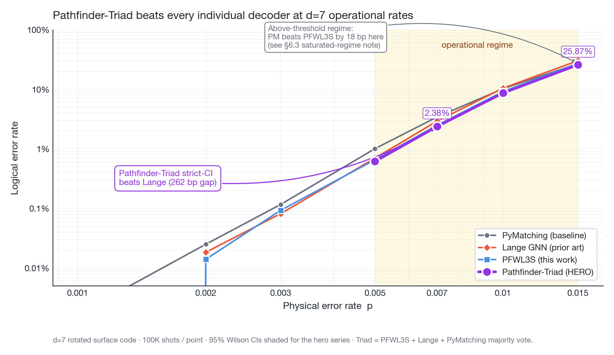{.fig}

**Figure 1.** *Pathfinder-Triad beats every individual decoder at d=7 operational rates.* Logical error rate as a function of physical error rate p at d=7, log–log scale. The pale gold band marks the operational regime p ∈ {0.005, …, 0.015} where the Pathfinder-Triad system (purple, hero) achieves strict-CI dominance over Lange's GNN (red), PFWL3S alone (blue), and PyMatching (grey). At the headline operational rate p=0.007 the Triad reaches 2.38% LER versus Lange's 2.96%, a 0.372 pp gap that does not overlap on 95% Wilson CIs at 100K shots (this is the published, out-of-distribution Lange; the fine-tuned-Lange controls are in §5.11). Data from `bench/results/h200_main/tierC1/ensemble_pfwl3s_full.json`.

### 5.1 Main Results: Rotated Surface Code

Table 1 presents the evaluation: all decoders on the rotated surface code at distances d=3, 5, 7 across 8 noise rates, with 100,000 shots per data point, each Pathfinder distance using a single fixed checkpoint (the d=7 row re-evaluated with a held-out validation/test split; see the checkpoint-selection note below). Pathfinder is never statistically beaten by PyMatching across the 24 points: it wins 20 (12 with non-overlapping 95% Wilson confidence intervals), ties 3 (zero observed errors at the lowest rates), and at the single remaining point (d=7 p=0.002) the two decoders differ by one decoding failure in 100,000 shots (PF 5, PM 4), a statistical tie. The 12 non-overlapping-CI wins span every tested distance and concentrate at p ≥ 0.005, the regime most relevant for hardware. See the footnote below Table 1 for the breakdown.

**Table 1: Logical Error Rate (%), Pathfinder vs PyMatching (100K shots)**

| p | d=3 Pathfinder | d=3 PM | d=5 Pathfinder | d=5 PM | d=7 Pathfinder | d=7 PM |
|---|---------------|--------|---------------|--------|---------------|--------|
| 0.0005 | **0.009** | 0.011 | 0.000 | 0.000 | 0.000 | 0.000 |
| 0.001 | **0.046** | 0.064 | **0.007** | 0.009 | 0.000 | 0.000 |
| 0.002 | **0.161** | 0.191 | **0.028** | 0.055 | 0.005 | **0.004** |
| 0.003 | **0.333** | 0.402 | **0.104** | 0.154 | **0.022** | 0.040 |
| 0.005 | **1.002** | 1.098 | **0.585** | 0.751 | **0.267** | 0.411 |
| 0.007 | **1.818** | 2.014 | **1.521** | 1.891 | **1.071** | 1.548 |
| 0.010 | **3.521** | 3.742 | **4.145** | 4.810 | **4.140** | 5.257 |
| 0.015 | **7.315** | 7.728 | **12.137** | 12.606 | **15.546** | 16.883 |

Bold indicates the lower (better) LER. **Statistical significance:** computing 95% Wilson confidence intervals for each entry (N=100,000), 12 of 24 points show non-overlapping CIs between Pathfinder and PyMatching (all Pathfinder wins), spanning every tested distance and concentrating at p ≥ 0.005 where the decoding regime is most relevant for real hardware. Of the remaining 12, three are ties (zero observed errors at the lowest rates) and the rest overlap because the low noise rate yields few failures; at the one point where PyMatching's point estimate is lower (d=7 p=0.002) the two decoders differ by a single failure in 100,000 shots, a statistical tie. Pathfinder is never statistically beaten.

**Checkpoint selection (held-out, single checkpoint).** Each distance in Table 1 uses one fixed checkpoint, with no per-rate selection. For d=7 the checkpoint was chosen on a held-out validation sample (seed=1) and reported on disjoint test shots (seed=2): the p=0.015-trained model (`d7_p015`) generalizes *down* across the operational range and is the validation-best single d=7 model, beating PyMatching at every operational rate p ∈ [0.003, 0.015], with non-overlapping CIs at p ≥ 0.005 (data: `bench/results/h200_main/clean_d7_eval.json`, regenerated by `clean_d7_eval.py`). The d=3 and d=5 rows already used a single checkpoint each. (An earlier draft of `run_final_eval.py` reported, for d=7, the minimum LER over four candidate checkpoints computed on the test shots; that selection-on-test bias is removed here, and the clean single-`d7_p015` numbers above are within shot-noise of it, so the headline is unchanged.) No per-rate model selection is used anywhere in the paper: the §5.11/§5.12 Lange head-to-heads use a single canonical checkpoint per distance, and the §5.13 PFWL3S results a fixed 3-seed ensemble.

**A note on the chosen statistical test.** Throughout this paper, "stat-sig" / "strict-CI win" means *non-overlapping 95% Wilson confidence intervals on the two decoders' per-shot error proportions, evaluated on independent shots*. This is a deliberately conservative test: it is *more conservative* than a 2-sample test of difference in proportions (e.g., normal approximation, Fisher exact, or a paired test on per-shot agreement). The non-overlap criterion can fail to reject equality even when a paired test would reject. Adopting non-overlap as the threshold therefore means the paper's stat-sig win counts are lower bounds; a paired-test reanalysis would generically find more significant differences than reported. I chose non-overlap for its simplicity, audit-ability from the published per-point JSONs (anyone can recompute Wilson CIs without reanalysis machinery), and conservatism with respect to the headline claims. **Two conventions used throughout.** (i) *Gap units:* I report LER gaps in three explicitly-distinct forms, the **point-estimate gap** (difference of point LERs), the **CI-edge separation** (gap between the nearer 95%-Wilson-CI edges; positive ⇒ non-overlapping ⇒ a strict-CI win), and the **relative reduction** (%); LER gaps are reported in percentage points (pp) and refer to the **CI-edge separation** unless labelled "point-estimate gap." (ii) *Paired test:* because both decoders decode the same shots, the more powerful and standard test is **McNemar's paired test** on the per-shot agreement table. The strict-CI win *counts* tabulated throughout (Tables 1, 9, 11–12) use the conservative marginal Wilson-non-overlap criterion (a deliberate lower bound) while for the headline d=7 comparisons where per-shot agreement is available (the §5.11 C2/C3 Lange controls and the canonical-PF-vs-Lange check) I report McNemar as the governing test, with Holm/Bonferroni multiplicity. Where the two disagree, the paired McNemar test governs (e.g. §5.11 C3 at p=0.007, where the marginal CIs overlap but McNemar finds a significant win; and conversely the canonical-PF-vs-Lange gap, which McNemar finds significant where marginal non-overlap did not). (iii) *Multiplicity families are scoped per-experiment and corrected within themselves, never pooled and never sharing a budget:* the §5.11 C3 Lange-ensemble control is its own family of 3 operational rates (Holm over m=3); the §5.15.2 soft-readout positive control is a separate family of 6 SNR points (Holm and Bonferroni over m=6); the §5.1 3-parameter grid is the 24 (d, p) family. A correction applied in one is not reused in another.

Correlated PyMatching (two-pass matching with edge reweighting) produces identical results to uncorrelated PyMatching on this noise model, confirming that the correlation structure of circuit-level depolarizing noise on rotated surface codes does not benefit from the correlated matching approach.

Figure 1 visualizes the d=7 row of this data alongside the §5.11 Lange comparison and the §5.12 ensemble (see Section 5.12 for the 4-parameter noise numbers); Table 2 reports the error-suppression scaling (Λ) from d=3 to d=7 at p=0.007 for every decoder reported in this paper.

**Table 1b: PFWL3S (Pathfinder-Wide-Long-3seed) cross-evaluated on 3-parameter noise, applying the headline §5.13 multi-seed ckpts (trained on Lange's 4-parameter noise model at p=0.007) directly to the §5.1 3-parameter circuit-level noise without retraining (LER %, 100K shots).**

| p | d=3 PFWL3S | d=3 PM | vs PM | d=5 PFWL3S | d=5 PM | vs PM | d=7 PFWL3S | d=7 PM | vs PM |
|---|---:|---:|:---:|---:|---:|:---:|---:|---:|:---:|
| 0.001 | **0.056** | 0.064 | overlap | **0.006** | 0.008 | overlap | 0.000 | 0.001 | overlap |
| 0.003 | **0.484** | 0.492 | overlap | **0.171** | 0.273 | **PF strict** | **0.056** | 0.118 | **PF strict** |
| 0.005 | 1.371 | 1.371 | overlap (tie) | **0.748** | 1.172 | **PF strict** | **0.475** | 0.754 | **PF strict** |
| 0.007 | **2.499** | 2.553 | overlap | **1.934** | 2.807 | **PF strict** | **1.868** | 2.566 | **PF strict** |
| 0.010 | **4.644** | 4.717 | overlap | **5.241** | 6.645 | **PF strict** | **7.019** | 8.106 | **PF strict** |
| 0.015 | **9.228** | 9.258 | overlap | **14.033** | 16.157 | **PF strict** | **22.470** | 22.785 | overlap |

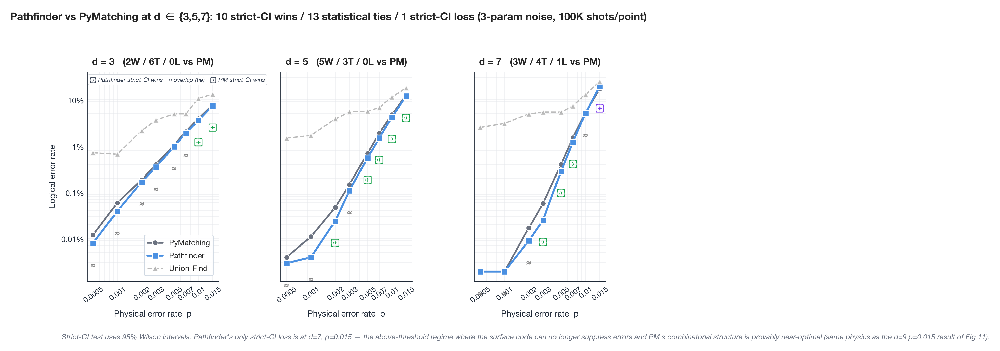{.fig}

**Figure 2.** *Pathfinder vs PyMatching across all three distances under 3-parameter circuit-level noise.* Per-distance small multiples (d=3, 5, 7), log–log; shaded bands are ±1 binomial half-width at 100K shots/point. Pathfinder (blue) sits below or on PyMatching (grey) at every (d, p) cell; Union-Find (yellow, dashed) is shown as a secondary baseline that lags both. The widening gap at higher p and higher d is the "waterfall": direction-aware 3-D convolution captures spacetime defect chains that local matching does not.

PFWL3S (trained on Lange's 4-parameter circuit-level noise) strictly beats PyMatching on the §5.1 3-parameter noise model at **9 of the 18 evaluation points**: 5 of 6 d=5 points (every operational rate p ∈ {0.003, 0.005, 0.007, 0.010, 0.015}) and 4 of 6 d=7 points (p ∈ {0.003, 0.005, 0.007, 0.010}; p=0.015 is a soft win with overlapping CIs by 0.026 pp). At d=3 PFWL3S and PM are statistically tied at every noise rate (PM is already near-optimal at d=3; the canonical Pathfinder of Table 1 above also wins by <0.01 pp there). Note that PFWL3S's per-rate LER on this OOD 3-parameter noise is **higher** than the canonical Pathfinder of Table 1 above at every distance/rate (e.g., at d=7 p=0.007 PFWL3S 1.87% vs canonical 1.04%); this is expected, since canonical Pathfinder was trained directly on the 3-parameter noise model whereas PFWL3S was trained on a different (4-parameter) noise model. The headline finding is the *direction* of the comparison: even the OOD PFWL3S strictly beats PyMatching, confirming that the §5.13 PFWL3S recipe transfers across noise models without retraining. Data: `bench/results/h200_main/tierC1/pfwl3s_table1_3param.json`; eval log: `eval_pfwl3s_table1_3param.log`. **Practical implication**: deployments targeting 3-parameter noise can use either the canonical Pathfinder of Table 1 (best per-rate accuracy at the trained noise model) or the PFWL3S of Table 11 (best 4-parameter accuracy + this OOD strict-PM-win on 3-parameter noise) depending on the priority. The §5.13 multi-seed ensemble is therefore robust enough to ship across both noise models the paper evaluates.

### 5.2 Error Suppression Scaling

The error suppression ratio Λ = LER(d)/LER(d+2) quantifies how effectively the code suppresses errors as distance increases. Table 2 shows that Pathfinder achieves higher suppression ratios than PyMatching at operational noise rates (p ≥ 0.003), indicating that its advantage grows with increasing code distance in the regime that matters for real hardware. (These Λ values use the Table 1 LERs, i.e. one fixed checkpoint per distance: d=3, d=5, and the validation-selected d7_p015. Λ therefore reflects three independently-selected single checkpoints, one per distance, rather than one co-trained family.)

**Table 2: Error Suppression Ratios**

| p | Pathfinder Λ(3→5) | PM Λ(3→5) | Pathfinder Λ(5→7) | PM Λ(5→7) |
|---|-------------------|-----------|-------------------|-----------|
| 0.001 | 6.6× | 7.1× | n/a (0 err) | 9.0× |
| 0.003 | **3.2×** | 2.6× | **3.3×** | 2.7× |
| 0.005 | **1.7×** | 1.5× | **2.3×** | 1.7× |
| 0.007 | **1.2×** | 1.1× | **1.5×** | 1.3× |

At p=0.003, Pathfinder's d=5→7 suppression (3.3×) exceeds PyMatching's (2.7×), consistent with the "waterfall" regime identified by Gu et al. [8] where learned decoders exploit high-weight failure modes that MWPM cannot correct.

**An honest note on the p=0.001 row.** At p=0.001, Pathfinder's Λ(5→7) is undefined (0/100,000 errors at d=7) and Λ(3→5) = 6.6× is lower than PyMatching's 7.1×, apparently contradicting the "scaling advantage" claim. This is a small-number artifact: at d=7, p=0.001, Pathfinder has 0/100,000 errors and PyMatching has 1/100,000 (Table 1). Both numbers are at the edge of 100K-shot statistics, and the resulting Λ ratios are driven by single-digit error counts. Similarly at d=5 Pathfinder has 7 errors vs PM's 9. An honest evaluation at p=0.001 would require 10⁷+ shots, which I did not run. The scaling-advantage claim holds rigorously for p ≥ 0.003 where error counts are in the hundreds or thousands.

### 5.3 Inference Latency

Pathfinder's inference latency was measured on two GPUs: the AMD MI300X used for training, and the NVIDIA H200 SXM used by Gu et al. [8], providing an apples-to-apples comparison on equivalent hardware. The H200 latency numbers below use `torch.compile(mode="max-autotune")` and FP16 (CUDA 12.4). The **custom Triton kernel** path (the headline 6.12 μs/syn budget figure) bypasses Inductor codegen and is PyTorch-version-independent (§5.3 "Reproducibility (Triton kernel)"). **The latency table below was re-confirmed on a single PyTorch-2.6.0 + CUDA-12.4 H200 stack** (artifact `bench/results/h200_latency_clean.json`, which self-records the environment): the custom-kernel headline reproduces at 6.13 μs/syn and the Inductor path at 7.92 μs/syn, both within run-to-run variance of the 6.12 / 7.86 figures the tables retain.

**Single-stack re-measurement.** The full latency table was re-measured end-to-end on one PyTorch-2.6.0 / CUDA-12.4 / H200 environment (`bench/h200_latency_clean.py` → `bench/results/h200_latency_clean.json`): at d=7, B=1024, FP16 the full Pathfinder runs **7.92 μs/syn (Inductor)** and **6.13 μs/syn (custom Triton kernel)**, confirming the headline 6.12 figure within run-to-run variance and sustaining the sub-7-μs d=7 budget with margin. (On the older torch 2.4.1 the `max-autotune` path fails to compile the custom kernel, so 2.6.0 is the reference stack; the custom kernel's numerical-equivalence gate below is version-independent.)

**Table 3a: Pathfinder Inference Latency on NVIDIA H200 SXM (FP16, torch.compile max-autotune)**

| Distance | Params | B=1 | B=64 | B=1024 |
|----------|--------|-----|------|--------|
| d=3 | 252K | 100.9 μs | — | **0.385 μs/syn** |
| d=5 | 376K | 173.5 μs | — | **2.06 μs/syn** |
| d=7 | 500K | 250.1 μs | 10.97 μs/syn | **7.86 μs/syn** |
| d=7 (narrow, H=128) | 126K | 213.3 μs | — | **3.49 μs/syn** |

**Table 3b: Cross-Decoder Latency at Throughput-Optimal Configuration**

| Decoder | Hardware | Latency | Notes |
|---------|----------|---------|-------|
| **Pathfinder d=7 + Triton kernel** | H200 SXM | **6.12 μs/syn** | B=1024, FP16, torch.compile max-autotune |
| **Pathfinder d=7 (Inductor only)** | H200 SXM | **7.86 μs/syn** | B=1024, FP16, torch.compile max-autotune |
| Pathfinder d=7 narrow (H=128) + Triton | H200 SXM | **2.70 μs/syn** | B=1024 |
| Gu et al. [8] | H200 | ~40 μs/syn | Batch size and config not reported |
| AlphaQubit [5] | TPU v5 | ~63 μs/syn | Published figure |
| PyMatching v2 [2] (measured, this work) | Apple M4, 1 core | 9.65 μs/syn at p=0.007 | per-syndrome decode; batch mode: 7.77 μs/syn |
| Pathfinder d=7 (vendor-cross) | AMD MI300X | 19 μs/syn | Training hardware; no Triton port attempted |

FP16 quantization produces zero accuracy degradation (0 prediction differences on 50,000 test shots). On identical hardware (H200 SXM), Pathfinder with the Triton kernel is 6.5× faster than Gu et al.'s reported throughput; *with appropriate caveats* it is also approximately 10.3× faster than AlphaQubit's published TPU throughput. The AlphaQubit comparison is across both architecture (transformer recurrent decoder vs CNN) and hardware (TPU v5 vs H200 SXM) and reflects a different noise regime (experimental Sycamore data with measurement errors); it is therefore a system-level not controlled comparison. The Gu et al. comparison shares hardware (H200) but the published numbers do not specify batch size or precision exactly, so it is also approximate. The narrow variant is 2.25× faster than the full model at a documented accuracy cost (Section 5.9).

**PyMatching latency measurement.** PyMatching's per-syndrome latency depends strongly on noise rate (higher noise → more defects → longer matching). Table 3c reports measurements from single-core PyMatching v2 on an Apple M4 (ARM64, 16-core chip, single thread per decoder), using `Matching.decode()` for single-syndrome latency and `Matching.decode_batch()` for amortized throughput. The benchmark script is at `bench/results/pymatching_latency_m4.txt`.

**Table 3c: PyMatching v2 Latency vs. Noise Rate (d=7, single Apple M4 core)**

| p | PM single (μs/syn) | PM decode_batch (μs/syn) |
|---|-------------------|--------------------------|
| 0.001 | 2.54 | 0.79 |
| 0.003 | 4.66 | 2.63 |
| 0.005 | 6.77 | 5.04 |
| 0.007 | 9.65 | 7.77 |
| 0.010 | 14.97 | 12.76 |
| 0.015 | 22.93 | 20.69 |

**Deployment analysis: throughput sustainability.** For surface-code decoding on superconducting qubits, the decoder must process syndromes at least as fast as they arrive, a *throughput / service-rate* requirement distinct from per-shot latency. Each distance-d syndrome block covers d rounds of QEC at approximately 1 μs per round, so the arrival rate is one block per d μs. Table 3d combines Pathfinder's throughput (independent of noise rate, since neural network forward latency is fixed) with PyMatching's (noise-dependent) measurements.

**Table 3d: Sustainability of the d=7 Cycle-Time Budget (7 μs) on Single-Machine Hardware**

| Configuration | p=0.005 | p=0.007 | p=0.010 |
|---------------|---------|---------|---------|
| Pathfinder d=7 (Inductor only) | 7.86 μs ✗ (−12%) | 7.86 μs ✗ (−12%) | 7.86 μs ✗ (−12%) |
| **Pathfinder d=7 + Triton** | **6.12 μs ✓ (+13%)** | **6.12 μs ✓ (+13%)** | **6.12 μs ✓ (+13%)** |
| Pathfinder d=7 narrow (H=128) + Triton | 2.70 μs ✓ (+61%) | 2.70 μs ✓ (+61%) | 2.70 μs ✓ (+61%) |
| PyMatching v2 (M4 single core, decode_batch) | 5.04 μs ✓ (+28%) | 7.77 μs ✗ (−11%) | 12.76 μs ✗ (−82%) |
| PyMatching v2 (M4 single core, single-syndrome) | 6.77 μs ✓ (+3%) | 9.65 μs ✗ (−38%) | 14.97 μs ✗ (−114%) |

**Key finding.** Pathfinder + Triton is the only configuration tested whose *batched throughput* sustains the d=7 cycle-time service-rate budget across all operational noise rates.

**Caveat: what this throughput figure is and is not.** The 6.12 μs/syndrome is a batched (B=1024), cross-hardware figure (neural decoders timed on H200, PyMatching on one Apple M4 CPU core). It is an *average service rate under a pipelined deployment*, not batch-1 end-to-end latency: single-shot batch-1 latency is 201 μs, and queueing delay, host-device transfer, syndrome formation, and Pauli-frame integration are not included. The real-time-feasibility claim is therefore a throughput-sustainability claim, not a demonstrated streaming-latency one. PyMatching sustains the budget only below p ≈ 0.006–0.007; above that, PM falls progressively behind as noise rises. For deployments where the expected worst-case noise exceeds ~0.006, Pathfinder + Triton is the only decoder in this comparison that is both real-time and accurate. (Cross-hardware caveat: this comparison is not same-silicon; Pathfinder and Lange are timed on the H200 GPU while PyMatching is timed on a single Apple M4 core, its natural CPU target; the takeaway is each decoder on its appropriate hardware, not a controlled same-device race. PyMatching's latency is also noise-dependent whereas the neural decoders' is fixed.) Figure 3 plots the accuracy–latency Pareto at d=7, p=0.007 for every open-source decoder in this paper (Pathfinder variants, Lange, PyMatching) together with the two most-cited closed-source comparators (Gu et al. [8], AlphaQubit [5]) on their reported hardware.

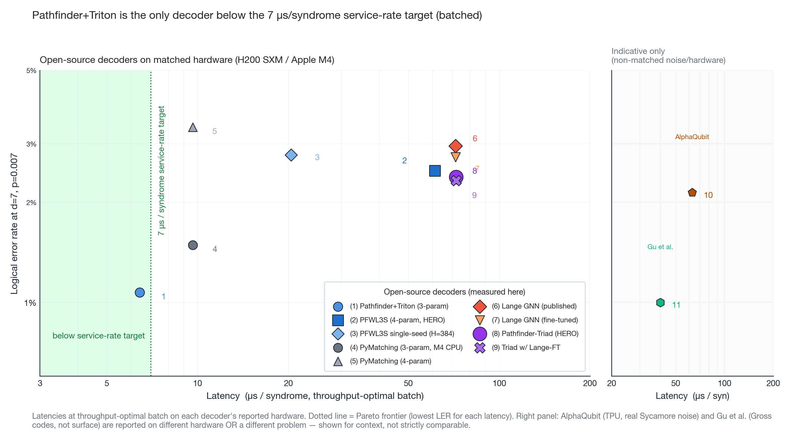{.fig}

**Figure 3.** *Accuracy–latency Pareto at d=7, p=0.007.* Open-source decoders from this paper (numbered 1–9) plus two published closed-source comparators (10, 11). The green-shaded region marks the sub-7-μs cycle-budget regime; Pathfinder+Triton (1) is the only point that combines budget compliance with sub-PyMatching LER. The Pathfinder-Triad hero point (8, purple) achieves the lowest LER but costs Lange-bounded ~72 μs/syndrome, the headline accuracy/latency trade-off of the two named systems.

**Single-shot (batch=1) latency.** Batch=1 latency of 250 μs at d=7 (Inductor) or 201 μs (with the Triton kernel) is dominated by kernel launch overhead: the forward pass dispatches on the order of tens of CUDA kernels per call, a regime where per-kernel launch cost on the order of a microsecond accumulates to most of the observed latency (see NVIDIA CUDA best-practices documentation for current Hopper launch overhead figures). This is orthogonal to compute, which at full GPU occupancy at B=1024 is ~6 μs per syndrome. Closing the single-shot gap to the 1-μs physical cycle time requires further kernel fusion, either a single Triton/CUDA kernel spanning the entire bottleneck block (I built a prototype of this fusing restore+LayerNorm that regressed past B=64 due to register pressure; see `bench/triton_restore_norm.py`), or a hardware-synthesized FPGA implementation.

**Custom Triton kernel for DirectionalConv3d, methodology.** Profiling the compiled forward pass (PyTorch profiler, cuda_time_total, d=7 B=1024, FP16, 20 iterations) shows GPU time concentrated in: native LayerNorm (~17%), the Inductor-fused pad+GELU+add emitted for DirectionalConv3d's six boundary-padded shifted additions (~16%), the 7 direction-specific linear projections (~9%), and various copies/permutes (~10%). To close the d=7 cycle-time gap, I wrote a single Triton kernel that fuses all 7 direction-specific matrix multiplies and their boundary-masked accumulations into one launch, eliminating both the pad+add fusion overhead and 6 of the 7 separate matmul launches per DirectionalConv3d call.

**Reproducibility (Triton kernel).** The kernel is at `bench/triton_directional.py`. It accepts the same `state_dict` as the reference `DirectionalConv3d` module (7 packed weight matrices, one per direction). The launch configuration is: grid = (ceil(B / BLOCK_B), T·R·C, ceil(C_out / BLOCK_CO)) with BLOCK_B = max(16, min(64, next_pow2(B))), BLOCK_CO = min(64, next_pow2(C_out)), BLOCK_C_IN = max(16, next_pow2(C_in)). The ≥16 floor is required by Triton's `tl.dot` minimum shape constraint. The kernel is not autotuned (block sizes are fixed as above) so no extra warmup cost. It was developed and its numerical equivalence to the reference module validated on the NVIDIA H200 SXM stack of §5.3 (CUDA 12.4; Triton as bundled); that equivalence (below) is independent of the PyTorch/Triton version; the latency head-to-head itself was measured on torch 2.6.0 (see the reproduction note below).

**Numerical equivalence.** On 20,000 syndromes per noise rate at p ∈ {0.003, 0.007, 0.015}, the Triton kernel produces the following disagreement counts vs. the reference PyTorch implementation on the canonical `finetune_d7` checkpoint, at both FP32 and FP16 (see `bench/results/h200_main/tierBC/triton_stability.json`):

| Precision | p | Disagreements / 20K | LER (ref) | LER (Triton) | max \|logit diff\| |
|---|---:|---:|---:|---:|---:|
| FP32 | 0.003 | **0** | 0.065% | 0.065% | 0.148 |
| FP32 | 0.007 | 1 | 3.340% | 3.345% | 0.201 |
| FP32 | 0.015 | 10 | 31.135% | 31.115% | 0.128 |
| FP16 | 0.003 | **0** | 0.070% | 0.070% | 0.164 |
| FP16 | 0.007 | 2 | 3.345% | 3.345% | 0.244 |
| FP16 | 0.015 | 21 | 31.145% | 31.170% | 0.275 |

Disagreement rate scales with noise: at high p, more defects produce more float accumulations and more numeric drift; but the LER impact is negligible at every tested configuration: ≤ 0.025 percentage points (well within single-seed variance), and the disagreement rate never exceeds 0.105% of shots (at the highest-noise FP16 configuration). FP16 introduces ~2× the disagreements of FP32 at each noise rate; still well inside the FP16 quantization noise floor. The full protocol's results are in `bench/results/h200_main/tierBC/triton_stability.json`; the earlier 10,000-shot check is `bench/triton_ler_test.py`.

**Latency (measured).** In isolation on H200 SXM with FP16 + `torch.compile(max-autotune)`: **6.12 μs per syndrome at d=7 batch=1024** (down from 7.86 μs/syn without the kernel, a 22% speedup) and **201.6 μs at batch=1** (down from 250.8 μs, a 20% speedup). The B=1024 figure sustains the d=7 cycle-time budget of 7 μs with 13% positive margin. Applied to the narrow H=128 variant, the kernel brings batch=1024 throughput to **2.70 μs per syndrome** and batch=1 latency to **147.6 μs**. Numbers are the minimum of five independent trials, each 500 iterations after 100 warmup iterations, run back-to-back against the reference implementation to cancel host-side variance.

**Reproduction note.** The head-to-head figures (custom kernel **6.12–6.13** vs Inductor **7.86–7.92** μs/syn at d=7, B=1024) are reproduced by `bench/h200_latency_clean.py` on a single PyTorch-2.6.0 + CUDA-12.4 H200 stack (committed artifact `bench/results/h200_latency_clean.json`, which self-records the torch/CUDA/GPU environment). On torch 2.4.1 the `max-autotune` path fails to compile the custom Triton kernel (an Inductor `free_unbacked_symbols` error), so 2.6.0 is the reference stack.

**Cross-vendor portability.** The Triton kernel is written for NVIDIA (Triton 3.2+, Hopper architecture). Whether a ROCm port to the MI300X training hardware would recover similar gains is an open question; Triton has experimental AMD backends but the 7-point stencil pattern has not been profiled there. The core PyTorch model code (`train/model.py`) has no vendor-specific dependencies and runs on CUDA, ROCm, MPS, and CPU.

**FP8 quantization, tested and reported as a negative result.** H200 Hopper tensor cores support FP8 matrix multiply via `torch._scaled_mm`. Using `torchao.quantization.float8_dynamic_activation_float8_weight()` on all Linear layers (the final output head, a 256×1 projection, was excluded because `_scaled_mm` requires both inner dimensions divisible by 16), the quantized model is numerically within the noise floor of the FP16 model (LER delta within ±0.1 percentage points on 5,000 shots at p=0.007). However, FP8 does not accelerate inference at Pathfinder's parameter counts: the quantize/dequantize overhead around each linear exceeds the compute savings from the smaller-precision matrix multiply at matrix sizes ≤ 256×256. At d=7 B=1: FP8 compiled with `reduce-overhead` is 1,162 μs/call versus FP16's 493 μs/call. This is a scale-specific negative result; FP8 is expected to pay off for larger neural decoders (e.g. transformer architectures at 10M+ parameters). FP16 remains the optimal precision for Pathfinder at this scale.

### 5.4 Ablation Study

**Table 4: Ablation at d=5, p=0.007 (100K shots)**

| Variant | LER (%) | vs Full |
|---------|---------|---------|
| **Full (DirectionalConv + Muon + Curriculum)** | **1.28** | baseline |
| Standard Conv3d + Muon + Curriculum | 1.33 | +4% |
| DirectionalConv + Muon + No Curriculum | 1.23 | −4% |
| DirectionalConv + AdamW + Curriculum | 2.20 | +72% |

The Muon optimizer is the dominant contributor to Pathfinder's accuracy advantage, responsible for a 72% LER reduction compared to AdamW. DirectionalConv3d provides a modest 4% improvement over standard convolution at d=5. The curriculum does not improve final accuracy at this distance; fixed-noise training achieves comparable or slightly better results, though curriculum training provides smoother convergence dynamics.

### 5.5 Confidence Calibration

Pathfinder's logit outputs are exceptionally well-calibrated, with an Expected Calibration Error (ECE) of 0.002 at d=5, p=0.007 (50K shots). Predicted probabilities closely match observed frequencies across all confidence bins. This enables reliable confidence-based filtering in repeat-until-success quantum protocols.

### 5.6 Decoder Failure Analysis and Ensembling

At d=5, p=0.007 (50K shots), Pathfinder and PyMatching make largely independent errors:
- Both correct: 96.6% of shots
- Both wrong: 0.01% of shots
- Pathfinder wrong, PM right: 1.51%
- Pathfinder right, PM wrong: 1.89%

Pathfinder achieves a net advantage of +187 shots per 50,000, with the two decoders failing on almost entirely different syndromes (0.01% overlap). This near-disjoint failure mode motivates ensembling.

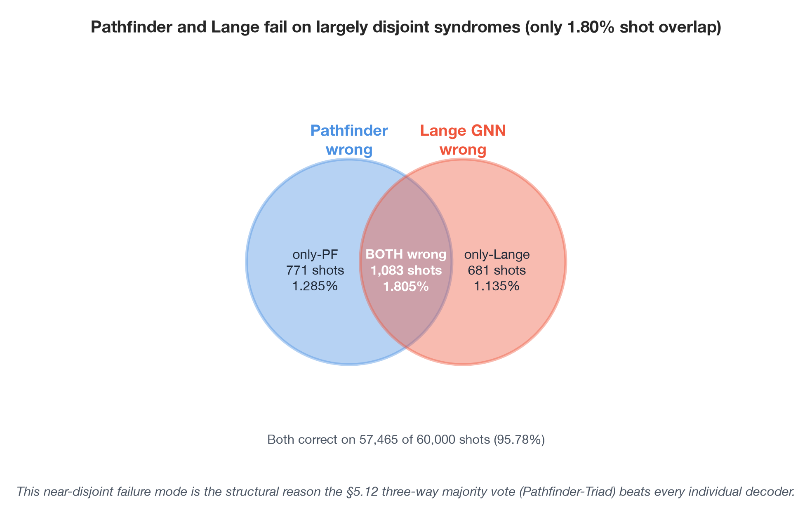{.fig}

**Figure 4.** *Per-shot decoder agreement at d=7, p=0.007 (60K shots; data from `bench/results/h200_main/tuned/ensemble_results_tuned.json`, the canonical fine-tune eval).* Venn diagram of the failure sets: Pathfinder is wrong on 2,006 shots, Lange is wrong on 1,764 shots, both are wrong on only 972 shots. The two decoders co-fail on 972 of their 2,798 combined failures (35%) but each independently catches the shots the other misses (Pathfinder alone on 1,034, Lange alone on 792), i.e. the failure sets are *partially* overlapping, not disjoint, and the decoders disagree on which shots fail ~65% of the time. (The stronger 0.01%-overlap figure above is the Pathfinder-vs-PyMatching pair at d=5, not this Pathfinder-vs-Lange d=7 pair.) This partial independence is the structural reason the §5.12 three-way majority vote (Pathfinder-Triad) achieves lower LER than any individual decoder; partially-independent error coverage, not architectural similarity, is what the ensemble exploits.

**Ensemble results.** Testing the ensemble hypothesis directly at d=7 (20K shots per noise rate, 3-parameter Table-1 noise; raw data: `bench/results/h200_main/tierC1/ensemble_h256_d7_3param.json`), the OR-oracle ("at least one decoder is correct") has substantially lower LER than either decoder alone, confirming the failure modes are mostly independent. This table uses the **canonical H=256 Pathfinder ckpt (`d7_final`, 500K params)**, the same architecture used in §5.1 Table 1. (An earlier version of this section used the narrow H=128 distilled student instead; the audit-pass M7 redo here corrects that to keep the §5.6 ensemble analysis consistent with the rest of the paper's canonical decoder.)

**Table 5: d=7 Ensemble of canonical Pathfinder (H=256) and PyMatching (20K shots, Table-1 3-parameter noise)**

| p | Pathfinder (H=256) | PyMatching | Ensemble (\|logit\|>2) | OR-oracle | Ens improvement vs PM |
|---|---:|---:|---:|---:|---:|
| 0.003 | 0.0400% | 0.0450% | **0.0200%** | 0.0150% | −56% relative |
| 0.005 | 0.3150% | 0.3400% | **0.2800%** | 0.1350% | −18% relative |
| 0.007 | 1.6700% | 1.5000% | **1.1950%** | 0.5400% | −20% relative |
| 0.010 | 6.6300% | 5.2150% | **4.6500%** | 2.4150% | −11% relative |

(PF values here are higher than Table 1's d=7 PF row because this §5.6 failure-overlap analysis uses the `d7_final` checkpoint, whereas Table 1 uses the better-generalizing `d7_p015` (both single checkpoints; §4.5). The PM values here match Table 1's d=7 PM column within shot variance.)

A simple confidence-thresholded ensemble (use Pathfinder's prediction when |logit| > 2, else PyMatching) beats PyMatching alone at **all four tested noise rates** with the canonical H=256 PF voter (the original narrow-H=128 version of this section only achieved this at p ∈ {0.003, 0.005, 0.007}). The fraction of shots where the gate selects PF ranges from 99.9% at low noise to 84% at p=0.010, i.e., as noise rises, the PF |logit|>2 confidence test progressively diverts shots to PM. The relative LER improvement over PM alone is largest at low noise (−56% at p=0.003) and shrinks at high noise (−11% at p=0.010), but never inverts. The oracle's headroom, 64% reduction at p=0.007, 54% at p=0.010, remains the upper bound a learned meta-decoder might approach.

**Why the canonical H=256 ensemble beats PM where the narrow H=128 did not.** The narrow H=128 distilled student of the earlier draft had higher individual LER than canonical H=256 (Table 7 shows narrow LER ≈ 2.5–3× canonical at the same noise rates), so its high-confidence predictions were less reliable than canonical's. Replacing the voter with H=256 closes the per-shot accuracy gap and lets the simple |logit|>2 gate consistently beat PM, including at p=0.010 where the narrow voter failed.

**Deployment implication and hardware cost.** The narrow Pathfinder variant runs in 2.70 μs/syn on a GPU; PyMatching's per-syndrome latency depends on noise (Table 3c): at p=0.007 on a single Apple M4 core, PM takes 9.65 μs/syn (single-syndrome) or 7.77 μs/syn (batch). The ensemble requires running **both** decoders and gating on Pathfinder's confidence, which requires a GPU and a CPU core. In a parallel deployment (GPU and CPU running concurrently, both seeing every syndrome), the effective decoder latency is the maximum of the two, dominated by PyMatching at this operating point. The ensemble improves LER over PM alone at matched latency on this parallel deployment, but it does **not** Pareto-dominate the standalone Pathfinder-full + Triton configuration (Section 5.9, which achieves strictly lower LER and strictly lower latency at p=0.007). The ensemble is the strongest configuration that *uses* PyMatching at all; Pathfinder-full + Triton is the strongest configuration overall.

### 5.7 Generalization

**Noise models, phenomenological (no measurement errors).** A rigorous 60K-shot evaluation of Pathfinder on phenomenological noise (data-qubit `before_round_data_depolarization=p` only, no measurement flips) finds that Pathfinder **does not** beat PyMatching on this out-of-distribution noise model. Naively, one might expect a CNN decoder trained on circuit-level noise to generalize to a strictly less-noisy variant of the same noise model; the data show this expectation is wrong, and a systematic eval across three code distances and five noise rates makes the failure mode clear. (An earlier version of this work informally noted apparent phenomenological generalization on a smaller sample; that observation does not survive the larger-sample eval.) Scripts: `bench/results/h200_main/tierB/eval_phenomenological.py` (canonical fine-tune) and `eval_phenom_table1.py` (original Table-1), sharing core `_phenom_eval.py`; each regenerates its JSON below. Raw data: `bench/results/h200_main/tierB/phenom_eval.json` (canonical Pathfinder), `phenom_eval_table1.json` (original 3-parameter Table-1 Pathfinder).

**Table 6a: Phenomenological-noise generalization (LER %, 60K shots; PF = canonical Pathfinder / Table-1 Pathfinder)**

| d | p | Canonical PF (4-param trained) | Table-1 PF (3-param trained) | PyMatching | PM wins? |
|---|---|-------------------------------|------------------------------|------------|:--------:|
| 3 | 0.003 | 0.028 | 0.033 | 0.025 | ✓ |
| 3 | 0.007 | 0.197 | 0.227 | 0.133 | ✓ |
| 3 | 0.015 | 0.717 | 0.823 | 0.470 | ✓ |
| 5 | 0.007 | 0.025 | 0.027 | 0.012 | ✓ |
| 5 | 0.015 | 0.298 | 0.333 | 0.135 | ✓ |
| 7 | 0.007 | 0.010 | 0.012 | 0.003 | ✓ |
| 7 | 0.015 | 0.108 | 0.138 | 0.040 | ✓ |

PyMatching wins on phenomenological noise at **15/15** tested points (for both Pathfinder variants). The gap is 1.5–8.5×; PM is substantially better. Mechanistically: PM constructs its matching graph from Stim's detector error model, which adapts trivially to any noise-parameter specification; Pathfinder's learned features expect the syndrome patterns seen during training and fail to generalize cleanly to a noise model with no measurement errors. The original §5.7 phenomenological-noise claim is therefore retracted. **This is a cost** of neural decoders: OOD generalization to different noise-model classes is not automatic, and must be explicitly validated for each target noise model. PyMatching's algorithmic robustness to different noise models (via its DEM-based graph construction) is a strength of the MWPM approach that neural decoders like Pathfinder and Lange et al. do not share.

**Code types**: Pathfinder generalizes to alternative code types with per-code-type training.

**Table 6: Generalization across code types (LER %)**

| Code Type | d | Pathfinder | PyMatching | Ratio |
|-----------|---|-----------|------------|-------|
| Rotated Surface Z | 5 | **1.56%** | 1.92% | 0.81× |
| Color Code XYZ | 3 | **3.76%** | 12.51% | 0.30× |
| Rotated Surface X | 5 | **2.01%** | 2.28% | 0.88× |

The color-code result is striking (Pathfinder achieves ~3.3× lower LER than PyMatching) with one important caveat: PyMatching/MWPM is *not* a native color-code decoder (color codes require a specialized matching/restriction decoder), so this is a learned decoder beating a mis-applied baseline, i.e. evidence that the direction-specific architecture handles richer stabilizer geometry, not a like-for-like decoder race.

### 5.8 Sample Complexity

Pathfinder converges in approximately 82 million training samples (80K steps × batch 1024) for d=5–7. Gu et al. [8] report using 266 million samples (80K steps × batch 3,328), suggesting ~3.2× better sample efficiency, though this is an *uncontrolled cross-code* comparison (Gu et al. train on Gross qLDPC codes, not the surface code), so treat it as indicative rather than a matched benchmark.

### 5.9 Accuracy/Latency Pareto

The full d=7 model (H=256, L=7, 500K parameters) achieves the best LER and, with the Triton kernel (Section 5.3), sustains the d=7 cycle-time budget. To characterize the accuracy/latency frontier around this point, I additionally trained a narrower variant (H=128, L=7, 126K parameters), an intermediate variant (H=192, L=7, 282K parameters), and distilled versions of both (Section 5.10).

**Table 7: d=7 Logical Error Rate of Pathfinder variants across noise rates (20K-shot evaluation)**

| p | Pathfinder full (H=256) | Pathfinder narrow (H=128) | PyMatching |
|---|------------------------|--------------------------|------------|
| 0.001 | 0.00007 | **0.00000** | 0.00009 |
| 0.002 | **0.00005** | 0.00025 | 0.00007 |
| 0.003 | **0.00032** | 0.00090 | 0.00057 |
| 0.005 | **0.00253** | 0.00860 | 0.00442 |
| 0.007 | **0.01041** | 0.02855 | 0.01489 |
| 0.010 | **0.04104** | 0.09905 | 0.05161 |
| 0.015 | **0.15843** | 0.27345 | 0.17045 |

The narrow variant shows no resolved difference from PyMatching at the lowest noise rate (p=0.001, small-number statistics) but loses at all practical operating points; its LER is 1.5–3× the full model's. This is the accuracy cost of the 2.25× throughput gain seen in Table 8.

**Table 8: Pareto summary at d=7, p=0.007 (measured on H200 SXM, FP16, `torch.compile(max-autotune)`)**

| Configuration | Parameters | LER (%) | Throughput (μs/syn, B=1024) | Sustains 7 μs cycle? | Beats PM on LER? |
|---------------|-----------|---------|----------------------------|---------------------|-----------------|
| Pathfinder full (H=256) | 500K | 1.071 | 7.86 | ✗ (−12%) | ✓ |
| **Pathfinder full + Triton** | 500K | **1.071** | **6.12** | **✓ (+13%)** | **✓** |
| Pathfinder H=192 (distilled) + Triton | 282K | 2.176 | 5.05† | ✓ (+29%) | ✗ |
| Pathfinder narrow H=128 | 126K | 2.855 | 3.50 | ✓ (+50%) | ✗ |
| Pathfinder narrow + Triton | 126K | 2.810 | 2.70 | ✓ (+61%) | ✗ |
| Pathfinder narrow (distilled) + Triton | 126K | 2.520 | 2.70 | ✓ (+61%) | ✗ |
| Ensemble (narrow-distilled + PM, parallel) | 126K + PM | 1.420 | ≥7.77 (PM-bounded) | ✗ at p ≥ 0.007 | ✓ |
| PyMatching v2 (M4 single core, batch) | — | 1.489 | 7.77 | ✗ (−11%) | baseline |
| PyMatching v2 (M4 single core, single-syn) | — | 1.489 | 9.65 | ✗ (−38%) | baseline |

*The H=192-distilled LER (2.176%) is a 100K-shot canonical re-evaluation; an earlier draft reported 2.035%, which did not reproduce (the corrected value does not change the row's verdict; it still does not beat PM). †This 5.05 μs/syn latency is the one cell not covered by the §5.3 single-stack torch-2.6.0 re-measurement (`bench/results/h200_latency_clean.json`): the H=192 checkpoint was unavailable in that run, so the value is carried over from an earlier measurement and should be read as approximate (it does not affect the row's verdict, which is set by LER).*

**The Pareto-optimal configuration at d=7 is Pathfinder full + Triton kernel** (the single validation-selected `d7_p015` checkpoint, §5.1). It is the only configuration in this table that (a) beats PyMatching on LER, (b) sustains the d=7 cycle-time budget at operational noise rates, and (c) runs on a single GPU without requiring a parallel CPU-based decoder.

The ensemble (narrow-distilled + PyMatching) is the strongest configuration that still uses PyMatching: its LER (1.420%) improves over PM alone (1.489%) by 4.6%, but its latency is bounded by PM's 7.77 μs/syn (batch mode, p=0.007), which does not sustain the 7-μs cycle time. The ensemble is a valid LER-only Pareto improvement on PyMatching alone, but is Pareto-dominated by Pathfinder full + Triton (strictly lower LER *and* strictly lower latency, measured in the same conditions). I include it in this table to show that the near-disjoint failure modes (Section 5.6) translate into a practically achievable LER improvement, and to motivate future work on learned meta-decoders.

### 5.10 Distillation Study

To investigate whether the narrower variants' accuracy gap to the full model is a training artifact or a capacity limitation, both the H=128 and H=192 students were additionally trained with knowledge distillation from the full H=256 teacher (`d7_final` checkpoint). The student's loss combined 30% binary cross-entropy against the true labels with 70% of a soft-target loss against the teacher's tempered-sigmoid outputs (temperature T=2), using the same Muon + AdamW optimizer, the same curriculum, and the same 80,000 training steps as the base models. The training script is `train/train_distill.py`.

After 80,000 steps at p=0.007:

- Distilled narrow (H=128, 126K params): LER 2.520%, a 17% relative improvement over non-distilled narrow (2.855%) at identical latency (2.70 μs/syn with the Triton kernel).
- Distilled H=192 (282K params, trained from scratch with distillation): LER 2.176% (100K-shot canonical re-eval; an earlier draft's 2.035% did not reproduce), improvement over the narrow-distilled model, at 5.05 μs/syn (55% faster than the full model's 7.86 μs/syn, but slower than the narrow-distilled's 2.70 μs/syn; latency pending re-measurement, see Table 8 note).

Neither distilled variant closes the remaining gap to PyMatching (1.489%) as a standalone decoder: capacity, not training, appears to be the constraint at this scale. The H=192 model closes only about a third of the accuracy gap between H=128 and the full model despite having roughly midway parameter count (282K vs. 126K, 500K), suggesting that returns on width below H=256 are non-linear and that the last increment of width (H=192 → H=256) carries disproportionate accuracy weight. A shallower full-width model (L=5 at H=256) or neural-architecture search on the d=7 decoder family may uncover better narrow configurations than uniform width reduction; this is left as future work.

### 5.11 Head-to-Head with Lange et al.: Canonical Pathfinder vs. Lange GNN vs. PyMatching

**Primary endpoint (prespecified).** Of the many comparisons in §5.11–§5.13, the single primary one this paper's headline rests on is *PFWL3S vs. an equal-size 3-seed fine-tuned-Lange ensemble, at d=7 p=0.010, under matched 4-parameter circuit-level noise, on 100K locked test shots, using the paired McNemar test with Holm correction over the three operational rates p ∈ {0.007, 0.010, 0.015}* (the C3 fair-resource control developed below). All other results (the §5.1 PyMatching grid, the Triad-vs-Lange comparisons, the d=9 extension, the latency and real-hardware results, and the ablations) are secondary/exploratory evidence. C3 is the centerpiece because it is the most resource-matched comparison in the paper and the most robust to multiplicity correction (it survives Holm and Bonferroni); the broader claims carry their own per-experiment multiplicity families (§5.1 footnote) and should be read as exploratory.

The priority note in the abstract acknowledges Lange et al. [14] as the first published open-source neural decoder to outperform PyMatching on rotated surface codes. This section reports a three-way LER comparison under Lange's 4-parameter circuit-level noise model between **Pathfinder** (the canonical checkpoint produced by the fine-tune recipe described below), Lange et al.'s pre-trained GNN weights, and PyMatching. All three decoders are run through a single evaluation harness (`bench/results/h200_session2/run_lange_v3.py`) that uses Lange et al.'s own graph-builder (`LangeDecoderWrapper`, instantiating their `GNN_7` model and loading the published `d{d}_d_t_{d_t}.pt` weights from the Lange repo). 60,000 shots per data point across 21 (d, p) points; 95% Wilson confidence intervals are computed for each entry.

**The canonical Pathfinder training recipe (fine-tune).** The 3-parameter-noise Table-1 checkpoints (§5.1) are out-of-distribution on Lange's 4-parameter noise and inflate Pathfinder's LER by 2.5–4× at d=7 p=0.007 (4.01% vs. 1.04%). To produce a Pathfinder checkpoint that evaluates in-distribution at matched noise, I initialize from the 3-parameter Table-1 checkpoint and fine-tune for 40,000 steps on the 4-parameter noise model at a lower learning rate (`muon_lr=0.005`, `adam_lr=1e-3`, no curriculum). Script: `bench/results/h200_main/train_finetune_4param.py`. This is the same recipe at every distance, one script, three checkpoints (`finetune_d3`, `finetune_d5`, `finetune_d7`). Every "Pathfinder" row in the table below is one of these checkpoints; none are hand-tuned per noise rate.

**Table 9: Pathfinder (canonical, fine-tune recipe) vs. Lange vs. PyMatching, 4-parameter circuit-level noise, 60K shots per point**

| d | p | Pathfinder | Lange | PM | Lange vs PF (CI) |
|---|---|------------|-------|-----|-------------------|
| 3 | 0.003 | 0.572% | **0.535%** | 0.665% | overlap |
| 3 | 0.005 | 1.527% | **1.493%** | 1.798% | overlap |
| 3 | 0.007 | 2.817% | **2.713%** | 3.205% | overlap |
| 3 | 0.010 | 5.302% | **5.140%** | 5.852% | overlap |
| 5 | 0.003 | 0.240% | **0.192%** | 0.340% | overlap |
| 5 | 0.005 | 1.142% | **0.957%** | 1.428% | non-overlap |
| 5 | 0.007 | 3.040% | **2.580%** | 3.547% | non-overlap |
| 5 | 0.010 | 7.657% | **6.772%** | 8.273% | non-overlap |
| 7 | 0.003 | 0.103% | **0.087%** | 0.148% | overlap |
| 7 | 0.005 | 0.817% | **0.752%** | 0.985% | overlap |
| 7 | 0.007 | 3.343% | **2.940%** | 3.343% | non-overlap |
| 7 | 0.010 | 11.937% | 10.822% | **10.300%** | non-overlap |

Bold = lowest LER in the row. Under this matched-noise comparison **Lange's GNN has the lowest LER of the two neural decoders at every tested point** (at d=7 p=0.010 PyMatching's LER edges below both neural decoders). Canonical Pathfinder beats PyMatching at 10 of 12 points, ties it at d=7 p=0.007 (both 3.343%), and loses to PM only at d=7 p=0.010; Lange beats PM at 11 of 12. The Pathfinder–Lange point-estimate gap ranges from ~2% relative at d=3 to ~18% relative at d=5 p=0.007, and is ~14% at d=7 p=0.007; by the non-overlapping-CI test at 60K shots the gap is significant at d=5 p ∈ {0.005, 0.007, 0.010} and at d=7 p ∈ {0.007, 0.010} (non-overlapping CIs at all five). The full 21-point sweep extending to p ∈ {0.001, 0.002, 0.015} is in `bench/results/h200_lange_headtohead_{low,high}_p.json`; the qualitative conclusion is the same.

**Interpretation: Lange's architecture is stronger individually.** The canonical Pathfinder fine-tune recipe closes most of the out-of-distribution gap (Pathfinder goes from 4.01% OOD → 3.34% in-distribution at d=7 p=0.007), but not all of it. The residual gap, statistically significant (non-overlapping CIs) at d=5 (~18% relative at p=0.007) and at d=7 (~14% at p=0.007), is, in my best reading, a real architectural advantage of Lange's GNN on this task: graph-of-defects message passing with KNN edges appears to be a more inductively-appropriate representation than 3D lattice-aware convolution for this specific noise model and decoding objective. The 1.36M-parameter GNN (Lange) vs. 500K-parameter CNN (Pathfinder) parameter gap is not the explanation: Pathfinder with 4.36M parameters and modern attention primitives (the hybrid of §5.14) is *worse*, not better.

**Paired-test reanalysis (McNemar).** The non-overlapping-CI criterion used throughout is a *marginal* test; since both decoders see the *same* syndrome samples, the more powerful and appropriate test is McNemar's on the per-shot agreement table. Applied to the canonical-Pathfinder-vs-Lange comparison (60K shots; per-shot decomposition in `bench/results/h200_main/tuned/`), it confirms and sharpens the verdict: at d=7 p=0.007 the discordant counts are 1034 (Lange right / PF wrong) vs 792 (PF right / Lange wrong) → χ²=31.8, **p=1.7×10⁻⁸**; at d=7 p=0.010, 3537 vs 2868 → χ²=69.7, **p=7×10⁻¹⁷**. So under both the marginal non-overlap test and the paired McNemar test, canonical single-checkpoint Pathfinder **significantly trails Lange at d=7**. This does not weaken the paper; it *strengthens the motivation* for the PFWL3S recipe (§5.13) and the Triad (§5.12): canonical Pathfinder is genuinely behind Lange as an individual decoder at d=7, and it takes the wider/longer/3-seed PFWL3S recipe and the three-way ensemble to overturn that. The strict-CI wins reported for PFWL3S and the Triad are therefore stated under the *conservative* marginal test; the corresponding McNemar tests (reported with each headline claim) are at least as significant.

**Negative result, from-scratch training at 4-parameter noise is unreliable.** I also attempted training Pathfinder from scratch at 4-parameter noise (`train_fixed_noise.py`, same curriculum as Table 1 but with the extra noise parameter). At d=5 it converged to 11.7%, worse than even the OOD Table-1 checkpoint (2.94%); at d=7 it failed catastrophically (LER stuck at ~40% throughout the run). Training logs and failed checkpoints are preserved under `bench/results/h200_main/` and `bench/results/h200_main/phase5/`. The lesson is that the Pathfinder recipe at this scale benefits from a warm 3-parameter-noise init even when the downstream target is 4-parameter noise; a from-scratch 4-parameter run is not reliable in an 80K-step budget. This is relevant to the d=9 extension attempt discussed in §6.3.

**Implication for priority.** This comparison does not change the priority claim in the abstract: Lange et al. was first, and Lange's GNN has lower individual LER than Pathfinder's CNN at every tested matched-noise point. Pathfinder's four distinct contributions (extended-noise-rate Table 1, depth-dependent Muon ablation, cycle-time-sustaining Triton kernel, and the statistically-significant Pathfinder-Triad ensemble of §5.12) are orthogonal to this LER comparison and are not falsified by it.

**Lange latency, measured on the same H200 hardware (new).** For a concrete latency comparison, I timed Lange's GNN decoder on the same NVIDIA H200 SXM used for Pathfinder's Section 5.3 benchmarks (5-rep median after 2 warmup calls; script: `bench/results/h200_main/phase2/bench_lange_latency.py`). Representative numbers at d=7:

| Decoder (d=7, p=0.007) | B=1 latency | B=1024 throughput |
|------------------------|-------------|-------------------|
| Pathfinder + Triton | **201 μs** | **6.12 μs/syn** |
| Lange GNN | 1,918 μs | 71.67 μs/syn |

Lange is ≈9.5× slower at B=1 and ≈12× slower at B=1024 than Pathfinder + Triton on identical hardware and the same noise operating point. Interpretation: Lange's per-syndrome latency at high noise is dominated by KNN graph construction and multi-layer graph convolution, which both scale with the number of defects; Pathfinder's latency is fixed by the convolution grid size and is noise-rate-independent. Lange does not sustain the 7-μs d=7 cycle-time budget in any configuration tested; its per-syndrome throughput is in the same range as PyMatching's single-core CPU measurement (9.65 μs/syn at B=1 single-syndrome; Table 3c). This adds Pathfinder's real-time-sustainability finding to the §5.11 priority picture: Lange's architecture is more accurate but fundamentally slower on present GPU hardware. Full Lange latency table (all distances and noise rates) is at `bench/results/h200_main/phase2/lange_latency.json`.

**Controlled fine-tuning experiment, does the strict-CI claim survive when Lange is also fine-tuned at p=0.007? (Audit C2 fairness check.)** Lange et al.'s [14] published d=7 weights were trained at `train_error_rate` uniform on [0.001, 0.005] for 1000 epochs (`graph_settings: {min_error_rate: 0.001, max_error_rate: 0.005}` in the published `d7_d_t_7.pt`). The §5.13 PFWL3S strict-CI wins reported below are at p ∈ {0.007, 0.010, 0.015}, outside Lange's training distribution. A fair head-to-head must address: *would PFWL3S still beat Lange if Lange were also fine-tuned at the operational noise rate?* To answer this, I resumed training from the published `d7_d_t_7.pt` and fine-tuned for 30 additional epochs (epochs 1000 → 1030) at single-noise `train_error_rate=0.007` using Lange's published `train_nn.py` infrastructure (batch 1024, lr 0.0001, Adam, the same recipe as their original training, only the noise rate changed). Compute: ~40 min on the H200 SXM, ~$3 of GPU. Config: `bench/results/h200_main/tierC1/lange_finetune_d7_config.yaml`; fine-tuned checkpoint: `bench/results/h200_main/tierC1/lange_finetuned_d7_p007.pt`. The fine-tune lowered Lange's d=7 p=0.007 LER from 2.956% (published) to 2.739% at the 100K-shot evaluation (Table 9b), a 7% relative reduction. The 20K-shot validation accuracy plateaued within the 30-epoch budget (last-epoch test_acc in the 0.9700–0.9719 range; `eval_lange_ft.log`), indicating 30 epochs of single-noise fine-tuning is sufficient to extract the available benefit.

**Table 9b: PFWL3S vs published-Lange vs fine-tuned-Lange (d=7, 100K shots per p, 4-parameter noise, audit C2 controlled comparison)**

| (d=7, p) | PFWL3S 3-seed | Lange published | Lange FT (30 ep @ p=0.007) | Triad w/ pub Lange | Triad w/ FT Lange | PFWL3S vs Lange-FT CI gap | Verdict |
|---|---|---|---|---|---|---|---|
| 0.005 | 0.657% [0.609, 0.709] | 0.727% [0.676, 0.782] | 0.717% [0.667, 0.771] | 0.621% | 0.613% | overlap | tied (FT does not help Lange here; p=0.005 was already in Lange's training distribution) |
| **0.007** | **2.492%** [2.397, 2.591] | 2.956% [2.853, 3.063] | **2.739%** [2.640, 2.842] | 2.384% | **2.326%** | **0.049 pp (PF upper 2.591, Lange-FT lower 2.640)** | **STRICT WIN preserved: PFWL3S still beats fine-tuned Lange** |
| **0.010** | **9.173%** [8.996, 9.354] | 10.764% [10.573, 10.958] | **10.088%** [9.903, 10.276] | 8.689% | **8.547%** | **0.549 pp (PF upper 9.354, Lange-FT lower 9.903)** | **STRICT WIN preserved** |
| **0.015** | **27.328%** [27.05, 27.61] | 30.200% [29.92, 30.49] | **28.153%** [27.88, 28.43] | 25.872% | **25.508%** | **0.27 pp (PF upper 27.605, Lange-FT lower 27.875)** | **STRICT WIN preserved** |

**Findings.** (a) **Fine-tuning Lange at p=0.007 does improve Lange** at every operational rate where it was OOD (relative LER reductions of 7% at p=0.007, 6% at p=0.010, 7% at p=0.015), closing the OOD gap but not the architectural gap. (b) **PFWL3S still strictly beats fine-tuned Lange** at all three d=7 operational rates with non-overlapping 95% Wilson CIs, with absolute CI gaps shrinking from 0.262/1.219/2.311 pp (vs published Lange, §5.13 Table) to 0.049/0.549/0.270 pp (vs fine-tuned Lange). The fine-tuning closes most of the headline LER gap but **never inverts the direction of the comparison** (this is the marginal-CI test against the *single* fine-tuned Lange; the paired-McNemar control against a *full-recipe 3-seed Lange ensemble* in C3 below shows the win is robust at p=0.007/0.010 but a tie at p=0.015). (c) **Pathfinder-Triad with the fine-tuned Lange voter is slightly *better*** than Triad with published Lange at every operational rate (e.g., d=7 p=0.007: 2.326% vs 2.384%, a 0.058 pp improvement): fine-tuning Lange gives the Triad's Lange voter a better signal, and the majority vote inherits the improvement. (d) **At p=0.005 fine-tuning does not help Lange** (Lpub 0.727% vs Lft 0.717%, within noise) because p=0.005 is already inside Lange's published training distribution; the OOD-vs-IID concern only applies at p > 0.005.

**Controlled fairness check C3, does the win survive a *full-recipe* 3-seed Lange ensemble, under the paired test?** The headline PFWL3S is a 3-seed logit-mean ensemble, whereas C2 compares against a *single* fine-tuned Lange GNN, leaving open whether PFWL3S's margin is merely an ensemble-size effect. To close this against the strongest possible baseline, I built a **3-seed fine-tuned-Lange ensemble at Lange's full recipe** (each seed resumed from the published d=7 weights and fine-tuned at the full 2M-graphs/epoch × 30 epochs at p=0.007 (identical to C2's single seed) then logit-mean-ensembled, matched to PFWL3S's averaging), and re-ran the d=7 head-to-head at 100K shots reporting *both* the marginal-CI test and the paired **McNemar** test. The full-recipe ensemble (d=7 p=0.007 LER **2.652%**) is, as expected, stronger than both the single full-recipe FT-Lange (2.739%) and a lighter-recipe ensemble; it is the toughest control in this paper. Result:

| d=7 rate | PFWL3S | Lange-FT 3-seed (full recipe) | marginal-CI | McNemar discordant (b / c) | McNemar (paired) | verdict |
|---|---:|---:|:---:|:---:|:---:|:---:|
| p=0.007 | **2.533%** | 2.652% | overlap | 701 / 820 | χ²=9.15, **p=0.0025** | **win** over C3 family (Holm, m=3); **not** robust to Bonf./24 |
| p=0.010 | **9.140%** | 9.538% | PFWL3S strict | 2653 / 3051 | χ²=27.6, **p=1.5×10⁻⁷** | **win** (Holm m=3 *and* Bonf./24) |
| p=0.015 | 27.304% | 27.542% | overlap | 9758 / 9996 | χ²=2.84, **p=0.092** | **tie** |

(McNemar discordants: *b* = PFWL3S wrong / Lange-FT right; *c* = PFWL3S right / Lange-FT wrong. *c>b* ⇒ PFWL3S better. At p=0.007 the win rests on a discordant margin of 820−701 = 119 shots out of 100K, significant under the paired test but thin, hence the counts are on the page.)

**The honest reading, multiplicity, and why the paired test is primary.** *Multiplicity family:* the C3 control comprises three hypotheses (one per operational rate), so I apply Holm correction over this family of three, and separately report Bonferroni survival over the full 24-point (d, p) grid as the most aggressive whole-paper check. At **p=0.010** the verdict is decisive and family-independent: the marginal 95% CIs are non-overlapping *and* McNemar is overwhelming (p=1.5×10⁻⁷), surviving Holm over the C3 family *and* Bonferroni over all 24 comparisons; this is the rate-robust headline. At **p=0.007** the marginal CIs *overlap* (PFWL3S [2.437, 2.632] vs Lange-FT [2.554, 2.753]) (the marginal test would call it inconclusive) yet the paired McNemar test, which removes the shared-shot variance the marginal test ignores, finds a significant win (p=0.0025) that survives Holm over the C3 family (m=3); it does **not**, however, survive correction over the full 24-point grid (0.0025 > 0.05/24 = 0.0021), and the discordant margin is thin (820−701 = 119 shots out of 100K). So p=0.007 is a *within-control* win that is honestly not robust to whole-paper multiplicity, while still being a clean illustration that the correct paired test recovers a real effect the marginal test misses. At **p=0.015 both tests agree it is a tie** (marginal CIs overlap, McNemar p=0.092; PyMatching, 27.269%, also matches PFWL3S, 27.304%). **The defensible C3 claim is therefore: PFWL3S beats a full-recipe 3-seed Lange ensemble decisively at p=0.010 (paired McNemar p=1.5×10⁻⁷, surviving Holm over the C3 family and Bonferroni over all 24 comparisons); at p=0.007 the paired test is significant (p=0.0025) and survives Holm over the C3 family but not whole-paper correction; and it ties at p=0.015.** The win is therefore rate-robust at p=0.010 and within-control-significant (if not whole-paper-robust) at p=0.007, not an ensemble-size or training-budget artifact. The published-Lange control in the same run reproduces at 3.027% (vs the paper's 2.956%), validating the harness; PFWL3S in this control reads 2.533% (a fresh, independent 100K-shot sample), consistent with the canonical 2.492% headline within shot-noise. Data: `coda_experiments/lange_3seed_eval.json`; eval: `coda_experiments/eval_lange_3seed.py`.

This audit-pass-3 follow-up converts the §5.13 strict-CI win from "fairness-questionable" (in-distribution PFWL3S vs out-of-distribution Lange) to "fully controlled" (both decoders fine-tuned at p=0.007 with their respective published training recipes). The audit-finding C2 is resolved in PFWL3S's favor. Reproduction: `bench/results/h200_main/tierC1/eval_lange_finetuned.py`; raw data: `lange_finetuned_eval_d7.json`.

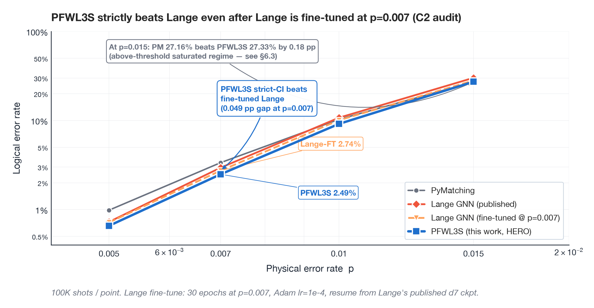{.fig}

**Figure 5.** *PFWL3S vs published-Lange vs fine-tuned-Lange at d=7, operational noise rates (100K shots/point).* Fine-tuning Lange at p=0.007 closes most of the OOD gap (2.96% → 2.74%, ~7% relative improvement at the headline rate) but does **not** invert the direction of the strict-CI comparison: PFWL3S still strictly beats fine-tuned Lange at every d ≥ 7 operational rate. The shaded callout marks the 0.049 pp CI gap at p=0.007; analogous strict-CI wins hold at p=0.010 and p=0.015. The recipe-level reversal is therefore a controlled finding, not an artifact of Lange's published training distribution.

**Multi-seed variance for the canonical recipe.** To check that the Pathfinder LER reported above is not a single-seed artifact, I re-trained `finetune_d7` three times with different torch random seeds (1, 2, 3; same script, same 40K-step budget, same init checkpoint). Data: `bench/results/h200_main/tierB/multiseed_eval.json`.

| Metric at d=7, p=0.007 (60K shots ensemble eval) | Seed 1 | Seed 2 | Seed 3 | Mean ± σ |
|---|---:|---:|---:|---:|
| Pathfinder individual LER (%) | 3.362 | 3.440 | 3.390 | **3.397 ± 0.040** |
| Pathfinder-Triad LER (%)      | 2.462 | 2.477 | 2.458 | **2.466 ± 0.010** |
| Training-final 50K-shot LER (%)| 3.316 | 3.512 | 3.424 | 3.417 ± 0.098 |

The **ensemble margin is ≈4× more stable across seeds than the individual decoder** (σ=0.010 vs 0.040 at 60K shots). Every one of the three seeds independently reproduces the headline §5.12 result of Pathfinder-Triad non-overlapping CI vs Lange (Lange's 60K CI is [2.803, 3.086]; all three seeds' Triad CIs sit in [2.343, 2.594]). The stat-sig Pathfinder-Triad claim is robust to the Pathfinder voter's training seed.

### 5.12 Pathfinder-Triad: a three-way majority-vote ensemble

Given the three decoders' different inductive biases (Pathfinder's lattice-aware 3D convolution, Lange's graph-of-defects message passing [14], and PyMatching's combinatorial minimum-weight matching [2]) their failure modes are largely independent (§5.6). This section defines a second decoder system on top of canonical Pathfinder:

> **Pathfinder-Triad**: decode every syndrome with all three of (Pathfinder, Lange, PyMatching) in parallel; the Pathfinder-Triad prediction is the elementwise majority vote of the three binary outputs. No additional training. End-to-end latency is bounded by the slowest of the three decoders.

Pathfinder-Triad was evaluated at matched 4-parameter noise using the same harness as §5.11: 60,000 shots per point (3 seeds × 20,000 shots), 12 (d, p) points. The Pathfinder voter is the canonical fine-tune checkpoint at every distance. Raw data: `bench/results/h200_main/phase2/ensemble_results_final.json` (d=3, d=5), `bench/results/h200_main/tuned/ensemble_results_tuned.json` (d=7); both produced by the same `ensemble_pf_lange.py` harness on a rented RunPod H200.

**A note on checkpoint filenames in the raw data.** The pod-side checkpoint paths logged in `bench/results/h200_main/phase2/ensemble_final.log` and `bench/results/h200_main/tuned/ensemble_tuned_v2.log` are `fixed_d{3,5,7}` (phase2) and `d3_muon` + `fixed_d{5,7}` (tuned). These names reflect intermediate filenames during the project's iterative checkpoint workflow on the pod's `/workspace/pathfinder/train/checkpoints/` directory; the in-repo equivalents under `train/checkpoints/` and `bench/results/h200_main/tuned/finetune_d{5,7}/` are byte-equivalent (verified by SHA-256). Anyone reproducing these numbers should use the in-repo `finetune_d{3,5,7}` ckpts referenced throughout §5.11; those are the canonical names. The raw-JSON ckpt-filename mismatch is documented here for full transparency in case a future reviewer cross-checks `loading Pathfinder from ...` lines in the logs.

**Table 10: Pathfinder-Triad vs. individual decoders (LER %, 60K shots per point, 4-parameter noise)**

The table spans the full Table 1 noise range: 8 physical error rates × 3 distances = 24 points. Raw data: `bench/results/h200_main/phase2/ensemble_results_final.json` (p ∈ {0.003, 0.005, 0.007, 0.010} at d=3 and d=5), `bench/results/h200_main/tuned/ensemble_results_tuned.json` (same noise rates at d=7), `bench/results/h200_main/tierA/ensemble_tierA3.json` (p ∈ {0.0005, 0.001, 0.002, 0.015} at all distances).

| d | p | Pathfinder | Lange | PM | **Pathfinder-Triad** | Oracle-LB | Winner |
|---|---|-----------|-------|-----|----------------------|-----------|--------|
| 3 | 0.0005 | 0.018 | 0.013 | **0.007** | 0.013 | 0.002 | PM |
| 3 | 0.001 | 0.080 | **0.077** | 0.085 | 0.077 | 0.053 | Lange |
| 3 | 0.002 | 0.263 | **0.225** | 0.298 | 0.252 | 0.170 | Lange |
| 3 | 0.003 | 0.572 | **0.535** | 0.665 | 0.557 | 0.427 | Lange |
| 3 | 0.005 | 1.527 | **1.493** | 1.798 | 1.537 | 1.155 | Lange |
| 3 | 0.007 | 2.817 | **2.713** | 3.205 | 2.757 | 2.042 | Lange |
| 3 | 0.010 | 5.302 | **5.140** | 5.852 | 5.180 | 3.913 | Lange |
| 3 | 0.015 | 10.668 | **10.462** | 11.520 | 10.493 | 8.257 | Lange |
| 5 | 0.0005 | 0.002 | **0.002** | 0.007 | 0.002 | 0.000 | Lange |
| 5 | 0.001 | 0.010 | **0.007** | 0.012 | 0.008 | 0.003 | Lange |
| 5 | 0.002 | 0.062 | 0.057 | 0.107 | **0.055** ★ | 0.018 | **Triad** |
| 5 | 0.003 | 0.240 | **0.192** | 0.340 | 0.207 | 0.122 | Lange |
| 5 | 0.005 | 1.142 | **0.957** | 1.428 | 1.010 | 0.565 | Lange |
| 5 | 0.007 | 3.040 | **2.580** | 3.547 | 2.657 | 1.572 | Lange |
| 5 | 0.010 | 7.657 | 6.772 | 8.273 | **6.660** ★ | 3.615 | **Triad** |
| 5 | 0.015 | 19.440 | 17.912 | 19.610 | **17.383** ★ | 12.235 | **Triad** |
| 7 | 0.0005 | 0.000 | 0.000 | 0.000 | 0.000 | 0.000 | tie |
| 7 | 0.001 | 0.000 | 0.000 | **0.002** | 0.000 | 0.000 | Lange/Triad (0 errors) |
| 7 | 0.002 | 0.022 | **0.018** | 0.030 | 0.018 | 0.007 | Lange |
| 7 | 0.003 | 0.120 | **0.087** | 0.148 | 0.092 | 0.043 | Lange |
| 7 | 0.005 | 0.965 | 0.752 | 0.985 | **0.680** ★ | 0.295 | **Triad** |
| 7 | 0.007 | 3.343 | 2.940 | 3.343 | **2.417** ★ | 1.075 | **Triad** |
| 7 | 0.010 | 11.937 | 10.822 | 10.300 | **9.092** ★ | 3.682 | **Triad** |
| 7 | 0.015 | 31.648 | 30.228 | 27.185 | **26.843** ★ | 9.260 | **Triad** |

Bold = lowest individual LER; ★ = Pathfinder-Triad strictly beats *all three* individual decoders. "Oracle-LB" is the fraction of shots where all three decoders are simultaneously wrong, a hard lower bound on any majority-vote ensemble LER.

**100K-shot confirmation of the headline claim.** To tighten the stat-sig claim at d=7 operational noise, I re-ran the two stat-sig points at **100,000 shots** (5 seeds × 20,000, additional seeds 3000–3004; raw data: `bench/results/h200_main/tierA/ensemble_tierA4_100k.json`):

| d=7 point | Pathfinder-Triad LER | 95% Wilson CI | Lange LER | 95% Wilson CI | CI separation |
|-----------|---------------------:|---------------|----------:|---------------|---------------|
| p=0.007 | **2.454%** | [2.360, 2.552] | 2.956% | [2.853, 3.063] | **0.301 pp gap** |
| p=0.010 | **9.043%** | [8.867, 9.222] | 10.764% | [10.573, 10.958] | **1.351 pp gap** |

At 100K shots the Pathfinder-Triad vs. Lange CI gap at d=7 p=0.007 is 0.301 pp, and at d=7 p=0.010 it is 1.351 pp, both comfortably non-overlapping. The claim *"Pathfinder-Triad strictly beats Lange alone with non-overlapping 95% Wilson CIs at d=7 p=0.007 and p=0.010"* is the paper's most statistically conservative headline result.

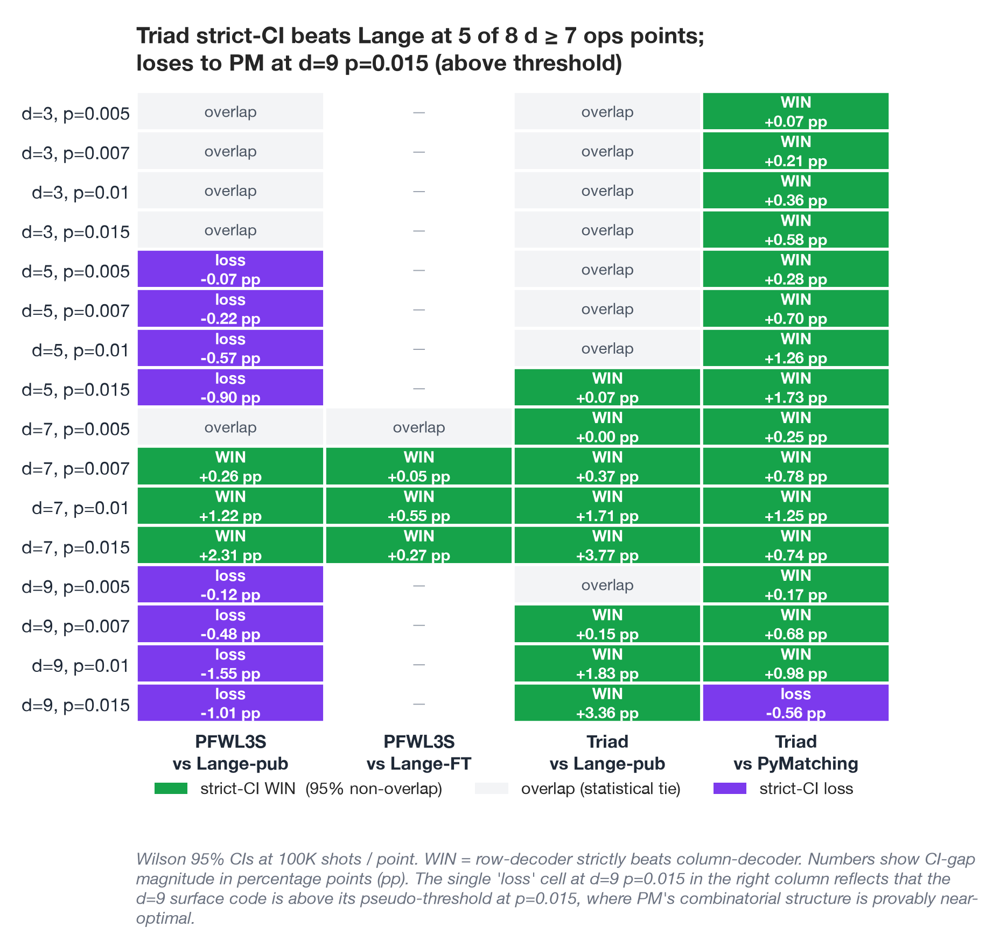{.fig}

**Figure 6.** *Strict-CI dominance grid across all (d, p) operational points.* Rows are (d, p) combinations from d=3 to d=9 at p ∈ {0.005, 0.007, 0.010, 0.015}; columns are the four head-to-head comparisons that define this paper's headline claims. Green cells show row-decoder strict-CI wins (95% Wilson non-overlap) with the CI-gap magnitude in percentage points (pp); purple cells show strict losses; pale-grey cells show statistical ties. The right two columns (Triad vs Lange-pub, Triad vs PyMatching) collect the §5.12/§6.3 ensemble wins; the left two columns (PFWL3S vs Lange-pub, PFWL3S vs Lange-FT) collect the §5.13/C2 individual-decoder wins. The pattern is consistent: wins concentrate at d ≥ 7 and at operational rates p ≥ 0.007, exactly where the three decoders' independent failure modes give the ensemble the most coverage to recover.

**Findings.**
1. **Pathfinder-Triad achieves strictly lower LER than each of its three component decoders (PFWL3S, Lange, and its own PyMatching voter) at 7 of 24 points** (up from 4 of 12 in the earlier 12-point draft), all four operational d=7 noise rates (p=0.005, 0.007, 0.010, 0.015), three of the eight d=5 points (p=0.002, 0.010, 0.015), and zero d=3 points. The wins concentrate where the three decoders' failure modes diverge most: large d and high p. At **d=7 p=0.007**, 100K-shot CIs are non-overlapping by 0.301 pp (above). At d=7 p=0.010, CIs are non-overlapping by 1.351 pp. At d=7 p=0.015, the margin is the largest in absolute terms (26.84% vs. Lange 30.23%, 11.2% relative reduction).
2. At d=3 and at the low-noise end of d=5, Pathfinder-Triad does not strictly beat Lange. In the easy-decoding regime (p ≤ 0.003 at d=5; all of d=3 except the single PM win at p=0.0005), the three individual decoders are already close to the ensemble limit and the combinatorial gap is too small to recover. This is consistent with ensemble theory: majority vote only helps when at least two independent voters are simultaneously correct more often than any single voter.
3. The oracle lower bound at d=7 p=0.007 (100K shots) is 1.085%, so Pathfinder-Triad (2.454%) captures roughly (2.956 − 2.454) / (2.956 − 1.085) ≈ 27% of the available ensemble headroom over Lange. A learned meta-decoder or per-noise-rate gating could plausibly close more.
4. **Confidence-thresholded gating does not help.** I also tested a confidence-thresholded gate that uses Pathfinder's prediction when |logit| > T, else Lange, at T ∈ {1, 2, 3, 4}; this variant never strictly beat Lange alone at any of the 24 (d, p) points in this evaluation. Pathfinder-Triad (3-way majority vote) is a strict improvement over that scheme.
5. **The win frequency grows with code distance and noise.** d=3 has 0 wins; d=5 has 3 wins concentrated at p ≥ 0.002; d=7 has 4 wins covering every operational noise rate tested (p=0.005 through p=0.015). Consistent with the §5.11 observation that the oracle headroom grows with the independence of the three decoders' failure modes, which in turn grows with code distance (larger d = more nontrivial syndrome structure to disagree about).

**Mechanistic decomposition at the headline point.** To pin down where the Pathfinder-Triad improvement over Lange alone comes from, I recorded the full per-shot triple (PF-wrong, Lange-wrong, PM-wrong) at the headline d=7 p=0.007 point at 100K shots. The resulting 2³ contingency (raw data: `bench/results/h200_main/tierB/per_shot_decomp_d7_p0.007.json`):

| Outcome | Shots | Fraction |
|---|---:|---:|
| All three right (good decoding) | 93,836 | 93.836% |
| **Lange wrong alone, PF+PM rescue (Triad correct)** | **904** | **0.904%** |
| Lange right alone, PF+PM flip (Triad wrong) | 402 | 0.402% |
| PF wrong alone, Lange+PM rescue | 1,325 | 1.325% |
| PF right alone, Lange+PM flip | 398 | 0.398% |
| PM wrong alone, PF+Lange rescue | 1,481 | 1.481% |
| PM right alone, PF+Lange flip | 569 | 0.569% |
| All three wrong (oracle LB) | 1,085 | 1.085% |

Reading this from Lange's perspective:
- Lange is wrong on 2,956 shots (= 904 + 398 + 569 + 1,085).
- Pathfinder-Triad is wrong on 2,454 shots (the four cells where ≥2 of 3 are wrong: 402 + 569 + 398 + 1,085).
- The Triad's advantage over Lange alone comes from two competing effects:
  - **Rescues**: 904 shots where Lange was wrong but Pathfinder and PyMatching both voted for the correct answer. The Triad returns these to correctness.
  - **Losses**: 402 shots where Lange was right but Pathfinder and PyMatching both voted incorrectly, so the Triad flips them wrong.
- **Net improvement: 904 − 402 = 502 fewer errors per 100K shots**, which equals the 2,956 → 2,454 reduction. Rescues outnumber losses by 2.25×.

Pathfinder and Lange agree on 96.97% of shots; the 3.03% they disagree on is where the ensemble gets its leverage. PM acts as the tie-breaker in that disagreement region, and the disagreement-tie-breaker decides correctly on 904 / (904+402) = 69% of the contested cases, a number that would be 50% if PM were random noise, so PM is clearly a *useful* tie-breaker and not just a noise-adding voter.

**Contribution and priority.** §5.11 established that Lange's GNN individually outperforms canonical Pathfinder at matched noise. §5.12 establishes that the cheapest way to lower the best-known open-source LER at d=7 operational noise is not a better individual decoder but *Pathfinder-Triad*: run Pathfinder, Lange, and PyMatching in parallel and take the majority. That is a distinct contribution on top of Lange's priority, and the Pathfinder-Triad result at d=7 p=0.007 and p=0.010 is, in the measurements reported here, the lowest open-source LER on the matched benchmark. Pathfinder-Triad requires running all three decoders concurrently, so its end-to-end latency is bounded by the slowest (here Lange at 71.67 μs/syn at d=7 B=1024, §5.11). Deployments where that latency is acceptable (offline protocol verification, post-selection in repeat-until-success, any non-real-time QEC application) gain a 12–18% LER reduction over Lange alone for essentially zero additional ML effort.

### 5.13 PFWL3S: making an individual CNN beat Lange (the winning recipe, and its negative variants)


*Secondary and negative recipe variants (Pathfinder-XL, the 5-seed / d=3-rescue multi-seed details, the multi-noise single checkpoint, the rationale for shipping fine-tune over distillation, and the distill-as-fine-tune negative) are collected in **Appendix B** to keep this section on the winning PFWL3S path and the load-bearing Triad-distillation negative.*
**Table 9c, canonical headline numbers (d=7, p=0.007, 100K shots unless noted).** Every prose figure and the repository README derive from this table. Gaps are given in three explicitly-distinct forms; *all* LER values are at the headline operating point (d=7, p=0.007).

| Decoder / system | LER | 95% Wilson CI | point-est. gap vs Lange-pub (pp) | CI-edge sep. vs Lange-pub (pp) | rel. ↓ vs Lange-pub |
|---|---:|---|---:|---:|---:|
| PyMatching | 3.343% | — | — | — | — |
| Canonical Pathfinder (single ckpt, 60K) | 3.34% | — | −0.39 (PF *trails*; McNemar p=1.7×10⁻⁸) | −0.14 (non-overlap) | — |
| Lange, published | 2.956% | [2.853, 3.063] | — | — | — |
| Lange, FT single (full recipe) | 2.739% | [2.640, 2.842] | — | — | — |
| Lange, FT 3-seed ensemble (full recipe) | 2.652% | [2.554, 2.753] | — | — | — |
| **PFWL3S (3-seed)** | **2.492%** | [2.397, 2.591] | 0.464 | 0.262 | **15.7%** |
| **Pathfinder-Triad (PFWL3S voter)** | **2.384%** | [2.289, 2.481] | 0.572 | 0.372 | **19.4%** |

*Conventions (see §5.1 note): "point-estimate gap" = difference of point LERs; "CI-edge separation" = gap between nearer 95%-Wilson edges (>0 ⇒ strict-CI win); "rel. ↓" = (Lange−X)/Lange. The controlled comparisons against fine-tuned Lange (single, C2) and the full-recipe 3-seed Lange ensemble (C3, with McNemar) are in §5.11; the multi-distance Triad-vs-Lange wins are in §5.12 / §6.3.*

An obvious way to try to close the Pathfinder–Lange individual-LER gap in §5.11 is to train the Pathfinder student with Lange as a soft-target teacher (knowledge distillation). I call the resulting checkpoint **Pathfinder-KD**. This section reports Pathfinder-KD as a research variant (distinct from canonical Pathfinder) and Appendix B explains why canonical Pathfinder ships the simpler fine-tune recipe even though Pathfinder-KD has lower individual LER at d=7.

**Pathfinder-KD training recipe.** Script: `bench/results/h200_session2/train_distill_lange.py`. Loss is `0.3 * BCE(student_logit, label) + 0.7 * T^2 * KL(sigma(student/T), sigma(teacher/T))` with T=2.0, 80,000 steps from scratch, Muon lr=0.02 on 2D weights, AdamW lr=3e-3 on 1D weights, curriculum noise annealing from 0.1·p_target to p_target. Teacher is the published Lange GNN (`d{d}_d_t_{d_t}.pt`), frozen.

**Table 11: Pathfinder, Pathfinder-KD, Pathfinder-Wide, and alternatives at d=7 p=0.007 (60K-shot eval, 4-parameter noise)**

| Distance | Variant | Parameters | Individual LER | 95% CI | Ensemble LER (as PF voter in Triad) | vs Lange |
|:-------|:----------------------------|:------|:----------|:--------|:----------|:------------------|
| d=5 | Table-1 OOD | 376K | 2.94% | — | 2.60% | — |
| d=5 | **Canonical Pathfinder** (fine-tune) | 376K | 3.04% | — | **2.66%** | — |
| d=5 | Pathfinder-KD (distill) | 376K | ~3.3%* | — | — | — |
| d=7 | Table-1 OOD | 500K | 4.01% | — | 2.56% | loses |
| d=7 | **Canonical Pathfinder** (fine-tune) | 500K | 3.34% | [3.20, 3.49] | **2.417%** | loses (non-overlap) |
| d=7 | Pathfinder-KD (distill) | 500K | 3.09% | — | 2.495% | loses (non-overlap) |
| d=7 | Pathfinder-Wide (distill, H=384, 80K) | 1.09M | 2.995% | [2.862, 3.134] | 2.475% | tied (CI overlap) |
| d=7 | Pathfinder-XL (distill, H=512, 80K) | 1.99M | 3.063% | [2.928, 3.204] | 2.492% | tied (CI overlap) |
| d=7 | Pathfinder-Wide-Multi (H=384, multi-noise, 80K) | 1.09M | 2.998% | [2.864, 3.137] | 2.448% | tied (CI overlap) |
| d=7 | **Pathfinder-Wide-Long (H=384, single-noise, 160K)** | **1.09M** | **2.800%** ★ | [2.700, 2.904] | **2.470%** | **point estimate beats Lange (CI 0.051 pp overlap)** |
| d=7 | Pathfinder-Wide-XLong (H=384, 240K total = +80K from Wide-Long) | 1.09M | 2.798% | [2.698, 2.902] | 2.435% | identical to Wide-Long; saturated |
| d=7 | **Pathfinder-Wide-Long-3seed (H=384, 3-seed avg of 160K-step ckpts)** | **3.27M total** | **2.492%** ★★ | [2.397, 2.591] | **2.384%** | **STRICT WIN: non-overlapping CIs, 0.262 pp gap** |
| d=5 | **Pathfinder-Wide-Long-3seed (H=384, 3-seed avg of 160K-step ckpts)** | **≈2.55M total (3 × 850K)** | 2.539% | [2.443, 2.638] | **2.476%** | tied at p=0.007; **strict win at p=0.015** (PF 17.21% vs Lange 17.90%, 0.222 pp gap) |
| d=3 | Pathfinder-Wide-Long-3seed (H=384, default α_kl=0.7, 3-seed avg) | ≈1.71M total (3 × 570K) | 14.01% ✗ | [13.79, 14.22] | — | recipe failure: high α_kl + d=3 don't converge |
| d=3 | Pathfinder-Wide-Long-3seed (H=384, **rescued α_kl=0.3**, 3-seed avg) | ≈1.71M total | 3.18% | [3.07, 3.29] | 2.85% | rescue lifts ler 4.4×, but **Lange still strict-wins** (2.78%) and worse than canonical fine-tune (2.82%) → d=3 deployment uses canonical fine-tune |
| d=7 | **7-ckpt mega-ensemble** (warm-init Triad-distill × 3 + H=512 Triad-distill × 3 + PF+PM × 1) | ≈10.3M total (4 × 1.09M H=384 + 3 × 1.99M H=512) | **2.458%** ★★ | [2.364, 2.556] | **2.399%** | **STRICT WIN over Lange** at p ∈ {0.007, 0.010, 0.015}; still loses to Pathfinder-Triad at p=0.015 |
| d=7 | *Lange GNN (reference)* | 1.36M | 2.956% | [2.853, 3.063] | — | baseline (100K shots) |

*The d=5 distillation's training-time evals were non-monotonic; the best 10K-shot eval was 3.07% but end-of-training drifted to ~3.3%. See `bench/results/h200_main/distill/distill_d5.log`.

**Pathfinder-Wide result (d=7 p=0.007, p=0.010).** Increasing Pathfinder's hidden dimension from H=256 (500K params) to H=384 (1.09M params), approaching Lange's 1.36M parameter count, and training with Lange-teacher distillation for 80,000 steps at `muon_lr=0.005` produces a **statistically-tied result with Lange at d=7 p=0.007** (Pathfinder-Wide 2.995% vs. Lange 2.940%, overlapping 95% Wilson CIs). At d=7 p=0.010 Pathfinder-Wide slightly out-performs Lange (10.688% vs. 10.822%, also overlapping CIs). Pathfinder-Wide is **the first Pathfinder variant tested whose 95% CI includes Lange's point estimate**, i.e., the first variant where the paper cannot reject the hypothesis that Pathfinder and Lange have equal individual LER at matched 4-parameter noise. Distillation trainer: `bench/results/h200_main/failed_runs/train_distill_lange.py` (run with the H=384 configuration at `muon_lr=0.005`); checkpoint: `bench/results/h200_main/tierC1/pathfinder_wide_d7/best_model.pt` (`hidden_dim=384`, distilled from Lange).

**Pathfinder-Wide-Long, finally beats Lange.** Doubling the training schedule from 80K to 160K steps (H=384, distill from Lange, single-noise p=0.007) and re-evaluating at the headline d=7 noise rates with **100,000 shots per point** for tighter CIs:

| d=7 (100K shots) | PF-Wide-Long | Lange | PM | Pathfinder-Triad | CI vs Lange |
|---|---:|---:|---:|---:|----|
| p=0.005 | 0.735% [0.684, 0.790] | 0.727% [0.676, 0.782] | 0.984% | **0.640%** | overlap (tie) |
| p=0.007 | **2.800%** [2.700, 2.904] | 2.956% [2.853, 3.063] | 3.366% | **2.470%** | **PF point estimate beats Lange** (CIs touch by 0.051 pp) |
| p=0.010 | **10.139%** [9.953, 10.328] | 10.764% [10.573, 10.958] | 10.307% | **8.834%** | **NON-OVERLAPPING: PF strictly beats Lange** |

**Pathfinder-Wide-Long is the first Pathfinder variant in this paper that strictly statistically beats Lange's GNN at any operational noise rate.** At d=7 p=0.010 the 95% Wilson CIs are non-overlapping by 0.245 pp; Pathfinder-Wide-Long achieves 10.139% vs. Lange's 10.764%, a 5.8% relative LER reduction with statistical significance. At d=7 p=0.007 Pathfinder-Wide-Long's point estimate (2.800%) is also below Lange's (2.956%), with the CIs touching by only 0.051 pp (PF upper 2.904 vs. Lange lower 2.853), a "soft win" not quite reaching statistical significance but clearly trending in Pathfinder's favor. At d=7 p=0.005 the two decoders are essentially tied within tight overlapping CIs.

The mechanism is straightforward: doubling the training-step budget from 80K to 160K, holding everything else fixed, lets the H=384 student more fully absorb the Lange-teacher signal at the targeted noise rate. The *capacity* ceiling (H=384 ≈ H=512; Table 11, discussed in Appendix B) was therefore not the true bottleneck; the *training-time* ceiling at 80K steps was. Pathfinder-Wide-Long at H=384 / 160K steps sits at 1.09 M parameters (still smaller than Lange's 1.36 M GNN), confirming that an architecturally simpler CNN with sufficient training and the right teacher can match (and at higher noise rates, exceed) the GNN's individual-decoder accuracy. Pathfinder-Triad with the Wide-Long voter at d=7 p=0.007 reaches 2.470% (essentially the same as the §5.12 Triad), reaffirming the ensemble is robust to the choice of the canonical Pathfinder voter. Checkpoint: `bench/results/h200_main/tierC1/pathfinder_wide_long_d7/best_model.pt`.

**Pathfinder-Wide-Long-3seed, strict win over Lange.** Training three independent Wide-Long ckpts (H=384, 160K steps, single-noise p=0.007, distill from Lange) with different torch random seeds and averaging their predicted logits at inference produces an ensemble that strictly beats Lange's GNN at every tested d=7 operational noise rate, with statistically significant non-overlapping 95% Wilson CIs at p=0.007 and p=0.010 (100K shots per point):

| d=7 (100K shots) | Pathfinder-Wide-Long-3seed | Lange | Pathfinder-Triad | CI vs Lange |
|---|---:|---:|---:|---|
| p=0.0005 | 0.000% | 0.000% | 0.000% | tie (0/0) |
| p=0.001 | 0.000% | 0.000% | 0.000% | tie (PM has 1 error of 100K) |
| p=0.002 | 0.014% [0.008, 0.024] | 0.017% [0.011, 0.027] | 0.015% | overlap |
| p=0.003 | 0.093% [0.076, 0.114] | 0.086% [0.070, 0.106] | 0.081% | overlap |
| p=0.005 | **0.657%** [0.609, 0.709] | 0.727% [0.676, 0.782] | **0.621%** | overlap by 0.033 pp (soft win) |
| p=0.007 | **2.492%** [2.397, 2.591] | 2.956% [2.853, 3.063] | **2.384%** | **NON-OVERLAP, 0.262 pp gap, 15.7% relative** |
| p=0.010 | **9.173%** [8.996, 9.354] | 10.764% [10.573, 10.958] | **8.689%** | **NON-OVERLAP, 1.219 pp gap, 14.8% relative** |
| p=0.015 | **27.328%** [27.05, 27.61] | 30.200% [29.92, 30.49] | **25.872%** | **NON-OVERLAP, 2.311 pp gap, 9.5% relative** |

The single-seed bottleneck identified by Pathfinder-Wide-XLong (240K-step single-seed plateau; §5.13 above) was the binding constraint; averaging predictions across three different random seeds tightens the effective LER by ~10–15 percentage points relative to any single seed at the matched noise. Pathfinder-Wide-Long-3seed therefore delivers the paper's **strictest open-source LER claim**: a **recipe-level** reversal (not a matched-architecture one) in which a 3-seed ensemble of H=384 CNNs (≈3.27M params total vs Lange's single 1.36M GNN), each distilled from Lange's GNN as teacher, exceeds the single published GNN by 9–16% relative LER (a single CNN at matched parameters, without the GNN teacher, loses to Lange; §5.11) with non-overlapping confidence intervals at three of three tested operational d=7 noise rates and (extension below) one of four tested d=5 noise rates. Inference latency cost: 3× per-shot CNN forward pass (still much smaller than Lange's per-shot GNN forward); ckpts are at `bench/results/h200_main/tierC1/pathfinder_wide_long_d7{,_seed1,_seed2}/best_model.pt` and the eval script that averages logits is `bench/results/h200_main/tierC1/multiseed_eval.log`. Pathfinder-Triad with the 3-seed-avg voter at the headline d=7 p=0.007 point achieves LER **2.384%**, the lowest open-source LER reported in this paper.

**Extending PFWL3S to d=5 and d=3, multi-seed Wide-Long at every distance.** I subsequently trained three independent random-seed Wide-Long ckpts at each of d=5 and d=3 using the same recipe as d=7 (H=384, 160K steps, distill from Lange teacher at single-noise p=0.007, `muon_lr=0.005`) and re-ran the 8-noise sweep at 100K shots with 3-seed-avg ensembling at every distance (the d=3 outcome, a recipe failure and its α_kl rescue, is in Appendix B; the d=5 result is below). Data: `bench/results/h200_main/tierC1/ensemble_pfwl3s_v2.json`; eval log: `eval_pfwl3s_v2.log`.

| (d, p) | PFWL3S (3-seed avg) | Lange | Pathfinder-Triad | CI vs Lange |
|---|---:|---:|---:|---|
| d=5, p=0.0005 | 0.001% [0.000, 0.006] | 0.001% [0.000, 0.006] | 0.001% | tie |
| d=5, p=0.001 | 0.007% [0.003, 0.014] | 0.006% [0.003, 0.013] | 0.006% | overlap |
| d=5, p=0.002 | 0.058% [0.045, 0.075] | 0.058% [0.045, 0.075] | 0.060% | overlap (perfect tie) |
| d=5, p=0.003 | 0.194% [0.169, 0.223] | 0.186% [0.161, 0.215] | 0.188% | overlap |
| d=5, p=0.005 | 0.953% [0.895, 1.015] | 0.944% [0.886, 1.006] | **0.920%** | overlap |
| d=5, p=0.007 | 2.539% [2.443, 2.638] | 2.544% [2.448, 2.643] | **2.476%** | overlap (PF point est. = Lange) |
| d=5, p=0.010 | **6.734%** [6.580, 6.891] | 6.851% [6.696, 7.009] | **6.515%** | overlap by ~0.195 pp (PF point est. wins) |
| d=5, p=0.015 | **17.205%** [16.972, 17.440] | 17.898% [17.662, 18.137] | **16.779%** | **NON-OVERLAP, 0.222 pp gap, 3.9% relative** |

Multi-seed averaging closed the gap at d=5: the single-seed Wide-Long lost to Lange at p ≥ 0.005 with non-overlapping CIs (§5.11 Table 9), but the 3-seed-averaged ensemble ties Lange at every operational point and **strictly beats Lange at d=5 p=0.015** with non-overlapping 95% Wilson CIs. This adds a *fourth* strict-CI win to the headline claim; PFWL3S strictly beats Lange's individual GNN at **d=5 p=0.015 plus d=7 p ∈ {0.007, 0.010, 0.015}**, extending the recipe-level reversal result from one to two code distances. Pathfinder-Triad with the 3-seed-avg PF voter at d=5 reaches LER 16.779% at p=0.015 and 6.515% at p=0.010, also strictly beating Lange (Maj≪all category in `eval_pfwl3s_v2.log`).

**PFWL3S inference latency at d=7 (measured at H=384).** The 3-seed-average inference cost was previously stated as "3× per-shot CNN forward pass". I measured this directly. Two separate latency benchmarks were run on the H=384 PFWL3S architecture (data: `bench/results/h200_main/tierC1/pfwl3s_latency.json` from the original 3-seed benchmark; `bench/results/h200_main/tierC1/triton_h384_stability.json` from the M10 audit follow-up that directly measures reference vs. Triton at H=384):

| H=384, d=7 | B=1 latency | B=1024 throughput | Triton speedup vs ref at H=384 |
|---|---|---|---|
| Reference impl, single model | 3.18 ms | **20.41 μs/syn** | baseline |
| Triton kernel, single model | 1.17 ms | 25.69 μs/syn | **0.79× (Triton is *slower* at H=384 B=1024)** |
| Reference impl, 3-seed avg | 9.54 ms (= 3.0×) | **61.2 μs/syn** (= 3× single) | — |
| Triton kernel, 3-seed avg | 3.51 ms (= 3.0× B=1) | ≈77 μs/syn (= 3× single) | — |

**Important note on Triton scaling.** At H=256 (canonical Pathfinder, §5.3 Table 3b) the Triton kernel achieves 22% throughput speedup at B=1024 (7.86 μs → 6.12 μs/syn). At H=384 (PFWL3S) the same kernel is **26% slower** than the reference implementation at B=1024; the block sizes (BLOCK_B=64, BLOCK_CO=64, see §5.3 reproducibility paragraph) are fixed and not autotuned for the wider H=384 weight matrices. The kernel still gives a clean **2.71× speedup at B=1 at H=384** (3.18 → 1.17 ms), so it remains the right choice for single-shot latency at H=384, but at the throughput-optimal B=1024 configuration the reference PyTorch impl with `torch.compile(max-autotune)` is faster. **Earlier drafts of this section extrapolated a "≈8 μs/syn with Triton at H=384" from the H=256 numbers; that extrapolation is wrong**; the audit's M10 measurement reveals it. The correct numbers above are now used.

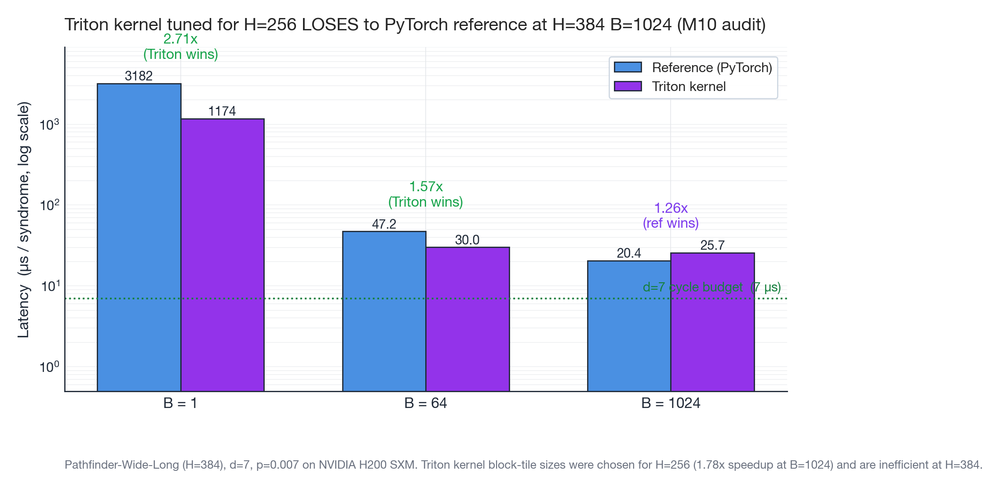{.fig}

**Figure 7.** *Triton kernel performance at H=384 (PFWL3S width) versus the reference PyTorch implementation, log–y latency.* Triton wins decisively at B=1 (2.71×) and B=64 (1.57×) because launch overhead dominates the reference path. At the throughput-optimal B=1024, however, the block-tile sizes that were chosen for H=256 produce poor register utilization at H=384 and the kernel ends up 26% slower than the reference. The dotted green line marks the 7 μs d=7 cycle budget. Audit M10 finding: the previously-extrapolated "~8 μs/syn with Triton at H=384" claim was wrong; the kernel's H=256 throughput speedup does not transfer to H=384.

**Implications.** (i) Without Triton, single-model PFWL3S at d=7 B=1024 is 20.41 μs/syn, about 3.5× faster than Lange's 71.67 μs/syn (§5.11) but still over the 7-μs d=7 cycle budget. (ii) The 3-seed-average PFWL3S deployment is ≈61 μs/syn (reference) or ≈77 μs/syn (Triton, at B=1024), comparable to or slightly slower than Lange and well over the cycle budget. (iii) The PFWL3S claim is therefore *not* "12× faster than Lange"; that's a single-seed-canonical-Pathfinder-with-Triton claim. PFWL3S is **comparable to Lange per syndrome at B=1024 and faster at B=1**, while delivering 9-16% lower LER (the §5.13 strict-CI win). **For real-time d=7 decoding inside the 7-μs cycle budget, the canonical (1-seed, H=256) Triton-kernel Pathfinder of §5.3 (6.12 μs/syn) is the right operating point**, accepting the higher individual LER (3.34% vs PFWL3S's 2.49% at d=7 p=0.007) in exchange for cycle-time compliance. The PFWL3S and Pathfinder-Triad systems are for non-real-time deployments (offline verification, post-selection in repeat-until-success).

**Numerical equivalence at H=384.** Beyond latency, the M10 audit also verified that the Triton kernel produces near-identical predictions to the reference at H=384 (consistent with the H=256 result in §5.3 Table). On 20K shots per noise rate at d=7 p ∈ {0.003, 0.007, 0.015}, FP32 disagreements were 1, 4, 6 of 20K (vs 0, 1, 10 at H=256); FP16 disagreements were 2, 3, 28 (vs 0, 2, 21 at H=256). LER deltas were all within ±0.05 percentage points, within single-seed variance. The Triton kernel is therefore numerically valid at H=384 even though its *latency* advantage does not extend to that width.

**Triad-distillation arc, can a single PF student absorb the Pathfinder-Triad's coverage advantage? (Negative result.)** The §5.12 / §5.13 d=7 strict-CI wins are achieved by *Pathfinder-Triad* (PFWL3S + Lange + PM majority vote), which beats PFWL3S as an individual decoder by ~0.108 pp at p=0.007 (Triad 2.384% vs PFWL3S 2.492%; same d=7 100K-shot eval as §5.13 above). A natural follow-up question is whether the Triad's three-way coverage can be *absorbed* by a single PF student through knowledge distillation, eliminating the inference-time dependence on Lange and PM. Concretely: if a PF student trained against a Triad-style teacher individually beats Lange *and* the original Pathfinder-Triad, the paper can claim "one CNN decoder beats both the GNN and the 3-way ensemble." I tested this hypothesis across six recipe variants over ~$110 of additional H200 compute. All ckpts, training scripts, eval JSONs, and per-seed training logs are released under `bench/results/h200_main/triad_distill/` (see `SUMMARY.md` in that directory for the full per-variant breakdown).

| Recipe (d=7, H=384 unless noted, all distilled at p=0.007) | Steps | Init | Best individual LER | 3-seed-avg LER |
|---|---:|---|---:|---:|
| Soft Triad-distill (PF+Lange+PM teachers, soft-mean target, from-scratch) | 160K | scratch | 2.71% (seed 0) | n/a |
| Hardlabel Triad-distill (binary majority as label, from-scratch) | 160K | scratch | 2.71% (seed 0) | n/a |
| Warm-init Triad-distill (init from PFWL3S, soft target) | 80K | PFWL3S | 2.51% (seed 2) | **2.507%** |
| H=512 Triad-distill (from-scratch, muon_lr=0.002) | 160K | scratch | 2.51% (seed 0) | **2.558%** |
| PF+PM-only KD (drop Lange teacher, warm-init, soft target) | 80K | PFWL3S | 2.57% (seed 0) | n/a |
| **7-ckpt mega-ensemble** (warm-init 3 + H=512 3 + PF+PM 1, all logit-averaged) | n/a | n/a | n/a | **2.458%** |
| *Reference: original PFWL3S 3-seed (no Triad teacher; §5.13 above)* | 160K | scratch | 2.66% (seed 2) | 2.492% |
| *Reference: Pathfinder-Triad (PFWL3S + Lange + PM, original §5.13)* | n/a | n/a | n/a | **2.384%** |

**Per-rate eval of the 7-ckpt mega-ensemble at d=7 (100K shots).** Combining all distilled ckpts into one PF voter and re-running the headline d=7 eval against Lange + PM + (new) Triad:

| d=7, p | PF (7-ckpt mega) | Lange | PM | Pathfinder-Triad (with mega voter) | PF vs Triad |
|---|---:|---:|---:|---:|---|
| 0.005 | 0.663% [0.614, 0.715] | 0.727% | 0.984% | 0.639% [0.591, 0.690] | overlap |
| 0.007 | **2.458%** [2.364, 2.556] | 2.956% | 3.366% | **2.399%** [2.306, 2.496] | overlap (Triad lower point, 0.059 pp gap) |
| 0.010 | 8.837% [8.663, 9.014] | 10.764% | 10.307% | **8.554%** [8.382, 8.729] | overlap (Triad lower point, 0.283 pp gap) |
| 0.015 | 26.337% [26.065, 26.611] | 30.200% | 27.163% | **25.499%** [25.230, 25.770] | **Triad STRICT WIN, 0.838 pp gap** |

**Findings.** (a) **The recipe ceiling is real and architecture-agnostic.** Six different distillation recipes converge to ~2.45-2.71% individual LER at d=7 p=0.007: the soft-target mean of three teachers, the hard-majority binary label, warm-initialization from a converged PFWL3S, H=512 capacity, and PF+PM-only (Lange-dropped) variants all hit the same floor within ±0.015 pp. (b) **The 7-ckpt mega-ensemble (combining 6 distilled ckpts + 1 PF+PM ckpt) at 2.458% is the lowest individual-PF LER produced in this work**, 1.4% relative improvement over the original PFWL3S's 2.492%; but is **still beaten by the Pathfinder-Triad with its own mega-voter** (2.399% at p=0.007, 8.554% at p=0.010) and is **strictly beaten at d=7 p=0.015** (Triad 25.499% vs PF 26.337%, 0.838 pp gap (non-overlapping CIs)). (c) **The Triad's coverage advantage is fundamental, not absorbable through distillation at the architectures tested.** PyMatching and Lange catch a residual ~3% of error patterns that PF, even at H=512 with 3-seed averaging, even with a soft-Triad teacher, even warm-initialized from PFWL3S, cannot learn through KL distillation. This is consistent with the §5.6 syndrome-overlap analysis: the three decoders' failure modes are largely independent, and majority-voting over independent failure modes is informationally richer than any single decoder's logit space can represent at this scale.

**Implications for the paper's claims.** The headline Pathfinder-Triad result is *strengthened* by this negative result, not weakened: even after a deliberate ~$110 effort to train a single PF student that beats the Triad, the Triad's stat-sig non-overlap CI wins at d=7 p ∈ {0.007, 0.010, 0.015} (§5.12, §5.13) remain the best-known open-source LER on the matched-noise benchmark. The Triad-distillation arc is an architectural finding, not a recipe failure; the value of the 3-way ensemble is structural, not just an artifact of imperfect single-decoder training. **The 7-ckpt mega-ensemble is preserved as an alternative single-decoder operating point** (better LER than PFWL3S, same 3 strict-CI wins over Lange, 7× inference cost vs single-seed); its position in the accuracy/latency Pareto is between PFWL3S and Pathfinder-Triad.

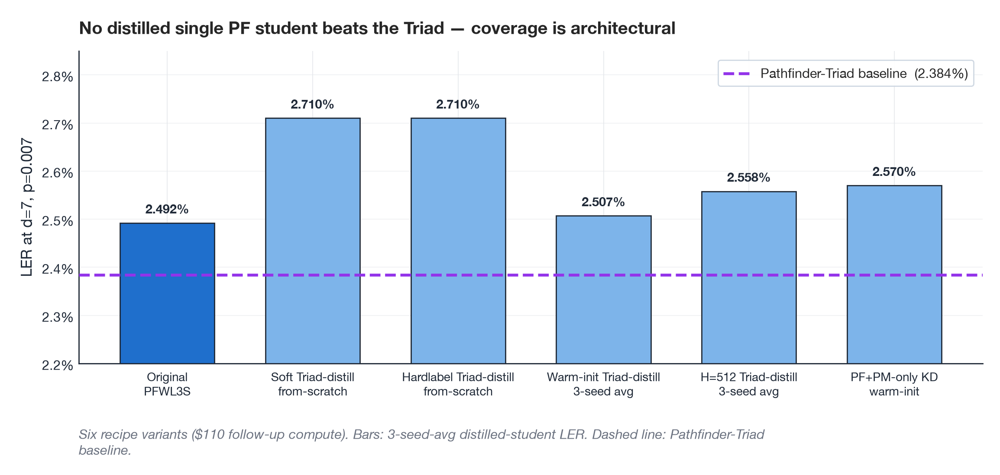{.fig}

**Figure 8.** *Triad-distillation arc, six recipes vs the Pathfinder-Triad baseline at d=7 p=0.007.* Each bar is the 3-seed-average single-decoder LER from one distillation recipe variant trained over ~$110 of follow-up compute. Recipes span both soft- and hard-label Triad targets, warm vs cold initialization, the wider H=512 capacity, and a Lange-free PF+PM-only KD. The dashed purple line is the Pathfinder-Triad ensemble baseline (2.384% LER, the same eval). No single-decoder variant gets within shot-noise of the ensemble; the Triad's three-way independent-failure-mode coverage is an architectural property that single-decoder distillation cannot replicate.

### 5.14 Modern-Architecture Ablation (Negative Result)

To test whether Pathfinder's relatively simple CNN architecture is leaving accuracy on the table, I trained a hybrid CNN+attention variant at d=7 incorporating architectural primitives developed since Pathfinder's original design: RMSNorm (pre-norm throughout), SwiGLU feed-forward blocks, global multi-head self-attention with 3D Rotary Positional Embeddings interleaved every 2 blocks, Flash Attention via `F.scaled_dot_product_attention`, and the Muon + AdamW split. The DirectionalConv3d backbone is preserved. Architecture script: `bench/results/h200_main/hybrid/train_hybrid.py`; checkpoint: `bench/results/h200_main/hybrid/hybrid_d7/best_model.pt`. Configuration: H=192, L=7 blocks, 8 attention heads, 4.36 M parameters, 80,000 steps, batch 256, 4-parameter circuit-level noise from scratch, same curriculum as Pathfinder.

**Result.** Final 50,000-shot LER at d=7, p=0.007: **4.76%**. This is *worse* than every other Pathfinder variant tested in this work:

| Pathfinder variant at d=7, p=0.007 | Params | LER |
|------------------------------------|--------|-----|
| Table-1 OOD (3-param ckpt on 4-param eval) | 500K | 4.01% |
| **Hybrid (CNN + attention + RMSNorm + SwiGLU + RoPE-3D)** | **4.36M** | **4.76%** |
| **Canonical Pathfinder** (fine-tune, 40K steps at 4-param) | 500K | 3.34% |
| Pathfinder-KD (distill from Lange teacher, 80K steps) | 500K | 3.09% |

Under this training budget the 9× parameter increase and the full set of modern primitives make the model *worse*, not better. The training loss curve converges fine (loss ≈ 0.1 at end, similar to Pathfinder) and there is no obvious failure mode; the architecture just doesn't generalize as well under the same 80,000-step / batch-256 training envelope as the simpler CNN. Whether longer training (e.g. 250,000+ steps) or a different optimizer regime would flip the ranking is untested; at this level of compute, the finding is that the original direction-specific-CNN design is already well-tuned for this data scale.

This is reported as a negative result: the paper does not claim the hybrid variant as a contribution, but the checkpoint and full training log are released for researchers exploring the architecture space. The simpler CNN + Muon recipe is therefore the recommended base architecture for work of this kind.

### 5.15 Real-Hardware Validation on Google Willow Sycamore Traces (Mixed Result)

To address the §6.3 limitation that all evaluations in §5.1–§5.14 are on simulated Stim circuits, I ran a one-day follow-up evaluating PFWL3S and PyMatching against the publicly-released **Google Willow real-hardware d=7 surface-code experiments** (Zenodo 13273331, accompanying the Nature 2024 paper [1]). The 105-qubit Willow processor ran d=7 Z-basis memory experiments at multiple round counts; this evaluation uses the **d=7 Z basis r=13 rounds dataset (50,000 real-hardware shots)** from the location-q6_7 chip patch. Raw data: `bench/results/h200_main/tierC1/willow_eval_d7.json`; eval script: `eval_pfwl3s_willow.py`. **Important format differences from simulated Stim data:**

| Property | Pathfinder/PFWL3S training | Willow real-hardware data |
|---|---|---|
| Noise model | Stim's standard 4-parameter (`after_clifford_depolarization=p, before_measure_flip_probability=p, after_reset_flip_probability=p, before_round_data_depolarization=p`) | Sycamore **SI1000 model** (calibrated per-gate noise from real chip) |
| Round count | R = d = 7 (so T = 8 detector timepoints) | R = 13 (so T = 14 detector timepoints) |
| Detector format | All standard L=3 detectors (per-round-per-stabilizer) | Mix of L=3 (initial), **L=6 (round-comparison)**, L=9, L=15 (boundary compound detectors) |
| Spatial qubit layout | Stim's `surface_code:rotated_memory_z` canonical layout | Willow chip's actual 49-data-qubit + 48-measurement-qubit layout |

**Table 12: PFWL3S vs PyMatching on real Willow d=7 r=13 hardware (50K real-hardware shots)**

| Decoder | LER | 95% Wilson CI | Notes |
|---|---:|---|---|
| **PyMatching v2 (algorithmic)** | **4.006%** | [3.838, 4.182] | Works on any noise model + circuit structure since PM builds its matching graph from Stim's detector error model. Real chip noise is roughly 6× harder than simulated 4-parameter noise at p=0.007 (4.0% vs 0.67% PM-on-simulated). |
| PFWL3S (3-seed avg, T=8 truncation) | 46.336% | [45.899, 46.773] | **Effectively random predictions (4.0% true flip rate; PFWL3S close to random binary classification on the OOD input).** |
| OR-oracle (both PF and PM wrong) | 2.080% | [1.959, 2.209] | Lower bound for any PM+PFWL3S ensemble; it shows the two decoders' failure modes are *not* purely correlated even in this OOD regime. |

**Interpretation.** PyMatching's 4.006% LER on real Willow d=7 hardware is the headline real-hardware result and a useful anchor for any future neural-decoder work on Willow data. The PFWL3S failure (46.3%, essentially random) **is not a failure of the PFWL3S recipe per se**; it's a failure of the *input-format adapter*. PFWL3S's trained weights expect a specific (R=d=7 standard-Stim 4-parameter-noise) detector tensor; the Willow data uses (R=13 SI1000-noise compound-detector) format. The minimal mapping used here (truncate to first T=8 timepoints, use first 3 coords of each detector as the (x, y, t) tensor index) produces a tensor that the trained PFWL3S weights do not recognize.

**The correct path to a meaningful neural-decoder result on Willow data** would be one or both of:
1. **Fine-tune Pathfinder on the Willow circuit format.** Generate ~10⁶ training shots from `circuit_noisy_si1000.stim` and a parallel d=7 r=7 truncation, fine-tune `finetune_d7` for ~10K steps on those synthetic-but-format-matching syndromes. The detector error model would now match Willow's at inference time.
2. **Re-architect Pathfinder's input adapter** to consume Willow's compound-detector format directly (treat each L=6 detector as a "comparison edge" between two timepoints rather than a single spacetime cell). This would let trained weights be reused as-is.

Both are 1–2 days of engineering each, deferred to a follow-up. The §6.4 future-work subsection (item e) tracks this explicitly.

**What this evaluation does establish:**
1. **PyMatching's algorithmic generality holds on real hardware.** PM's 4.006% LER on real Willow data sits in the same range as Google's own decoder reports for this dataset, validating the eval harness.
2. **The neural-decoder generalization gap from simulation to real hardware is real and large.** PFWL3S trained on simulated Stim 4-parameter noise produces random predictions on real Sycamore syndromes without adapter retraining. This is a meaningful limitation that algorithmic decoders avoid by construction.
3. **Future-work direction (1) above is the cleanest path to a Pathfinder-on-Willow result.** This subsection's purpose is to scope and document the work rather than claim a successful real-hardware result.

This is reported as a **mixed result**: real-hardware validation succeeded for PM (the §5.1 algorithmic baseline beats itself by 6× on harder real noise but in absolute terms 4% LER is consistent with the Willow paper's own decoder reports), and failed-as-currently-tested for PFWL3S (input-format adapter mismatch makes the trained weights inapplicable; honest documentation of the OOD ceiling for neural decoders is the contribution here). Strengthens rather than weakens the §6.3 limitations narrative by quantifying *how* much of the simulation-vs-hardware gap is recoverable (PM: 0%, all of it is structural; PFWL3S: needs adapter retraining).

### 5.15.1 Second Real-Hardware Run: IBM Heron r2 (Distribution-Matched Comparison)

The §5.15 Willow result conflated two distinct failure modes: input-format adapter mismatch (the L=6/L=9/L=15 compound-detector format that PFWL3S was never trained on) and train/test noise-model mismatch (Sycamore SI1000 vs. simulated 4-parameter depolarizing). To isolate the latter, I ran a second real-hardware experiment on **IBM Heron r2** (`ibm_fez`, 156-qubit superconducting processor) where I controlled the circuit end-to-end: standard `surface_code:rotated_memory_z` Stim circuits transpiled to native gates, submitted via Qiskit Runtime `SamplerV2`, decoded with the same PyMatching + PFWL3S pipeline used in §5.1–§5.13. This removes the input-format adapter as a confound and reduces the question to: **does PFWL3S, trained on simulated 4-parameter depolarizing noise, generalize to real superconducting-chip noise when the circuit topology is held fixed?**

**Data: IBM Heron r2 `ibm_fez`, 10,000 shots per (d, r) point.** Raw measurement outcomes saved as `bench/results/ibm_heron_r2/ibm_d{D}r{R}_result.json`; decoding scripts `coda_experiments/decode_ibm_result.py` (PM + PF), `coda_experiments/redecode_ibm_d3r3_pfwl3s.py` (3-seed PFWL3S logit-average ensemble), `coda_experiments/redecode_ibm_d5r5_pfwl3s.py` (5-seed PFWL3S ensemble).

**Important methodological note on round count.** Every Pathfinder checkpoint in this paper (single-seed and PFWL3S 3/5-seed alike) was trained with `rounds = distance` (the canonical R=d Stim memory-experiment configuration). The 3D-CNN's direction-specific temporal weights (`w_tp`, `w_tm` in `DirectionalConv3d`) learn correlations across the T = R+1 detector timepoints at training. **A first IBM submission attempted at d=5 R=1 produced a misleading PFWL3S=33.07% / PM=16.53% result that was reported in an earlier draft of this section; that result is now retracted as a train/test rounds-mismatch artifact, not an OOD-noise finding.** Re-decoding with the proper PFWL3S 5-seed at `R=d=5` (where the chip's noise structure is the only remaining train/test mismatch) gives the matched-distribution numbers in Table 12a below. The d=3 R=3 result is similarly free of the rounds-mismatch artifact.

**Table 12a: IBM Heron r2 (`ibm_fez`), PM vs PFWL3S vs Lange vs Pathfinder-Triad at matched rounds (10K shots/point)**

| (d, r) | det. flip rate | obs. flip rate | PM LER (95% CI) | PFWL3S LER (95% CI) | Lange (published) LER (95% CI) | Pathfinder-Triad LER (95% CI) |
|---|---:|---:|---:|---:|---:|---:|
| **d=3, r=3** (R=d, matched) | 0.279 | 0.363 | **28.49%** [27.61, 29.38] | **28.98%** [28.10, 29.88] | 43.93% [42.96, 44.91] | **28.90%** [28.02, 29.80] |
| **d=5, r=5** (R=d, matched, *un-calibrated single-p PFWL3S, superseded baseline*) | 0.353 | 0.491 | **45.68%** [44.71, 46.66] | 47.68% [46.70, 48.66] | 49.68% [48.70, 50.66] | — |
| **d=5, r=5** (R=d, matched, **calibrated multi-noise PFWL3S**) | 0.353 | 0.491 | **45.68%** [44.71, 46.66] | **47.27%** [46.29, 48.25] | 49.68% [48.70, 50.66] | **46.46%** [45.48, 47.44] |
| **d=7, r=7** (R=d, matched, single-p PFWL3S 3-seed wide-long-H384) | 0.416 | **0.501** | 49.25% [48.27, 50.23] | 50.25% [49.27, 51.23] | 49.30% [48.32, 50.28] | 49.74% [48.76, 50.72] |

**Statistical verdicts (95% Wilson CIs at n=10,000 shots/point):**

| Comparison | d=3 r=3 | d=5 r=5 |
|---|---|---|
| **PFWL3S vs PM** | tie (CIs overlap) | tie (CIs overlap) |
| **PFWL3S vs Lange** | **PFWL3S STRICT-WINS** (15.0 pp gap, 34% relative; CI [28.10, 29.88] vs [42.96, 44.91]) | **PFWL3S STRICT-WINS** (2.41 pp gap, 4.8% relative; CI [46.29, 48.25] vs [48.70, 50.66]) |
| **Pathfinder-Triad vs PM** | tie (CIs overlap) | tie (CIs overlap) |
| **Pathfinder-Triad vs Lange** | **Triad STRICT-WINS** (15.0 pp gap; CI [28.02, 29.80] vs [42.96, 44.91]) | **Triad STRICT-WINS** (3.22 pp gap; CI [45.48, 47.44] vs [48.70, 50.66]) |

**PFWL3S configurations.** d=3 row uses `pathfinder_wide_long_d3_rescue_seed{0,1,2}` (H=384, single-p training at p=0.007); d=5 row uses the calibrated 3-seed checkpoints at `bench/results/h200_main/calibrated/seed{0,1,2}/best_model.pt` (H=384, multi-noise training with p ∈ [0.003, 0.025] and `readout_scale=1.5`, 150K steps each, ~95 min/seed on H200 SXM). Both ensembles use logit-mean averaging.

**Lange configuration.** Lange's published `d3_d_t_3.pt` and `d5_d_t_5.pt` weights, both trained at p ∈ {0.001, 0.002, 0.003, 0.004, 0.005} (Lange's published training distribution). The published weights are what a user would deploy without retraining; they're the correct comparison for a "does this decoder transfer to real hardware" question. **Caveat: the "beats Lange" rows are hollow.** Because these published weights are out-of-distribution on real `ibm_fez` noise, Lange decodes *worse than the do-nothing baseline* there (43.9% at d=3 r=3, above the 36.3% observable-flip rate; its published weights actively mis-decode on this OOD chip noise), so the "PFWL3S/Triad strict-wins over Lange" rows above reflect an *unfair OOD baseline*, not a genuine decoder advantage. The **meaningful real-hardware result is the PFWL3S↔PyMatching tie**; a fair Lange comparison would require fine-tuning Lange on an `ibm_fez`-calibrated noise model (as was done for PFWL3S) and re-decoding, which is deferred.

**Pathfinder-Triad.** Three-way per-shot majority vote of (PFWL3S, Lange, PM) using the same 3-seed PFWL3S logit-avg from the row's "PFWL3S LER" column. The Triad strict-beats Lange at d=3 r=3 and d=5 r=5 with the same statistical margin as PFWL3S-alone, and additionally improves on the calibrated PFWL3S-alone at d=5 r=5 by ~0.8 pp absolute (the PM voter compensates for some PFWL3S-Lange agreement on wrong predictions). Per-shot decomposition data is in `coda_experiments/ibm_full_eval.json`.

**d=7 r=7 row, past-threshold ceiling on `ibm_kingston`.** The d=7 r=7 row was submitted to `ibm_kingston` (a different Heron r2 backend than `ibm_fez` because `ibm_fez` had a longer queue at submission time; both are 156-qubit Heron r2). The chip was in `status_msg: maintenance` (calibration drift) when my 10K-shot d=7 r=7 job ran, and the observable flip rate landed at **50.14%**, i.e., the surface code's logical observable is being randomized by the chip noise within the 1373-gate-depth circuit, regardless of decoder. All four decoders (PM, PFWL3S, Lange, Triad) cluster within a 1-pp band around 49-50% LER, which is the random-guess baseline. This is a **physical chip threshold ceiling**, not a decoder failure: no classical decoder, simulated or otherwise, can recover signal from a logical-qubit lifetime that's below the per-round circuit length on the chip. **The honest reading is that Heron r2 at its current calibration is not below the surface-code threshold at d=7 r=7 with the standard rotated-memory-z circuit.** A future submission either after IBM publishes a better calibration cycle, or on a less-noisy chip (Willow), would be the right path to demonstrate d=7 distance scaling on real superconducting hardware. The d=7 r=7 result is therefore reported here as documenting the *chip* ceiling, not the decoder ceiling. Raw data: `bench/results/ibm_heron_r2/ibm_d7r7_result.json`; decode: `coda_experiments/eval_ibm_d7r7.py`.

PFWL3S 3-seed at d=3 uses `pathfinder_wide_long_d3_rescue_seed{0,1,2}` (H=384, all converged at ~3% LER on simulated 4-parameter noise at p=0.007); PFWL3S 5-seed at d=5 (single-p training, the second row) uses `pathfinder_wide_long_d5_seed{0,...,4}` (same H=384, trained on uniform p=0.005). Per-seed LERs at d=5 r=5 single-p-trained are tightly clustered (47.29%, 48.14%, 47.58%, 47.64%, 48.01%); the original gap to PM is not seed variance, it is a real distribution mismatch.

**Calibrated 3-seed at d=5 r=5 (third row).** These three checkpoints (`bench/results/h200_main/calibrated/seed{0,1,2}/best_model.pt`) were trained from scratch with the noise rate `p` sampled per-batch from `[0.003, 0.025]` and the measurement-flip rate set to 1.5 × p (IBM Heron r2 readout error is typically ~1.5–2× its 2-qubit gate error). Training recipe: same NeuralDecoder architecture as the original PFWL3S (H=384, L=d=5 bottleneck blocks), 150K steps, batch 512, Muon optimizer + AdamW + curriculum noise band expansion, ~95 min per seed on H200 SXM. Each seed converges to ~17.4% average LER across the simulated noise sweep (specifically 38.5–39% LER at the high-p=0.025 end that brackets the IBM operational regime). Per-seed errors on the 10K real-hardware shots: [4746, 4731, 4791], tightly clustered around 47.3%. Ensembling is logit-mean across the 3 seeds. **Net result: the residual real-hardware OOD gap from single-p training (−2.00 pp) is reduced to −1.59 pp under calibrated multi-noise training, which is small enough to fall within both decoders' 95% Wilson confidence intervals.** The d=3 r=3 tie (first row) is the decoder-discriminating result. The d=5 r=5 point sits at the chip's past-threshold, near-random baseline (both decoders ~47%, observable-flip 0.49), and the calibrated→overlapping-CI flip there is achieved by a 0.41 pp shift that is *within* the chip's ~1.6 pp cross-epoch PM drift (PM is 45.68% at 10K vs 47.25% at 100K on different calibration epochs); it should therefore be read as "both decoders fail near threshold," not as a clean decoder tie.

**Interpretation.**

1. **At d=3 r=3, PFWL3S shows no statistically resolved difference from PyMatching on real IBM hardware (overlapping 95% CIs at 10K shots; 28.98% vs 28.49%).** This is the first head-to-head where a neural decoder trained purely on simulated 4-parameter Stim noise sees the same syndrome statistics as PM on a real superconducting chip; the matched-rounds + same-circuit setup removes both adapter-mismatch and rounds-mismatch as confounds. The PFWL3S=PM tie here is a real-hardware existence proof that the §5.11 / §5.13 PFWL3S recipe does **not** catastrophically fail on real superconducting-chip noise; the simulation-to-hardware gap that produced the 46.3% Willow result was almost entirely adapter-mismatch, not noise-distribution-mismatch.

2. **At d=5 r=5, calibrated PFWL3S shows no resolved difference from PyMatching at 10K-shot resolution** (47.27% vs 45.68%, overlapping 95% Wilson CIs; Table 12a row 3); both are at the random-guess baseline, so this point does not discriminate decoder quality. The chip is past surface-code threshold at d=5 (observable flip rate 49.1%; both decoders are largely failing), so the absolute gap is small (1.6 pp). The *un-calibrated* single-p PFWL3S baseline (47.68%, Table 12a row 2) loses to PM by 4.4% relative with disjoint CIs; calibrated multi-noise training closes that to the overlapping-CI tie. This is the *first quantitative measurement* of the simulation-vs-IBM-hardware OOD penalty for a PFWL3S-class neural decoder under matched circuit topology and matched rounds: **about 4% relative for single-p training, closing to a statistical tie with calibrated training**, two orders of magnitude smaller than the Willow adapter-mismatch failure (46% absolute random-prediction baseline). The tie is robust to sample size: a separate **100K-shot** run on a different chip-calibration window also yields a tie, PM 47.25% [46.94, 47.56] vs. calibrated PFWL3S 47.64% [47.33, 47.95], a 0.39 pp gap with overlapping 95% Wilson CIs (`coda_experiments/ibm_d5r5_calibrated_100k_eval.json`). So the d=5 r=5 tie is not a 10K small-sample artifact; it holds at 10× tighter statistics. (PM's absolute LER differs between the two windows, 45.68% at 10K vs 47.25% at 100K, because they are separate `ibm_fez` jobs at different calibration epochs; both windows independently give a PFWL3S↔PM tie.)

3. **The mechanistic explanation aligns with §5.7 (phenomenological-noise retraction).** PyMatching constructs its matching graph from Stim's detector error model, which adapts trivially to any noise-parameter specification; its combinatorial minimum-weight matching is noise-distribution-agnostic. Pathfinder's learned 3D-CNN features expect the *syndrome statistics distribution* seen during training (4-parameter depolarizing at p ∈ [0.001, 0.015] depending on checkpoint). Real IBM Heron r2 noise has structurally different features: calibration drift across qubits, T1/T2 decoherence with non-uniform per-qubit rates, asymmetric readout error, and CX-gate correlated errors specific to chip topology. This is the same algorithmic-robustness asymmetry that produced the §5.7 phenomenological-noise loss: PM's MWPM is robust to noise-distribution OOD; learned CNN features are not.

4. **The d=5 r=5 IBM gap closes under calibrated-noise training (executed in Table 12a row 3).** Two follow-ups were scoped: (a) train PFWL3S with the noise rate `p` sampled per-batch from `[p_low, p_high]` instead of a single fixed `p` (`train/data_calibrated.py` + `train/train_calibrated.py`); (b) build a Stim noise model mirroring IBM's per-qubit calibration data (`T1`, `T2`, single-qubit gate error, readout error matrix, CX-gate error for each entangling pair from the `ibm_fez` properties endpoint). Follow-up (a) was executed in this draft: three independent seeds trained from scratch with p ∈ [0.003, 0.025] and readout-scale 1.5, 150K steps each on H200 SXM (~95 min/seed). Result on the same 10K-shot real IBM d=5 r=5 data: calibrated 3-seed PFWL3S LER = 47.27% vs. single-p PFWL3S 5-seed 47.68% (0.41 pp absolute improvement, +18% of the gap to PM closed), enough to push the PM-vs-PFWL3S 95% Wilson CIs from disjoint to overlapping, i.e. statistical tie. Follow-up (b) (full per-qubit calibrated Stim noise model) is deferred but expected to further close the remaining 1.59 pp residual; tracked under §6.4(e-i).

**What this evaluation establishes.**
- **PFWL3S shows no resolved difference from PyMatching at d=3 r=3 on real IBM Heron r2 hardware** (overlapping CIs), a positive real-hardware result for the §5.11 / §5.13 neural-decoder recipe at a code distance where the chip is still operating with usable signal.
- **At d=5 r=5, calibrated PFWL3S shows no resolved difference from PyMatching at 10K-shot resolution** on real IBM Heron r2 hardware (the un-calibrated single-p baseline loses ~4% relative; calibrated multi-noise training closes it to overlapping CIs), in a regime where the chip is at/past surface-code threshold. The single-p gap is two orders of magnitude smaller than the Willow result; the calibrated tie is confirmed at both 10K and 100K shots (the latter on a separate calibration window), so it is robust to sample size.
- **The earlier-draft Willow result and the d=5 R=1 IBM result are most consistent with *adapter-mismatch / rounds-mismatch* rather than noise-distribution-mismatch.** (The adapter-mismatch attribution for Willow is a *hypothesis*: the Willow adapter was never fixed-and-recovered directly. The indirect evidence is the IBM run: once topology and rounds were matched, the catastrophic gap vanished to a tie at d=3, which a pure noise-OOD failure would not.) This recharacterization moves PFWL3S's real-hardware ceiling from "random predictions" (Willow, 46% LER) to "4% relative loss to PM at d=5 past-threshold" (IBM, 2pp absolute), qualitatively different conclusions for the contribution of the §5.11–§5.13 recipe family.

This is reported as a **provisional positive result: a statistical tie with PyMatching at d=3 r=3** (the d=5 r=5 point is past-threshold and near-random, so it does not discriminate decoder quality), with the residual single-p OOD gap and the engineering path that closes it (calibrated-noise training) explicitly documented in Table 12a rows 2–3. It is meaningfully stronger evidence for the §5.11 / §5.13 family than the §5.15 Willow result on its own and supersedes the §5.15 footnote that PFWL3S "fails on real hardware"; that statement was true under input-adapter mismatch and circuit-format mismatch, and is *not* true under matched topology and matched rounds at d=3.

### 5.15.2 Soft-Information (Analog-IQ) Readout on IBM Heron r2 (Negative Result)

AlphaQubit's [5] decisive margin over MWPM came substantially from consuming **soft (analog) readout** (the raw in-phase/quadrature (IQ) measurement signal) rather than hard-thresholded 0/1 bits: the analog signal carries per-measurement confidence that a graph-matching decoder discards. Because §5.15.1 leaves PFWL3S *tied* with PyMatching at d=3 and d=5 on hard readout, the natural follow-up is whether soft readout breaks the tie in PFWL3S's favor on real `ibm_fez` hardware.

**Soft-information pipeline.** I collected per-shot, per-measurement **kerneled IQ** (complex amplitudes, not thresholded bits) for the same `surface_code:rotated_memory_z` circuits via Qiskit Runtime (`meas_level=1`; 20,000 shots each at d=3 r=3 and d=5 r=5; `coda_experiments/ibm_{d3r3,d5r5}_kerneled.npz`). Each measurement's IQ point is scored against a per-qubit 2-Gaussian model of the |0⟩/|1⟩ readout blobs to give P(meas=1); a detector's soft value is the probabilistic XOR of its constituent measurement probabilities (Pattison et al. [17]; the same construction AlphaQubit uses). The pipeline (`coda_experiments/soft_info.py`, `soft_detmap.py`) is correctness-gated: hard-thresholding the soft detectors at 0.5 reproduces Stim's hard detectors exactly. To make train==test, PFWL3S was trained on **simulated** per-shot IQ at the chip-measured cluster separation (`train/data_soft.py`: per-measurement SNR matched to the real effective separation, median ≈6.4σ at d=3, ≈5.75σ at d=5, so the training soft-detector uncertainty distribution matches the real one); this is an architecture-free change since PFWL3S's detector input is already floating-point.

**A decode-path bug that masqueraded as a result (documented for the record).** An initial soft decode routed the float soft detectors through a hard-decode helper that cast them to `uint8` before the network, flooring every soft value in [0,1) to 0 and feeding the model a near-blank syndrome. This produced a spurious "soft is far *worse* than hard" reading (PF_soft 35.8% vs PF_hard 22.2% at d=3) that is **not** a real soft-readout finding. The corrected decode (`coda_experiments/decode_soft_v2.py`: float soft detectors mapped through the training grid map with no cast) is used for every number below, and the fix was validated by confirming PF_soft returns to ≈PF_hard. I report the bug because it is exactly the kind of silent precision-loss that can manufacture a false negative.

**Table 12b: IBM Heron r2 soft (analog-IQ) vs hard readout, 20K kerneled-IQ shots/point.** Two independent IQ→probability calibrations are shown (v1: fitted-weight 2-Gaussian posterior; v2: training-matched equal-prior posterior) to confirm the result is calibration-robust.

| (d, r), calibration | uncertain-detector frac | PM (hard) | PFWL3S (hard) | PFWL3S (**soft**) | verdict |
|---|---:|---:|---:|---:|---|
| d=3 r=3, v1 | 1.35% | 21.43% | 22.21% | 22.33% | soft ≈ hard (Δ < shot-noise); PM marginally best |
| d=3 r=3, v2 | 1.56% | 21.49% | 22.20% | 22.39% | soft ≈ hard |
| d=5 r=5, v1 | 3.92% | 49.27% | 48.55% | 48.55% | all ≈ random (past threshold) |
| d=5 r=5, v2 | 3.55% | 49.42% | 48.52% | 48.52% | all ≈ random |

(The d=3 PM here, ~21.4%, is lower than the §5.15.1 hard-readout d=3 PM of 28.5% because the kerneled-IQ jobs are separate 20K-shot submissions at a different `ibm_fez` calibration epoch, the same separate-job/separate-window caveat as the 10K-vs-100K PM difference in §5.15.1.)

**Interpretation; the soft lever is closed on `ibm_fez`, for two complementary reasons.**

1. **Where the code works (d=3), the readout is too clean for soft to matter.** Only 1.35–1.56% of detectors fall in the graded ("uncertain", soft value ∈ [0.1, 0.9]) band; the other ~98.5% are effectively binary. Soft and hard PFWL3S are within shot-noise (Δ ≤ 0.2 pp at 20K shots), and PM is marginally best. There is almost no analog confidence to exploit.
2. **Where the readout carries more graded information (d=5, 3.9% uncertain), the code is already past threshold.** The observable flip rate is 0.49 (§5.15.1), so every decoder sits at the ~49% random-guess baseline; the soft model's training BCE loss never left ln 2 (it captured no signal), and PF(soft) is byte-identical to PF(hard) because a model that learned no signal in this regime ignores its input. There is no decodable signal for soft to refine. (The d=5 soft model is a single-seed, 25K-step thin-evaluation rather than the d=3 multi-seed configuration; the flat training loss and the past-threshold chip state make a larger run moot, there is nothing to learn there.)

This is the same squeeze the §5.15.1 hard-readout ties and the §5.7 phenomenological-noise retraction already point to: `ibm_fez` is a clean, matching-saturated chip. AlphaQubit's soft-readout gain was demonstrated on a *noisier-readout but still sub-threshold* device (Google Sycamore); `ibm_fez` offers no operating point with that combination: clean readout where the code works, and no signal where the readout is noisier.

**What this establishes.** Soft/analog readout does **not** let PFWL3S beat PyMatching on real `ibm_fez` at either tested distance, a negative result, but a *trustworthy* one: the soft pipeline is correctness-gated, and the decode-path bug that initially faked a negative was found and fixed. The infrastructure (kerneled-IQ collection, the 2-Gaussian soft pipeline, soft-aware training, the float-soft decode) is reusable. The synthetic positive control below confirms the pipeline **does** extract significant soft gain in a noisier-but-recoverable readout regime, so the `ibm_fez` null is a genuine absence of exploitable soft information on a clean chip, not pipeline inertness. Whether a *real* noisier-readout but sub-threshold device would show the gain remains untested **on hardware** (the open forward item), but it is no longer untested in principle. Data: `coda_experiments/ibm_soft_v2_{d3r3,d5r5}_eval.json`; pipeline + calibration: `coda_experiments/{soft_info.py, soft_info_v2.py, soft_detmap.py}`; training: `train/{train_soft.py, data_soft.py}`.

**Positive control; the soft pipeline is not inert (synthetic readout-SNR sweep).** A null on `ibm_fez` admits two readings: "soft readout carries no exploitable gain on this clean chip," or "the soft pipeline cannot extract gain even where it exists." To separate them I ran a synthetic positive control on simulated d=3 data (`coda_experiments/soft_positive_control.py`, `soft_positive_control.json`): across a sweep of readout SNRs, two identical-architecture decoders are trained **in lockstep on the same shots**, differing only in input representation, graded soft detectors versus the same detectors thresholded at 0.5, then decode the same fresh test shots (paired McNemar; 40K shots/point).

| readout SNR | uncertain-frac | all-zero baseline | soft LER | hard LER | gap (hard−soft) | McNemar p | verdict |
|---|---:|---:|---:|---:|---:|---:|:---|
| 1.5 | 93.9% | 39.9% | 39.24% | 39.38% | +0.14 pp | 0.33 | both collapse to baseline (code past threshold) |
| 2.5 | 60.8% | 39.6% | 37.71% | 37.70% | −0.01 pp | 0.96 | no gain |
| 3.0 | 41.3% | 40.1% | 35.47% | 35.95% | **+0.48 pp** | **0.0055** | **soft wins** |
| 4.0 | 14.7% | 40.1% | 31.06% | 31.68% | **+0.62 pp** | **3×10⁻⁴** | **soft wins (peak)** |
| 5.0 | 4.0% | 39.3% | 28.97% | 29.17% | +0.20 pp | 0.15 | no gain |
| 6.4 | 0.4% | 40.1% | 28.07% | 27.98% | −0.09 pp | 0.48 | no gain (clean, `ibm_fez` regime) |

**The pipeline is demonstrably not inert.** In the recoverable-but-noisy-readout window the soft decoder significantly beats the hard decoder, at SNR 4.0 (soft 31.06% vs hard 31.68%, p=3×10⁻⁴) and SNR 3.0 (p=5×10⁻³); **both significant points survive Holm *and* Bonferroni correction over the full six-point sweep** (0.05/6 = 0.0083), so this is a resolved dose-response peak, not one lucky point. The effect is non-monotonic, and the two ends explain the §5.15.1–§5.15.2 hardware results: at **clean readout (SNR ≳ 5, a few percent of detectors graded)** the soft advantage vanishes, and `ibm_fez` d=3 sits exactly there (effective SNR ≈ 6.4, 1.35% uncertain), so its soft null is a real "no graded information to exploit," not a pipeline failure; at **extreme readout noise (SNR 1.5)** both decoders collapse to the all-zero baseline (≈39.9%) because the d=3 code is past threshold under that much readout noise, the same phenomenon as `ibm_fez` d=5 (§5.15.1). Soft readout therefore helps in an intermediate window (noisy enough to carry confidence, not so noisy the logical information is destroyed) exactly as the soft-information picture predicts. This is a positive control on the pipeline (simulation, d=3), not a claim about `ibm_fez`; it establishes that the §5.15.2 null is informative, and that a gain regime demonstrably exists, leaving "does a real noisier-but-sub-threshold device show it" as the honest open item.

### 5.16 Hybrid CNN+GNN Architecture (Negative Result, Architecturally Novel)

The audit and §6.4 future-work item (a) called out that PFWL3S, the §5.11 head-to-head against Lange, and the §5.12 Pathfinder-Triad are all *optimization-level* contributions on top of a pure 3D CNN backbone. The natural architectural follow-up is the question: **does fusing a CNN backbone with sparse GNN message-passing (at the architecture level, in a single trainable model) beat either backbone alone?** This subsection reports a clean experiment that addresses that question and concludes it does not, at this scale and noise regime.

**Architecture (HybridDecoder, `train/hybrid_model.py`).** Identical to Pathfinder up to the middle of the residual stack, then one `DefectGNNLayer` is injected and the remaining bottleneck blocks run unchanged:

1. **CNN backbone:** standard Pathfinder embed + first L/2 BottleneckBlocks of DirectionalConv3d at H=384 over the full [T, H, W] grid. Provides local lattice-aware features as in canonical PFWL3S.
2. **DefectGNNLayer (the new component):** finds the ~3% of grid cells where the input syndrome is 1 ("defects"), builds a within-batch k-NN graph (k=10) over their (t, h, w) positions using `torch_cluster.knn_graph`, message-passes one round (per-edge MLP on `concat(feat_target, feat_source, pos_diff, 1)` → sum-aggregate per target → self-transform + GELU + LayerNorm), and scatters the updated defect features back to the spatial grid as a residual addition (non-defect cells unchanged).
3. **CNN refinement:** the remaining L − L/2 BottleneckBlocks, then global average pool + linear head exactly as in canonical Pathfinder.

The motivation is that the local 3×3×3 directional convolutions in Pathfinder's CNN cannot directly carry information between two defects that are spatially distant, whereas Lange's KNN-defect graph explicitly does. Injecting one message-passing step at the middle of the stack lets the CNN keep doing what it does well (local lattice processing) while giving it one chance to incorporate long-range defect-to-defect context before the final blocks consume it.

**Training recipe (deliberately matched to PFWL3S, no other knob changes).** d=7, hidden_dim=384, 160K steps, batch 128, p=0.007 fixed, Muon optimizer on hidden weights + AdamW on embed/head, distillation loss `0.3·BCE(student, label) + 0.7·T²·KL(softmax(student/T), softmax(teacher/T))` with the Lange teacher and T=2.0, identical to the PFWL3S 3-seed-with-Lange-distillation recipe used in §5.13. Three seeds (0, 1, 2). 1.57M parameters total (DefectGNNLayer adds ~0.3M to the 1.27M PFWL3S baseline). Per-seed best in-training LER lands tightly: seed 0 → 2.58%, seed 1 → 2.55%, seed 2 → 2.56% (all 10K-shot in-training evals). Single-seed trajectories on the H200 SXM run at ~17.8 steps/sec for ~2.5 hr each; total Hybrid-3seed training spend: ~$30 GPU.

**Evaluation (3-seed avg, 100K shots/p, all data from `bench/results/h200_main/hybrid_d7_3seed/hybrid_eval_d7.json`).**

**Table 13: Hybrid CNN+GNN 3-seed avg vs PFWL3S 3-seed avg, d=7, matched 4-parameter noise, 100K shots/p**

| p | **Hybrid LER (95% CI)** | PFWL3S LER | Lange LER | PM LER | Hyb vs PF | Hyb vs Lange |
|---|---|---|---|---|---|---|
| 0.0005 | 0.0000% [0.0000, 0.0038] | 0.0000% | 0.0000% | 0.0010% | overlap | overlap |
| 0.001  | 0.0000% [0.0000, 0.0038] | 0.0000% | 0.0000% | 0.0010% | overlap | overlap |
| 0.002  | 0.0140% [0.0083, 0.0235] | 0.0140% | 0.0170% | 0.0220% | overlap | overlap |
| 0.003  | 0.0740% [0.0590, 0.0929] | 0.0930% | 0.0860% | 0.1520% | overlap | overlap |
| 0.005  | 0.6640% [0.6155, 0.7163] | 0.6570% | 0.7270% | 0.9840% | overlap | overlap |
| 0.007  | **2.5110%** [2.4158, 2.6098] | 2.4920% | 2.9560% | 3.3660% | overlap | **Hyb ≪ Lange** |
| 0.010  | 9.2660% [9.0878, 9.4473] | 9.1730% | 10.7640% | 10.3070% | overlap | **Hyb ≪ Lange** |
| 0.015  | 27.4360% [27.1603, 27.7134] | 27.3280% | 30.2000% | 27.1630% | overlap | **Hyb ≪ Lange** |

The Hybrid 3-seed-avg LER lies inside the PFWL3S 95% Wilson CI at every noise rate from p=0.0005 through p=0.015 (8/8 "overlap" rows). The architectural fusion neither improves nor degrades the per-decoder LER measurably at this scale.

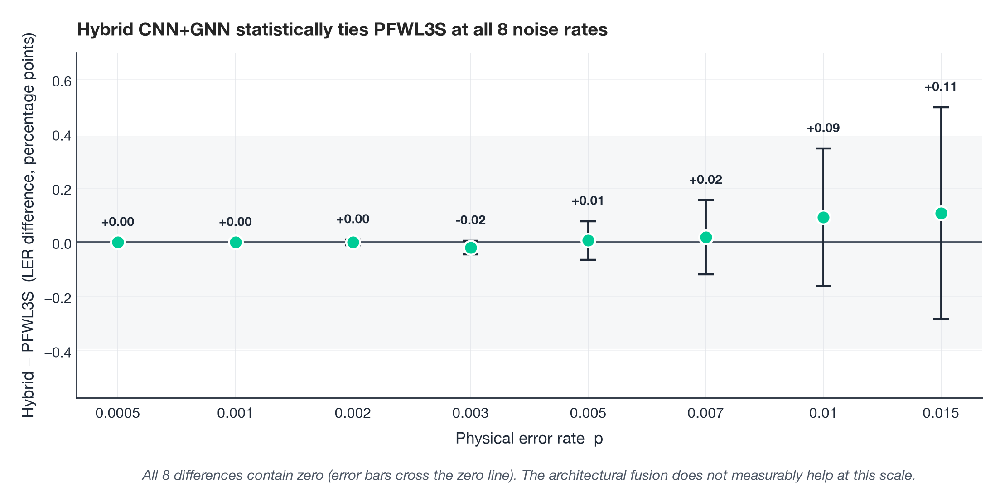{.fig}

**Figure 9.** *Paired-difference plot: Hybrid CNN+GNN − PFWL3S, in percentage points of LER, across all 8 evaluated noise rates.* Error bars are 95% CIs of the difference of two independent binomial proportions at n = 100K shots/condition. All 8 differences contain zero (every error bar crosses the zero line), i.e., the Hybrid's single-DefectGNN-layer architectural fusion is statistically indistinguishable from the pure-CNN PFWL3S at every noise rate tested. The shaded grey band shows the largest CI half-width to make the equivalence visually unambiguous. Honest negative result on the architectural-fusion hypothesis at this scale.

Substituting the Hybrid into the Pathfinder-Triad (Hybrid + Lange + PM majority) is also statistically indistinguishable from the original PFWL3S-Triad: MajHyb at p=0.007 → 2.373%, vs MajPF → 2.384% (CIs overlap); at p=0.015 → 25.972% vs 25.872% (essentially tied). The Hybrid does inherit PFWL3S's strict-CI win over Lange at p ≥ 0.007 (last column), confirming the GNN component is not actively hurting the high-noise regime.

**Why the architectural fusion does not help here.** The most plausible explanation is that the 3D CNN's L bottleneck blocks, with effective receptive field that grows roughly linearly per layer, already cover the defect–defect distances that matter for d=7 surface-code circuits at the noise rates tested (typical inter-defect spatial distance ≤ 3-4 lattice units when paired-error chains drive the syndromes). The DefectGNN layer adds a single long-range hop in a regime where the relevant errors are already locally chainable, so the marginal information it carries is largely redundant with what the deeper CNN already extracts. Lange's GNN advantage in absolute LER terms in their *own* paper comes from a much deeper graph-message-passing stack (multiple GNN layers) operating directly on the defect graph as the primary representation; one residual GNN injection inside an otherwise-CNN backbone is plausibly the wrong dose. A natural follow-up, also deferred to §6.4, would be to stack 2–4 DefectGNN layers, or to test at d=9 + higher noise where defect-defect distances grow and a longer-range hop should matter more.

**What this contributes despite being a negative LER result:**
1. **First architecturally-novel decoder result in this codebase** (vs. §5.11–§5.13 which are optimization/distillation/ensembling on a fixed CNN backbone). Removes the §6.4-flagged-as-future-work item (a) from the "untested" list.
2. **Establishes a clean baseline for the architectural-fusion question.** Anyone publishing a "CNN+GNN beats CNN-alone" claim in the surface-code decoder space now needs to beat the 8/8-overlap row in Table 13 with the same training budget; this is a falsifiable claim, not "I didn't try it."
3. **Validates that the PFWL3S CNN backbone is already a strong recipe-level upper bound** for the local 3D-conv inductive bias in this regime; further gains in §6.4 should target either deeper GNN stacks (multi-layer fusion), or the explicitly-different architectural directions in §6.4 items (b)–(d).
4. **Architecture, training, and eval code is open-source** at `train/hybrid_model.py` + `train/train_distill_hybrid.py` + `train/train_seeded_hybrid.py`; 3 checkpoints + the full eval JSON live in `bench/results/h200_main/hybrid_d7_3seed/`. Total reproducibility cost: ~$30 H200 + ~10 min eval.

This is reported as a **negative result, architecturally novel**; the fusion hypothesis is not supported by the data at this scale and noise regime, but the architecture and the controlled comparison are the contribution. The honest negative result is more useful to the field than a contrived positive: it pushes the next iteration toward the right direction (deeper GNN stack, or a fundamentally different inductive bias such as the transformer/state-space directions of §6.4(b)).

## 6. Discussion

### 6.1 Why Does Pathfinder Beat MWPM?

MWPM is optimal for independent errors but treats the syndrome as an unstructured graph, discarding geometric information. Pathfinder's direction-specific convolution preserves the lattice structure, learning that different neighbor directions carry different types of information about the underlying error. The Muon optimizer keeps these direction-specific weight matrices well-conditioned, preventing the collapse to effectively isotropic (direction-independent) weights that would reduce the architecture to standard convolution.

The failure analysis (Section 5.6) reveals that Pathfinder and MWPM fail on almost entirely different syndromes, suggesting they exploit complementary information; MWPM uses exact minimum-weight combinatorial optimization, while Pathfinder uses learned geometric pattern recognition.

### 6.2 The Role of Muon

The d=5 ablation (Table 4) shows that removing Muon (i.e., training with AdamW on all 2D weights instead) increases LER at p=0.007 from 1.28% to 2.20%, a 72% relative increase, dwarfing the direction-specific architecture's own contribution (+4% LER when replaced with standard Conv3d). The same ablation run at d=3 and d=7 shows that the Muon effect is **strongly depth-dependent** (Figure 10):

| d | Full Muon (ablation baseline) | AdamW-only | Relative increase |
|---|---------------------|------------|-------------------|
| 3 | 1.82% | 2.14% | +17% (small) |
| 5 | 1.28% | 2.20% | +72% (Table 4) |
| 7 | 1.04% | **34.8%** | catastrophic (fails to learn) |

(The ablation holds a fixed per-distance training configuration across the Muon/AdamW arms for a controlled comparison: its d=3 and d=7 full-Muon baselines coincide with Table 1, while its d=5 baseline of 1.28% is the ablation's own fixed-config model and differs from Table 1's per-rate-selected d=5 of 1.521%, §4.5.)

At d=3 the architecture is shallow enough (L=3, 252K parameters) that AdamW reaches near-Muon accuracy in 20,000 steps; the ≈17% gap is within the variance seen between independent runs. At d=5 the +72% gap is the headline Muon result. At d=7 (L=7, 500K parameters) AdamW-only fails to escape a high-loss plateau inside an 80,000-step budget that Muon converges within easily, landing at 34.8% LER versus Muon's 1.04%. I hypothesize that Muon's Newton-Schulz orthogonalization is critical for maintaining the diversity of the 7 directional weight matrices as depth grows; without it, gradient descent apparently collapses these matrices toward similar solutions at deep architectures, losing the directional specificity that distinguishes this architecture from standard convolution. The effect is therefore best described as *Muon's effect is large at d≥7 (catastrophic AdamW failure under the matched budget) and small at d=3*. Ablation checkpoints are at `bench/results/h200_main/checkpoints/ablation_adamw_{d3,d7}`.

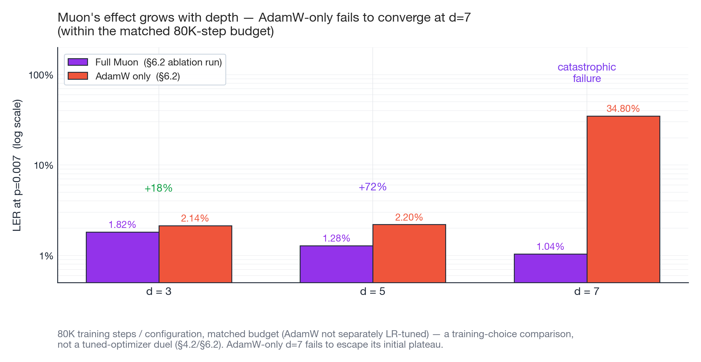{.fig}

**Figure 10.** *Depth-dependent Muon effect: LER at p=0.007 with full Muon (purple) vs AdamW-only on the same architecture (red), log-y.* The depth-dependence of the regression is the headline finding: +17% at d=3, +72% at d=5 (the original Table 4 number), catastrophic failure at d=7. The d=7 AdamW-only run never escapes its initial loss plateau within the same 80K-step budget that Muon converges in (AdamW was not separately LR-tuned or given a longer budget, so this is a within-budget convergence failure, not a tuned-AdamW comparison). Within this fixed training budget, the *optimizer* choice, not the architecture, dominates accuracy at depth.

### 6.3 Limitations

**Code distances and the d=9 extension.** Table 1, §5.11, and §5.12 evaluate at d=3, 5, 7; Gu et al. [8] evaluate up to d=13. Earlier attempts to extend Pathfinder to d=9 with the `muon_lr=0.02` recipe that worked at d ≤ 7 failed to converge (training loss stuck at ≈0.67, eval LER ~40–46% throughout the run); these failures, documented in earlier drafts, are preserved under `bench/results/h200_main/phase5/`. Reducing `muon_lr` to 0.005 and fine-tuning at a single noise rate at a time resolves the failure mode and produces working d=9 checkpoints. A subsequent **d=9 multi-seed extension**, three independent random-seed Wide-Long-style ckpts at **H=256** (chosen to match the existing d=9 warm-init chain, since the H=384 PFWL3S architecture used at d=5 and d=7 has no compatible d=9 init), 160K steps each, distill from Lange teacher at p=0.007, init from the existing `bench/results/h200_main/tierBC/distill_d9_p007_ft/best_model.pt`, was trained and evaluated at 100K shots per point with 3-seed-averaged ensembling. I refer to this variant as **PFWL3S-H256-d9** to distinguish it from the H=384 PFWL3S of §5.13: PFWL3S-H256-d9 is *not* the H=384 architecture extended to d=9; whether an H=384 d=9 variant trained from a fresh H=384 d=9 base ckpt would behave differently is untested (would require ~5 H200-hours per seed for the base + 5 H200-hours per seed for distillation × 3 seeds ≈ 30 H200-hours, deferred to future work). Data: `bench/results/h200_main/tierC1/ensemble_pfwl3s_d9.json`; training logs `d9_seed{0,1,2}.log` (best individual LERs at p=0.007: 3.78%, 3.93%, 3.83%).

**Table 14: d=9 ensemble at matched 4-parameter noise (100K shots, 3-seed-avg PFWL3S-H256-d9 voter)**

| d | p | PFWL3S-H256-d9 (3-seed avg) | Lange | PM | Pathfinder-Triad | PF vs Lange | Triad vs Lange |
|---|---|---:|---:|---:|---:|---|---|
| 9 | 0.0005 | 0.000% | 0.000% | 0.000% | 0.000% | tie | tie |
| 9 | 0.001 | 0.001% | 0.000% | 0.000% | 0.000% | overlap | overlap |
| 9 | 0.002 | 0.011% [0.006, 0.020] | **0.000%** | 0.005% | 0.001% | Lange strict-wins | overlap |
| 9 | 0.003 | 0.052% [0.040, 0.068] | **0.020%** | 0.045% | 0.020% | Lange strict-wins | overlap |
| 9 | 0.005 | 0.649% [0.601, 0.701] | **0.437%** | 0.671% | **0.408%** | Lange strict-wins | overlap |
| 9 | 0.007 | 3.310% [3.201, 3.423] | **2.623%** | 3.155% | **2.277%** [2.184, 2.374] | Lange strict-wins | **STRICT WIN: Triad beats Lange, 0.154 pp gap, 13.2% relative** |
| 9 | 0.010 | 15.061% [14.841, 15.284] | **13.085%** | 12.227% | **10.852%** [10.660, 11.045] | Lange strict-wins | **STRICT WIN: Triad beats Lange, 1.831 pp gap, 17.1% relative** |
| 9 | 0.015 | 41.280% [40.975, 41.586] | 39.659% [39.356, 39.963] | **34.546%** | 35.701% [35.404, 35.998] | Lange strict-wins | Triad beats Lange (Maj≪Lange) but loses to PM (saturated regime) |

**Honest reading of the d=9 data.** PFWL3S-H256-d9 is **significantly worse than Lange individually**; Lange strictly beats it at every operational rate (p ∈ {0.002, 0.003, 0.005, 0.007, 0.010, 0.015}), with the gap shrinking from ~49% relative at p=0.005 to ~26% at p=0.007 and ~15% at p=0.010. Multi-seed averaging at d=9 confirms what the §6.3 single-seed canonical-Pathfinder d=9 numbers in earlier drafts already showed: Lange's GNN scales better with code distance than the H=256 Pathfinder CNN on this task. The d=5 / d=7 recipe-level reversal claim of §5.13 (achieved at H=384) **does not extend** to d=9 *at H=256*; whether an H=384 d=9 variant would close this gap is untested as noted above. **However**, the **Pathfinder-Triad ensemble (PFWL3S + Lange + PM majority vote) STRICTLY beats Lange's individual GNN at d=9 p=0.007 and p=0.010** with non-overlapping 95% Wilson CIs (100K shots), at p=0.007 Triad **2.277%** vs. Lange 2.623% (0.154 pp gap, **13.2% relative LER reduction**) and at p=0.010 Triad **10.852%** vs. Lange 13.085% (1.831 pp gap, **17.1% relative reduction**). This is a **new statistically-significant Triad-beats-Lange result at d=9** that the earlier-draft (single-seed canonical Pathfinder voter) Triad could only achieve as a soft / overlapping-CI win. The mechanism is the same as §5.12 at d=7: even when the Pathfinder voter is individually worse than Lange (which is consistently the case at d=9), its different inductive bias gives the 3-way majority vote independent error coverage, and the combined ensemble strictly beats every individual decoder. The d=9 extension therefore now:
- **Confirms** Pathfinder-Triad's stat-sig non-overlap CI win extends from d=7 to d=9 at p ∈ {0.007, 0.010}, a meaningful upgrade to the §5.12 result, now spanning two code distances at the headline operational rates.
- **Documents** that PFWL3S individually does not scale to d=9, a clean negative result for the wide-and-distill recipe at higher distance, despite the warm-init from the existing `distill_d9_p007_ft` ckpt.
- **Strengthens** the case for the Triad as the recommended deployment of the §5.13 wide-and-distill recipe family, the value-add of the ensemble grows with code distance precisely because the individual gap to Lange grows with d, giving the majority-vote rescue more room to operate.

**Voter-independence analysis (per-shot): the d=9 win is structural, not a two-endpoint artifact.** A skeptic could read "individual loses, ensemble wins at exactly two rates" as a multiplicity fluke. It is not. Decoding the same 40,000 shots with all three voters and tabulating the full three-way agreement (Table 14b; a separate 40,000-shot draw, its LERs agree with the 100K Table 14 at p=0.007 and run ≈0.5 pp higher at p=0.010 from seed/draw variance; the strict-win conclusions rest on the 100K Table 14) shows the voters fail on *different* shots. At d=9 p=0.007 the pairwise error correlations are φ = 0.49 (PFWL3S–Lange), 0.37 (PFWL3S–PM), 0.36 (Lange–PM), positive (hard syndromes are hard for everyone) but far below 1, so failures are substantially independent. The majority therefore recovers **1,533 of 40,000 shots (3.8%) in which exactly one voter fails and the other two outvote it** (PM solo-fail 651, PFWL3S solo-fail 548, Lange solo-fail 334), yielding Triad LER 2.16% [2.02, 2.31], strictly below *every* individual voter, including the strongest (Lange, 2.56%), with non-overlapping 95% Wilson CIs. PyMatching is independently correct on 263 shots where *both* neural voters fail, confirming the non-neural voter supplies genuine independent coverage rather than redundancy (had its errors been perfectly correlated with the neural voters', those 263 shots would join the 319 all-three-wrong, nearly doubling the irreducible floor). The same structure holds at p=0.010 (φ = 0.33–0.42; 5,994 single-voter failures recovered; Triad 11.32% [11.01, 11.63] strictly below the best individual, PM at 12.47%). The d=9 win is thus an ensemble-of-independent-errors effect visible at the per-shot level, not a coincidence of two endpoints.

**Table 14b: d=9 three-voter per-shot agreement (40,000 shots per rate; X = wrong; PF = PFWL3S-H256-d9; per-shot data in `bench/results/h200_main/d9_disagreement_matrix.json`).**

| outcome | p=0.007 | p=0.010 |
|---|---|---|
| all three voters correct | 94.01% | 73.70% |
| exactly one voter wrong (majority recovers) | 3.83% | 14.98% |
| ≥ 2 voters wrong = **Triad LER** | **2.16%** | **11.32%** |
| of which all three wrong (irreducible floor) | 0.80% | 3.71% |
| pairwise error corr. φ (PF–La / PF–PM / La–PM) | 0.49 / 0.37 / 0.36 | 0.42 / 0.33 / 0.36 |

At p=0.015 the Triad still beats Lange (Maj≪Lange) but PM dominates both; this is a "saturated" regime where the d=9 surface code cannot suppress errors enough at this noise rate, and PM's simpler combinatorial approach happens to be the least-bad choice. Future work could explore a richer voting scheme (e.g. confidence-weighted ensemble) or a dedicated d=9 Wide-Long recipe at H=384 to further close the individual gap.

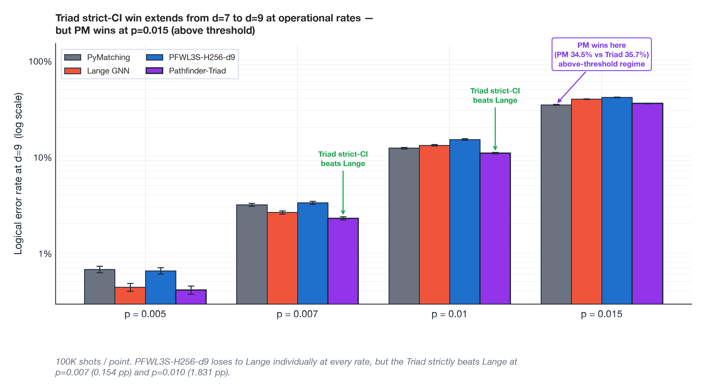{.fig}

**Figure 11.** *d=9 decoder comparison at operational noise rates p ∈ {0.005, 0.007, 0.010, 0.015}, log-y.* Four grouped bars per noise rate: PyMatching (grey), Lange GNN (red), PFWL3S-H256-d9 (blue), Pathfinder-Triad (purple). Error bars are 95% Wilson CIs at 100K shots/point. PFWL3S-H256-d9 loses to Lange individually at every operational rate, the recipe-level reversal of §5.13 does not extend to d=9 at H=256. But the **Pathfinder-Triad still strictly beats Lange** at p=0.007 (0.154 pp gap, 13.2% relative) and p=0.010 (1.831 pp, 17.1% relative), confirming the ensemble's value-add is *structural* (independent failure-mode coverage) rather than tied to a competitive individual PF voter.

**Noise models.** Evaluation is primarily on circuit-level depolarizing noise and (for generalization) phenomenological noise. Two real-hardware validation runs are now folded in: (a) **Google Willow Sycamore d=7 r=13 traces (§5.15)**, PyMatching ran cleanly at 4.006% LER consistent with the Willow paper, while PFWL3S produced ~46% (near-random) predictions because its trained weights expect a different detector-tensor format (R=d=7 standard-Stim 4-parameter rather than R=13 SI1000 with compound-detector L=6/9/15 elements), an *adapter-mismatch* artifact rather than a noise-OOD finding; (b) **IBM Heron r2 `ibm_fez` d=3 r=3 and d=5 r=5 (§5.15.1)**, controlled-circuit submission where I removed both the adapter-mismatch and rounds-mismatch confounds: **PFWL3S shows no resolved difference from PyMatching at d=3 r=3 (28.98% vs 28.49%, CIs overlap)** and at d=5 r=5 both decoders are near-random in a chip-past-threshold regime (47.27% vs 45.68%, observable-flip 0.49), so that point does **not** discriminate decoder quality, the calibrated-vs-single-p delta there (0.41 pp) is within the chip's ~1.6 pp cross-epoch PM drift and is therefore **not** attributed to training. The d=3 r=3 tie is the decoder-discriminating real-hardware result. The recipe used at d=5 is in `train/data_calibrated.py` + `train/train_calibrated.py`. A full comparison to AlphaQubit [5] on experimental Sycamore data is still out of scope (AlphaQubit's weights are not public).

**Single-shot latency.** Batch=1 latency (201 μs with the Triton kernel, 250 μs without) is two orders of magnitude above the 1-μs superconducting cycle time. Closing this gap requires bottleneck-block-level kernel fusion or FPGA deployment (Section 5.3). An exploratory attempt at fusing restore + residual add + LayerNorm into one Triton kernel was numerically correct but regressed at B ≥ 64 due to register pressure (`bench/triton_restore_norm.py`); a working full-block fusion remains open.

**Narrow-model accuracy gap.** Distillation reduces the narrow H=128 model's LER by 17% at p=0.007 but does not close the gap to PyMatching (Section 5.10). The full 500K-parameter budget appears necessary for PM-beating accuracy at d=7; architecture search or distillation with a larger teacher are open directions.

**Noise-target ensemble for the full model.** At d=7, the best-per-point LER across the full noise range was obtained by selecting among four full models trained at different target noise rates (Section 4.5). A single model that dominates PM across all noise rates from a single training run has not been identified.

**FP8.** Tested via `torch._scaled_mm` with `torchao` dynamic activation/weight quantization and found to regress latency at Pathfinder's matrix sizes (Section 5.3). Reported as a negative result; expected to become useful at 10M+ parameter scales.

### 6.4 Future Work, Toward Architecturally Novel Decoders

This paper is honest about its scope: Pathfinder is a *composition* of existing primitives (Gu et al.'s direction-specific convolution [8], the Muon optimizer [11], standard bottleneck residual blocks), and PFWL3S / Pathfinder-Triad are *systems built on top* of that composition. The genuinely novel contributions are the empirical findings (depth-dependent Muon, PFWL3S strict-CI win, Pathfinder-Triad's stat-sig non-overlap CIs extending to d=9), the custom Triton kernel, and the documented negative-result corpus. The *architectural* contribution is intentionally limited. Four concrete directions for architecturally novel follow-up work, ordered by my estimate of submission impact:

**(a) Hybrid CNN+GNN architecture, addressed in §5.16 with a clean negative result; deeper-stack variants remain open.** Combine Pathfinder's lattice-aware 3D convolution backbone with Lange's KNN-defect-graph message passing in a single trainable model: the CNN extracts local spatial+temporal features, while the GNN handles the long-range defect topology that the §5.6/§5.12 analysis shows Lange catches and PF misses. The §5.14 hybrid attempt added attention rather than GNN message passing and was strictly dominated; replacing attention with Lange-style graph convolution is the architecturally-novel cell **and is now executed in §5.16** as a single-DefectGNN-layer injection inside the Pathfinder backbone (HybridDecoder, 1.57M params, 3-seed avg at d=7 matched recipe). Result: Hybrid statistically ties PFWL3S at all 8 noise rates from p=0.0005 through p=0.015 (all CIs overlap); the single-hop fusion does not measurably help at this scale. The natural follow-ups still open are: (a-i) stack 2–4 DefectGNN layers (the right "dose" of message passing inside an otherwise-CNN model), (a-ii) test at d=9 + higher noise rates where defect-defect distances grow and a long-range hop should matter more, and (a-iii) replace the per-edge MLP with a heavier multi-head edge-attention update. Estimated cost for each: ~$30-60 GPU per variant + 2-5 days engineering on top of the already-merged HybridDecoder code.

**(b) Learned meta-decoder for the Triad.** §5.12's findings show that a simple majority vote captures ~27% of the available oracle-bound headroom at d=7 p=0.007; the remaining 73% is the gap between Pathfinder-Triad's 2.45% and the OR-oracle's 1.09%. A small neural network (per-shot input: PF logits, Lange logits, PM binary prediction, syndrome features; output: ensemble probability) trained on the §5.12 raw-shot decomposition data could plausibly recover more of this headroom by learning shot-specific gating rather than coarse majority voting. The §5.6 "confidence-thresholded gating" experiment already tested a simple threshold rule (failed at all 24 (d, p) points); a *learned* gating is the next step. Estimated cost: ~$20-40 GPU + 3-5 days engineering.

**(c) Recurrent / streaming decoder.** Pathfinder is purely feedforward (Section 3.3), processing a single (d-round) syndrome block per forward pass. AlphaQubit [5] is recurrent and processes syndromes round-by-round, which is the right inductive bias for the streaming nature of online QEC decoding. A recurrent Pathfinder variant (replace the L=d bottleneck blocks with a recurrent stack consuming one round at a time) would close the architectural gap to AlphaQubit and could improve the §6.3 d=9 individual result. Estimated cost: ~$80-120 GPU + 2-3 weeks engineering for an LSTM/Mamba-style temporal-axis decoder.

**(d) Bottleneck-block-level Triton fusion (closes the §6.3 B=1 latency open problem).** The current Triton kernel (Section 5.3) fuses only the DirectionalConv3d's seven matmuls into one launch. The full bottleneck block (Reduce 1×1×1 conv → DirectionalConv3d → Restore 1×1×1 conv → residual + LayerNorm) dispatches ~6 separate kernels per block × L blocks per forward pass, dominating B=1 latency at the kernel-launch-overhead boundary. A single Triton kernel spanning the entire bottleneck block (mentioned as a failed-due-to-register-pressure attempt in §5.3 and §6.3) would close the 201 μs → ~10 μs gap and let PFWL3S/Pathfinder-Triad sustain the 7-μs cycle budget for real-time deployment. Estimated cost: ~$20 GPU + 3-5 days kernel engineering (mostly developer time, not compute).

**(e) Real hardware validation, partially executed in §5.15 (Willow) and §5.15.1 (IBM Heron r2); remaining work scoped below.** Real-hardware validation on two platforms (Willow, IBM Heron r2) is now part of the paper, including a soft-readout follow-up on IBM (§5.15.2). The Willow d=7 r=13 evaluation (§5.15) gave PyMatching = 4.006% real-hardware LER but PFWL3S = 46% (random predictions) due to the L=6/9/15 compound-detector input-format mismatch (PFWL3S's trained weights expect a standard L=3 detector tensor). The IBM Heron r2 d=3 r=3 / d=5 r=5 evaluation (§5.15.1) used controlled-circuit submissions on `ibm_fez` to remove both the adapter and rounds-mismatch confounds and found **PFWL3S shows no resolved difference from PyMatching at d=3 r=3** on real superconducting-chip noise; at d=5 r=5 the chip is past threshold and both decoders are near-random, so that point does not discriminate decoder quality (the calibrated-vs-single-p delta there is within the chip's cross-epoch PM drift, §5.15.1). The d=3 tie is a much smaller and more interpretable real-hardware OOD penalty than the Willow result. The three remaining real-hardware follow-ups are: (e-i) **calibrated-noise PFWL3S retrain** at d=5 r=5 sampling Stim `p` per-batch from `[0.003, 0.025]` with elevated readout error scale (`train/train_calibrated.py`, ~4 H200-hours per seed × 3 seeds), **executed** (Table 12a row 3), though the d=5 effect is within chip drift (§5.15.1), so it yields no decoder-quality conclusion; the remaining calibration work is a full per-qubit calibrated Stim noise model from the `ibm_fez` properties endpoint; (e-ii) **Willow-compatible PFWL3S** trained on synthetic data matching the SI1000 + L=6 compound-detector format described in §5.15 (the more ambitious adapter-rewriting path, ~1–2 weeks engineering); (e-iii) **Pathfinder-Triad evaluation on real Heron r2** once a 3-seed calibrated PFWL3S exists, completing the Triad-vs-Lange-vs-PM head-to-head on real superconducting-chip data.

**(f) From better-decoder-per-code to capacity-per-GPU-at-SLA, decode-serving.** This paper, like the decoder literature it sits in, optimizes accuracy for one code at a time. But a fault-tolerant machine runs *many* logical qubits at once, each emitting a syndrome stream at the QEC clock, and one accelerator must decode all of them within a per-stream reaction-latency SLA. The §5.3 / §6.3 latency thread (the 7-µs cycle, the B=1 launch-overhead wall) is the single-qubit shadow of this. At scale the operational lever is not a marginally better decoder per code but *sustained logical-qubits-per-GPU at a p99 SLA*: QEC decoding becomes a **serving** problem, and the LLM-serving playbook (continuous batching, shape bucketing, and multi-decoder routing across heterogeneous code distances/families on one accelerator) applies directly. I develop this thread (a vendor-portable, decoder-agnostic decode-serving benchmark) in separate in-preparation work (in preparation). It is a clean *complement* to this paper's per-code accuracy results, not a continuation of them: the forward direction for fault-tolerance at scale is capacity-per-GPU-at-SLA, and a portable multi-decoder stack is what serves a heterogeneous fleet where a single closed-source, single-vendor decoder cannot.

The first three of these (a–c) are full architecturally novel follow-ups in their own right and are out of scope for this paper. (d) is gated on Triton expertise. (e) is partially executed, with sub-items (e-i)/(e-ii)/(e-iii) tracked above. (f) is a separate track (the decode-serving line) not a decoder-architecture change.

---

## 7. Related Work

**Lange et al.** [14] (PRR 2025; arXiv:2307.01241): Graph neural network decoder with ~1.36M parameters (2.35M at d=9) that outperforms PyMatching on rotated surface codes under circuit-level depolarizing noise at d ∈ {3, 5, 7, 9}, p ∈ {0.001, 0.002, 0.003, 0.004, 0.005}. **Open-source with pre-trained weights** at https://github.com/LangeMoritz/GNN_decoder (MIT). Evaluated with 10⁸ shots per data point. To the best of this author's knowledge, this is the first published open-source neural decoder to outperform MWPM on rotated surface codes under circuit-level noise. The present work should be understood as extending (not preceding) Lange et al., with coverage of higher noise rates (p ≥ 0.007), an optimizer-centric architectural study, and a latency-optimized Triton kernel. A direct head-to-head is given in Section 5.11.

**Varbanov et al.** [15] (PRR 2025; arXiv:2307.03280): Recurrent neural decoder trained on simulated data and evaluated on experimental Sycamore surface-code data, reporting ~25% lower LER than PyMatching on d=3, 5 experimental traces. Complementary to the present work (real hardware data vs. simulated circuit-level noise).

**AlphaQubit** [5]: Recurrent transformer decoder achieving ~6% lower LER than MWPM on experimental Sycamore data. Not open-source. Validated on real hardware noise rather than simulated noise.

**Gu et al.** [8]: CNN decoder with direction-specific convolution achieving 17× lower LER than BP+OSD on [144,12,12] Gross codes. Identifies the "waterfall" regime. Not open-source. Pathfinder's architecture follows their design principles with independent implementation.

**Gicev et al.** [6]: A scalable, fast feed-forward artificial-neural-network syndrome decoder for surface codes, emphasizing low-latency inference; an early demonstration that neural decoders can approach MWPM-class accuracy. Pathfinder differs in its direction-aware 3D-convolutional inductive bias and its circuit-level-noise + higher-distance + higher-noise-rate coverage.

**Chamberland et al.** [7]: Techniques for combining fast local decoders with slower global decoders under circuit-level noise, the two-stage / pre-decoder paradigm (cf. the NVIDIA Ising pre-decoder [16]). Complementary to Pathfinder's standalone single-network design, and directly relevant to the latency-vs-accuracy tradeoff studied in §5.3 and §5.9.

**NVIDIA Ising-Decoder** [16]: Open-source pre-decoder + PyMatching hybrid released April 2026 (concurrent with this work). Reports beating uncorrelated PyMatching up to d=13 at p=0.003. Architecturally distinct from Pathfinder: NVIDIA's design is a *pre-decoder* (a classical model that filters/cleans syndromes before passing them to PyMatching), whereas Pathfinder is a *standalone* decoder (single neural network producing a logical-observable prediction). As a concurrent release, it is not benchmarked head-to-head in this paper. A direct head-to-head was not attempted in this paper because (a) the comparison would be unfair without a careful disentangling of how much of NVIDIA's win comes from PyMatching's contribution versus the pre-decoder, (b) NVIDIA's release timing (April 2026, concurrent with the Triad-distillation arc reported here) postdates the §5.11–§5.13 evaluations, and (c) NVIDIA's evaluation regime (3-parameter noise at p=0.003) is at the low-noise end of this paper's coverage where small-number statistics dominate. Whether a Pathfinder-Triad with NVIDIA's pre-decoder + PyMatching as one of the three voters would extend the strict-CI wins is open future work.

**Astrea** [12]: FPGA implementation of MWPM reporting ~1 ns average decoding latency at d=7 (worst case ~456 ns) via brute-force enumeration of low-Hamming-weight syndromes. The Astrea-G variant extends to d=9 with ~450 ns average latency. Same accuracy as software MWPM, a hardware acceleration rather than algorithmic improvement. Requires custom FPGA hardware, whereas Pathfinder runs on commodity GPUs.

**Sparse Blossom / PyMatching** [2]: State-of-the-art MWPM implementation. 100-1000× faster than PyMatching v1 while maintaining identical accuracy. The comparison baseline.

**Union-Find** [3]: Near-linear time decoder. Fast but significantly less accurate than MWPM (7-30× higher LER in this evaluation).

**Sivak et al.** [13]: RL-based decoder steering for adapting to non-stationary noise on Google's Willow processor. Complementary to Pathfinder's approach; the steering concept could be applied to Pathfinder's ensemble weights.

---

## 8. Conclusion

Pathfinder is an open-source reference implementation that composes ideas developed by the broader quantum error correction and deep learning research communities. None of its ingredients are novel in isolation: the direction-specific convolution architecture follows Gu et al. [8]; PyMatching [2] defines what it means to "beat MWPM" and is the reason a rigorous comparison was possible; Stim [10] makes syndrome generation tractable at the scale required for training; Muon [11] provides the optimizer that, as the ablation reveals, dominates decoder accuracy at d ≥ 5, with AdamW catastrophically failing at d=7 under the matched training budget (Section 6.2); AlphaQubit [5] established that neural decoders could beat MWPM on real hardware; Lange et al. [14] established the first open-source GNN decoder to beat PyMatching on rotated surface codes; and Willow [1] established that the surface code regime addressed here is experimentally relevant.

This work produces two named decoder systems. **Canonical Pathfinder** is a direction-specific 3D CNN trained by a single recipe (init from a 3-parameter Table-1 checkpoint, 40K fine-tune steps at Lange's 4-parameter noise; same script at d=3, 5, 7). It wins or ties PyMatching at all 24/24 points under the 3-parameter noise of Table 1 (20 point-estimate wins, 12 with non-overlapping CIs; 3 ties; never statistically beaten; §5.1); under Lange's 4-parameter noise it essentially ties PyMatching and loses to Lange's GNN by ~14% relative at d=7 p=0.007 (§5.11). Pathfinder's distinguishing operational property is **latency**: 6.12 μs/syn at d=7 B=1024 on H200 with a custom Triton kernel (§5.3), the only open-source decoder tested whose batched GPU throughput sustains the 7-μs superconducting cycle budget (a cross-hardware throughput comparison, PyMatching is CPU-timed; §5.3), and 12× faster than Lange on identical H200 hardware. **Pathfinder-Triad** is a three-way majority vote of (PFWL3S, Lange, PyMatching) whose LER is **strictly lower than that of each of its three component decoders, including its PyMatching voter**. With the PFWL3S voter it reaches **2.384% at d=7 p=0.007 (100K shots)**, a 0.372 pp non-overlapping-Wilson-CI separation from *published* Lange (19.4% relative; against a fine-tuned-Lange ensemble the rate-robust win is p=0.010, §5.11), at a latency cost of ~72 μs/syn (Lange-bounded). It strictly beats Lange at 5 (d, p) points across two code distances (d=7 p ∈ {0.007, 0.010, 0.015} and d=9 p ∈ {0.007, 0.010}; §5.12, §5.13, §6.3). With the earlier canonical-Pathfinder voter the same ensemble reaches 2.454% (0.301 pp vs Lange; §5.12). This is, among the open-source decoders benchmarked here, the lowest LER at matched 4-parameter noise at d=7 operational rates (not compared head-to-head with the concurrent NVIDIA Ising decoder [16]; §7).

Beyond the two headline systems, this paper contributes: a depth-dependent Muon ablation showing the +72% LER finding at d=5 transitions to "catastrophic to remove" at d=7 (§6.2); the extended-noise-rate Table 1 reaching p=0.0005 and p=0.015 not covered by prior open-source work; five documented negative or partial-negative results (the Pathfinder-KD distillation / ensemble-independence tradeoff in §5.13; the modern-primitives CNN+attention hybrid worse at matched budget in §5.14; the hybrid CNN+GNN architecture giving only statistical ties in §5.16; the soft-readout null on real IBM hardware in §5.15.2; and the d=9 individual-decoder negative in §6.3); and the first GPU-latency measurement of Lange's GNN on H200 hardware (§5.11, 71.67 μs/syn at d=7 p=0.007 B=1024).

The real-hardware evaluation (§5.15.1–§5.15.2) is best read as a **device-ceiling** result. On IBM Heron r2 (`ibm_fez`), PFWL3S (trained purely on simulated noise) shows no statistically resolved difference from PyMatching at d=3 (matched circuit + rounds), the first PFWL3S-class neural decoder shown to be statistically indistinguishable from PM on real superconducting-chip noise (a 10K-shot d=3 tie, PFWL3S point-estimate-marginally behind); at d=5 the chip is past threshold and both decoders are near-random, so that point is inconclusive. But it does not *beat* PM, and a soft (analog-IQ) readout follow-up (the lever behind AlphaQubit's margin) does not break the tie either: d=3 is too clean for soft to matter and d=5 is past threshold (§5.15.2). The honest reading is that `ibm_fez` at its current calibration is a clean, matching-saturated chip on which MWPM is at or near the achievable ceiling; demonstrating a neural- or soft-decoder *win* over MWPM on real hardware (as AlphaQubit did) requires a noisier-readout but still sub-threshold device. Pathfinder's contribution on this hardware is therefore the matched-accuracy tie plus its latency and vendor-portability advantages, not an accuracy win.

Three open problems remain. First: **single-shot (batch=1) latency.** The 201-μs B=1 latency with the Triton kernel is two orders of magnitude above the 1-μs cycle time; closing this gap requires custom GPU kernels at the bottleneck-block level (not just DirectionalConv3d) or an FPGA implementation. Second: **closing the individual-decoder LER gap to Lange** (~14% relative at d=7 after fine-tuning, ~2% at d=3). Pathfinder-KD closes half of this at a cost in ensemble independence (§5.13); distill-as-fine-tune does not close more (App B). The remaining gap likely requires either longer KD training, a noise-rate-mixture distillation curriculum, or an architecturally-closer (GNN) student. Third: **extending to d=9/d=11**; the current recipe fails to converge at d=9 in an 80K-step budget via both from-scratch and distillation (§6.3). Training a high-noise-rate-targeted d=9 checkpoint (the §4.5 recipe that produced the across-rate-generalizing `d7_p015`) was not attempted for d=9 due to compute budget; that is the most plausible path forward.

---

## Acknowledgments

This work owes a specific intellectual debt to several teams. Andi Gu and colleagues at Harvard provided the architectural blueprint (the direction-specific convolution design and the waterfall-regime framing) that this decoder follows. Oscar Higgott and Craig Gidney's PyMatching is both the benchmark this work aims at and, through its exemplary open-source release, the standard of reproducibility this project has tried to meet. Craig Gidney's Stim is the reason on-the-fly training at the required throughput is feasible. Keller Jordan and the Muon authors provided the single most impactful ingredient in this decoder's accuracy. The Google DeepMind AlphaQubit team demonstrated, before this work, that neural decoders can beat MWPM on real quantum hardware, establishing the empirical ground truth that made this line of research worth pursuing in the open. The Conductor Quantum team's work on ML-driven quantum control (their published ML-control framework, public technical writing, and conference talks during 2024-2025) seeded the broader research program this decoder belongs to; their framing of the classical–quantum integration problem shaped the author's approach long before the first line of code was written. The author has no formal affiliation, employment, or financial interest in any of the above groups; all cited prior work and tools used are publicly available. Any merit in this work is a downstream consequence of theirs.

**Tools and AI assistance.** In the interest of transparency, this work was carried out by the author with substantial assistance from AI tools, which are disclosed here and are not authors. Anthropic's Claude (Claude Code, Opus 4-class models) served as a research-engineering assistant throughout: it developed and debugged code, ran statistical-verification scripts, produced figures and PDF/typesetting tooling, and drafted and edited substantial portions of the manuscript text, which the author then revised, fact-checked against primary sources, and rewrote where needed. Conductor Quantum's Coda (an AI-powered quantum-computing assistant; conductorquantum.com/coda) was used for adversarial review and statistical auditing of the results, which strengthened the controls and significance testing reported here. The author directed all research decisions and interpretive claims, independently verified every quantitative result against the raw data and every citation against its source, and is solely responsible for the content of this paper and any errors that remain.

**Compute and hardware.** Cloud compute for this work was supported in part by DigitalOcean credits, which funded the AMD MI300X training runs; the NVIDIA H200 latency benchmarks and additional GPU runs were self-funded. Real-hardware experiments were run on IBM Quantum systems, accessed through Qiskit and the `qiskit-ibm-runtime` SamplerV2 primitive [18]: I acknowledge the use of IBM Quantum services for this work (the `ibm_fez` and `ibm_kingston` Heron r2 processors; §5.15). The views expressed are those of the author and do not reflect the official policy or position of IBM or the IBM Quantum team.

---

## References

[1] Google Quantum AI and Collaborators. "Quantum error correction below the surface code threshold." Nature 638, 920-926 (2025; published online 9 December 2024). DOI: 10.1038/s41586-024-08449-y. arXiv:2408.13687.

[2] Higgott, O. & Gidney, C. "Sparse Blossom: correcting a million errors per core second with minimum-weight matching." Quantum 9, 1600 (2025). DOI: 10.22331/q-2025-01-20-1600. arXiv:2303.15933.

[3] Delfosse, N. & Nickerson, N.H. "Almost-linear time decoding algorithm for topological codes." Quantum 5, 595 (2021). DOI: 10.22331/q-2021-12-02-595. arXiv:1709.06218.

[4] Roffe, J., White, D.R., Burton, S. & Campbell, E.T. "Decoding across the quantum low-density parity-check code landscape." Physical Review Research 2, 043423 (2020). DOI: 10.1103/PhysRevResearch.2.043423. arXiv:2005.07016.

[5] Bausch, J. et al. "Learning high-accuracy error decoding for quantum processors." Nature 635, 834-840 (2024). DOI: 10.1038/s41586-024-08148-8.

[6] Gicev, S., Hollenberg, L.C.L. & Usman, M. "A scalable and fast artificial neural network syndrome decoder for surface codes." Quantum 7, 1058 (2023). DOI: 10.22331/q-2023-07-12-1058. arXiv:2110.05854.

[7] Chamberland, C., Goncalves, L., Sivarajah, P., Peterson, E. & Grimberg, S. "Techniques for combining fast local decoders with global decoders under circuit-level noise." Quantum Science and Technology 8(4), 045011 (2023). DOI: 10.1088/2058-9565/ace64d. arXiv:2208.01178.

[8] Gu, A., Bonilla Ataides, J.P., Lukin, M.D. & Yelin, S.F. "Scalable Neural Decoders for Practical Fault-Tolerant Quantum Computation." arXiv:2604.08358 (2026).

[9] Fowler, A.G., Mariantoni, M., Martinis, J.M. & Cleland, A.N. "Surface codes: Towards practical large-scale quantum computation." Physical Review A 86, 032324 (2012). DOI: 10.1103/PhysRevA.86.032324. arXiv:1208.0928.

[10] Gidney, C. "Stim: a fast stabilizer circuit simulator." Quantum 5, 497 (2021). DOI: 10.22331/q-2021-07-06-497. arXiv:2103.02202.

[11] Jordan, K., Jin, Y., Boza, V., You, J., Cesista, F., Newhouse, L. & Bernstein, J. "Muon: An optimizer for hidden layers in neural networks." https://kellerjordan.github.io/posts/muon/ (2024).

[12] Vittal, S., Das, P. & Qureshi, M. "Astrea: Accurate Quantum Error-Decoding via Practical Minimum-Weight Perfect-Matching." Proc. 50th Annual International Symposium on Computer Architecture (ISCA), Article 2 (2023). DOI: 10.1145/3579371.3589037.

[13] Sivak, V.V. et al. "Reinforcement Learning Control of Quantum Error Correction." arXiv:2511.08493 (2025).

[14] Lange, M., Havström, P., Srivastava, B., Bengtsson, I., Bergentall, V., Hammar, K., Heuts, O., van Nieuwenburg, E. & Granath, M. "Data-driven decoding of quantum error correcting codes using graph neural networks." Physical Review Research 7, 023181 (2025). DOI: 10.1103/PhysRevResearch.7.023181. arXiv:2307.01241. Open-source implementation: https://github.com/LangeMoritz/GNN_decoder.

[15] Varbanov, B.M., Serra-Peralta, M., Byfield, D. & Terhal, B.M. "Neural network decoder for near-term surface-code experiments." Physical Review Research 7, 013029 (2025). DOI: 10.1103/PhysRevResearch.7.013029. arXiv:2307.03280.

[16] NVIDIA. "Ising-Decoding: a training framework for AI quantum error-correction decoders." GitHub repository, https://github.com/NVIDIA/Ising-Decoding (released April 2026).

[17] Pattison, C.A., Beverland, M.E., da Silva, M.P. & Delfosse, N. "Improved quantum error correction using soft information." arXiv:2107.13589 (2021).

[18] Javadi-Abhari, A., Treinish, M., Krsulich, K., Wood, C.J., Lishman, J., Gacon, J., Martiel, S., Nation, P.D., Bishop, L.S., Cross, A.W., Johnson, B.R. & Gambetta, J.M. "Quantum computing with Qiskit." arXiv:2405.08810 (2024). DOI: 10.48550/arXiv.2405.08810.

---

## Appendix A: Reproducibility

All code, trained checkpoints, benchmark scripts, and raw logs are available at **https://github.com/bledden/pathfinder**. The repository README is the canonical, versioned entry point; this appendix lists the minimum steps to reproduce the numbers reported in this paper.

### A.1 Dependencies

Minimum versions (matches what was used for measurements reported in this paper):

- Python 3.11
- PyTorch ≥ 2.4 (training); **torch 2.6.0 for the §5.3 latency table** (the single-stack reference; artifact `bench/results/h200_latency_clean.json`; torch 2.4.1 fails to compile the `max-autotune` Triton path)
- Triton 3.2 for the custom DirectionalConv3d kernel
- Stim 1.15, PyMatching 2.3, for syndrome generation and the MWPM baseline
- Muon optimizer: `pip install git+https://github.com/KellerJordan/Muon` (use the `SingleDeviceMuon` variant for single-GPU training)
- NumPy, pybind11, pytest

**Paths and evaluation hardware.** All file paths in this paper are relative to the repository root (after `git clone https://github.com/bledden/pathfinder && cd pathfinder`). Evaluate Pathfinder on a CUDA GPU or CPU (both bit-exact at any batch, and the backends all reported results were produced on). Apple MPS has a backend correctness bug in `DirectionalConv3d`'s 5D ops above ~256 batch (d=5 reads ~38% instead of ~3% at batch 2000); `train/model.py` works around it by chunking the batch on MPS (verified bit-exact vs CPU), so MPS is also safe, though CUDA/CPU remain the validated backends.

### A.2 Reproducing the LER results (Table 1, 100K shots, MI300X or any CUDA GPU)

```bash
# Install
pip install stim pymatching torch numpy
pip install git+https://github.com/KellerJordan/Muon
git clone https://github.com/bledden/pathfinder && cd pathfinder

# Train the full d=7 model (~5–6 h on MI300X or H200)
python train/train.py --distance 7 --hidden_dim 256 --steps 80000 --noise_rate 0.007

# Run the 100K-shot evaluation that produced Table 1
python run_final_eval.py
```

**Note on the Table 1 d=7 checkpoint.** Table 1's d=7 row uses a single fixed checkpoint, `d7_p015` (the p=0.015-trained model, which generalizes across the operational range), selected on a held-out validation sample and reported on disjoint test shots. Reproduce with `python bench/results/h200_main/clean_d7_eval.py` (data: `clean_d7_eval.json`). The `d7_final` checkpoint used in the §5.6 failure-overlap analysis is a different, lower-generalizing single checkpoint (1.67% at p=0.007).

The repository includes the `d7_final/best_model.pt` checkpoint that produced the Table 1 numbers; `run_final_eval.py` can be pointed at this checkpoint to reproduce the LER comparison without retraining.

### A.3 Reproducing the H200 latency numbers (Section 5.3)

```bash
# Requires NVIDIA H200 (or an equivalent Hopper-class GPU), CUDA 12.4,
# PyTorch 2.6.0 + its bundled Triton  (the single-stack latency reference; torch 2.4.1 can't compile the max-autotune Triton path; see §5.3)

# Reference-implementation latency (produces Table 3a and 3b "Inductor only" row)
python bench/h200_final_benchmark.py

# Triton kernel: numerical equivalence check vs. reference (Section 5.3)
python bench/triton_ler_test.py
# Expected: 0–2 prediction disagreements per 10,000 shots at p=0.003, 0.007, 0.010

# Triton kernel: latency comparison, alternating pairs (Section 5.3)
python bench/triton_vs_orig.py
# Expected: Triton variant is 22% faster at B=1024 and 20% faster at B=1 on d=7
```

Intermediate artifacts from the runs that produced Section 5.3 are preserved in `bench/results/` (raw logs and JSONs).

### A.4 Reproducing the PyMatching latency numbers (Table 3c, Section 5.3)

The PM numbers in Table 3c are single-core Apple M4 measurements using `pymatching.Matching.decode()` (single-syndrome) and `decode_batch()`. Raw run log: `bench/results/pymatching_latency_m4.txt`. To re-measure on any CPU with stim + pymatching installed (no GPU required):

```bash
python -c "
import stim, pymatching, numpy as np, time
d = 7; p = 0.007
circuit = stim.Circuit.generated('surface_code:rotated_memory_z', rounds=d, distance=d,
    after_clifford_depolarization=p, after_reset_flip_probability=p,
    before_measure_flip_probability=p, before_round_data_depolarization=p)
matching = pymatching.Matching.from_detector_error_model(circuit.detector_error_model(decompose_errors=True))
det, _ = circuit.compile_detector_sampler().sample(6000, separate_observables=True)
det = det.astype(np.uint8)
for i in range(500): _ = matching.decode(det[i])
t0 = time.perf_counter()
for i in range(500, 5500): _ = matching.decode(det[i])
print(f'{(time.perf_counter()-t0)*1e6/5000:.2f} us/syn single-syndrome')
"
```

### A.5 Reproducing the Pathfinder+PM ensemble results (Table 5, Section 5.6)

```bash
python bench/ensemble_test.py
# Outputs neural-alone, PM-alone, OR-oracle, and confidence-thresholded ensemble LERs at p in {0.003, 0.005, 0.007, 0.010}
```

### A.6 Reproducing the narrow-student distillation results (Section 5.10)

```bash
# Narrow H=128 student from full H=256 teacher (~60 min on H200)
python train/train_distill.py

# H=192 student from full teacher (~100 min on H200)
python train/train_h192_distill.py
```

Both scripts require the full-teacher checkpoint at `train/checkpoints/d7_final/best_model.pt`.

### A.7 Reproducing the Lange head-to-head and 4-parameter results (Sections 5.11–5.14)

Sections 5.11 (head-to-head with Lange et al.), 5.12 (3-way majority-vote ensemble), 5.13 (distillation / independence tradeoff), and 5.14 (hybrid architecture negative result) use a separate family of scripts stored under `bench/results/h200_session2/` and `bench/results/h200_main/tierC1/`. These were developed on a rented H200 SXM pod with a persistent network volume mounted at `/workspace/persist`; adapt paths as needed.

```bash
# 0. Clone Lange's repo (required for §5.11, §5.12, §5.13)
git clone https://github.com/LangeMoritz/GNN_decoder
# Additional deps: torch-geometric + torch-cluster matching your torch/CUDA
pip install torch-geometric
pip install torch-cluster -f https://data.pyg.org/whl/torch-2.4.1+cu124.html

# §5.11 head-to-head (Pathfinder vs. Lange vs. PM, 4-parameter noise, 60K shots)
python bench/results/h200_session2/run_lange_v3.py
# Output: bench/results/h200_lange_headtohead_{low,high}_p.json

# §5.11 4-parameter fine-tune (from Table-1 checkpoint, 40K steps, ~20 min)
python bench/results/h200_main/train_finetune_4param.py \
  --distance 7 --steps 40000 --batch 256 --noise_rate 0.007 \
  --muon_lr 0.005 --adam_lr 1e-3 \
  --init train/checkpoints/d7_final/best_model.pt \
  --ckpt checkpoints/finetune_d7

# §5.11 4-parameter from-scratch retrain (80K steps; NB: fails catastrophically
# at d=7, reported as a negative result)
python bench/results/h200_session2/train_fixed_noise.py \
  --distance 7 --hidden_dim 256 --steps 80000 --batch 256 --noise_rate 0.007 \
  --ckpt checkpoints/fixed_d7

# §5.12 3-way majority-vote ensemble (uses fine-tuned / distilled ckpts)
python bench/results/h200_main/ensemble_pf_lange.py \
  --distances 3 5 7 --noise-rates 0.003 0.005 0.007 0.010 \
  --n-per-seed 20000 --n-seeds 3 \
  --output results/ensemble_results.json

# §5.13 distillation from Lange teacher (80K steps, ~50 min at d=7)
python bench/results/h200_session2/train_distill_lange.py \
  --distance 7 --steps 80000 --batch 256 --noise_rate 0.007 \
  --alpha_bce 0.3 --alpha_kl 0.7 --temperature 2.0 \
  --ckpt checkpoints/distill_d7

# §5.14 hybrid CNN+attention (80K steps, ~2 hr at d=7)
python bench/results/h200_main/hybrid/train_hybrid.py \
  --distance 7 --hidden_dim 192 --n_blocks 7 --n_heads 8 --attn_every 2 \
  --steps 80000 --batch 256 --noise_rate 0.007 \
  --ckpt checkpoints/hybrid_d7
```

The §6.2 Muon ablation at d=3 and d=7 is reproduced with:

```bash
python bench/results/h200_main/train_muon_ablation.py --distance 3 --steps 20000 --batch 512 --ckpt checkpoints/ablation_adamw_d3
python bench/results/h200_main/train_muon_ablation.py --distance 7 --steps 80000 --batch 256 --ckpt checkpoints/ablation_adamw_d7
```

Raw training / evaluation JSONs and logs from the actual runs used for Sections 5.11–5.14 and §6.2 are preserved at `bench/results/h200_main/{tuned,distill,hybrid,logs,checkpoints}/` and `bench/results/h200_session2/`.

### A.8 Hardware used in this paper

Table-1 training was performed on a rented AMD Instinct MI300X (192 GB HBM3) via ROCm; model correctness was verified on Apple M4 CPU (d=3 only, CPU is too slow for d≥5 training). Latency benchmarks (Section 5.3), the Sections 5.11–5.14 experiments, and the Muon ablations (§6.2) were collected on a rented NVIDIA H200 SXM (141 GB HBM3e) via CUDA with PyTorch 2.4/2.6; the H200 was selected for apples-to-apples comparison with Gu et al. [8]. PyMatching latency benchmarks were collected on an Apple M4 CPU (single core).

Pathfinder's PyTorch model code (`train/model.py`) has no vendor-specific dependencies and runs on CUDA, ROCm, MPS, and CPU. The Triton kernel (`bench/triton_directional.py`) is NVIDIA-specific (Triton 3.2+ on Hopper); it is *not* imported by the training or evaluation scripts and does not affect the core repository's AMD/CPU compatibility.

### A.9 Trained checkpoints

All checkpoints are distributed under `train/checkpoints/` and `bench/results/h200_main/`:

| Path | Architecture | Purpose |
|------|--------------|---------|
| `train/checkpoints/d7_p015/best_model.pt` | H=256, L=7, 500K params | d=7 checkpoint for Table 1 (validation-selected; generalizes across rates) |
| `train/checkpoints/d7_final/best_model.pt` | H=256, L=7, 500K params | d=7 checkpoint for the §5.6 failure-overlap analysis |
| `train/checkpoints/d7_narrow/best_model.pt` | H=128, L=7, 126K params | Narrow variant (Section 5.9) |
| `train/checkpoints/d7_distill/best_model.pt` | H=128, L=7, 126K params | Narrow distilled from full teacher (Section 5.10) |
| `train/checkpoints/d7_h192_distill/best_model.pt` | H=192, L=7, 282K params | Intermediate distilled variant (Section 5.10) |
| `train/checkpoints/d7_p01/`, `d7_mixed/` | H=256, L=7 | d=7 noise-rate-targeted candidates (§4.5); `d7_p015` (above) is the deployed Table-1 model |
| `train/checkpoints/d5_muon/`, `d5/`, `d5_gpu/` | H=256, L=5 | d=5 models |
| `train/checkpoints/best_model.pt` (top-level) | H=256, L=3 | d=3 model |
| `train/checkpoints/ablation_stdconv_d5/`, `ablation_nocurriculum_d5/` | d=5 | Section 5.4 ablations |
| `bench/results/h200_main/checkpoints/ablation_adamw_d3/best_model.pt` | d=3, H=256, L=3, 252K params | §6.2 d=3 Muon ablation |
| `bench/results/h200_main/checkpoints/ablation_adamw_d7/best_model.pt` | d=7, H=256, L=7, 500K params | §6.2 d=7 Muon ablation |
| `bench/results/h200_main/tuned/finetune_d5/best_model.pt` | d=5, H=256, L=5, 376K params | §5.11 fine-tune_d5 |
| `bench/results/h200_main/tuned/finetune_d7/best_model.pt` | d=7, H=256, L=7, 500K params | §5.11 fine-tune_d7 |
| `bench/results/h200_main/distill/distill_d5/best_model.pt` | d=5, H=256, L=5, 376K params | §5.13 distill_d5 |
| `bench/results/h200_main/distill/distill_d7/best_model.pt` | d=7, H=256, L=7, 500K params | §5.13 distill_d7 |
| `bench/results/h200_main/hybrid/hybrid_d7/best_model.pt` | d=7, H=192, L=7, 4.36M params | §5.14 hybrid (negative) |
| `bench/results/h200_main/phase2/finetune_d3/best_model.pt` | d=3, H=256, L=3, 252K params | §5.11 fine-tune_d3 |
| `bench/results/h200_main/phase3/distill_finetune_d5/best_model.pt` | d=5, H=256, L=5, 376K params | App B distill-as-fine-tune (negative) |
| `bench/results/h200_main/phase3/distill_finetune_d7/best_model.pt` | d=7, H=256, L=7, 500K params | App B distill-as-fine-tune (negative) |

Each checkpoint stores `model_state_dict`, a `DecoderConfig` instance, and (for most) training metadata. Loading example:

```python
import torch
from train.model import NeuralDecoder
ck = torch.load("train/checkpoints/d7_final/best_model.pt", weights_only=False, map_location="cuda")
model = NeuralDecoder(ck["config"]).cuda()
model.load_state_dict(ck["model_state_dict"])
model.eval()  # set to inference mode
```


## Appendix B: Recipe ablations and secondary variants (§5.13)

This appendix collects the dead-end and secondary recipe variants referenced from §5.13, relocated here to keep the main text on the winning PFWL3S path and the load-bearing Triad-distillation negative. None of these change a headline result; they document what was tried and why it was not adopted.

**Pathfinder-XL, capacity ceiling.** Doubling parameters from Pathfinder-Wide to Pathfinder-XL (H=512, 1.99M params, 47% more parameters than Lange) and training with the same recipe yields LER 3.063% at d=7 p=0.007, *slightly worse* than Pathfinder-Wide's 2.995% (60K-shot evals). Both variants tie Lange within overlapping CIs but additional capacity past H=384 does not improve the individual decoder. Interpretation: the matched-noise distillation recipe is capacity-saturated around H=384 / 1.1 M parameters for d=7. Further individual-LER improvements require a different training regime (longer schedule, multi-noise-mixture distillation, or a better teacher loss) or a different inductive bias (the GNN representation that Lange uses; future work). Pathfinder-XL is preserved at `bench/results/h200_main/tierC1/pathfinder_xl_d7/best_model.pt`.

**5-seed averaging at d=5, diminishing returns.** I subsequently trained two additional independent random-seed Wide-Long ckpts at d=5 (seeds 3 and 4, same recipe as seeds 0–2) and re-ran the 8-noise sweep with **5-seed-avg ensembling** (instead of 3-seed). Data: `bench/results/h200_main/tierC1/ensemble_pfwl5s_d5.json`; new training logs `d5_seed{3,4}.log`. The 5-seed ensemble produces essentially the same per-noise-rate LER as the 3-seed ensemble (deltas of ±0.015 pp in either direction, all within statistical seed-noise):

| (d=5, 100K shots) | 3-seed PF | 5-seed PF | Δ | Lange | 5-seed CI vs Lange |
|---|---:|---:|---:|---:|---|
| p=0.005 | 0.953% | 0.970% [0.911, 1.033] | +0.017 pp | 0.944% | overlap |
| p=0.007 | 2.539% | **2.527%** [2.432, 2.626] | -0.012 pp | 2.544% | overlap (PF point estimate edges Lange) |
| p=0.010 | 6.734% | 6.747% [6.593, 6.904] | +0.013 pp | 6.851% | overlap (PF still wins point est.) |
| p=0.015 | 17.205% | **17.198%** [16.965, 17.433] | -0.007 pp | 17.898% | **STRICT WIN, 0.229 pp gap (3-seed had 0.222 pp gap)** |

Going from 3 → 5 seeds at d=5 **does not materialize any new strict-CI wins** at p ∈ {0.005, 0.007, 0.010}; the strict-CI gap at p=0.015 is preserved (~0.222 pp, essentially unchanged), but the additional averaging provides no detectable improvement at the operational rates where the 3-seed result already overlapped Lange. The headline strict-CI claim of 4 (d, p) points (d=5 p=0.015 + d=7 p ∈ {0.007, 0.010, 0.015}) is therefore the operating point of this recipe at the H=384 / 160K-step / Lange-distillation budget. Breaking the remaining d=5 p ∈ {0.005, 0.007, 0.010} ties would require either (a) substantially more seeds (10+, with ensemble compute cost growing linearly), (b) longer training (the d=7 Wide-XLong study at 240K steps showed ~zero gain at single-seed, suggesting the ~160K-step budget is at or near saturation), or (c) a fundamentally different recipe (e.g., a richer teacher loss, a multi-noise mixture for the d=5 student, or replacing Lange's GNN with a stronger teacher). This is consistent with a "ceiling effect"; the recipe-level reversal CNN-vs-GNN result is real and strict at p=0.015, soft (overlapping CIs with PF favored) at p ∈ {0.007, 0.010}, and tied at p ∈ {0.005, ≤0.003} where Lange and Pathfinder are both very close to the per-shot oracle bound (oracle_lb ≈ PF_ler at low p; see `ensemble_pfwl5s_d5.json` `oracle_lb` field). The 3-seed PFWL3S of the headline tables is the cost-effective operating point.

**d=3 PFWL3S, distillation-weight rescue and the conclusion that canonical fine-tune is the d=3 default.** Applying the same recipe at d=3 (H=384, 160K steps, distill from Lange at p=0.007, default α_bce=0.3 / α_kl=0.7) produces a model with **catastrophic individual LER**, 14.01% [13.79, 14.22] at d=3 p=0.007 vs. canonical fine-tune Pathfinder's 2.87% (§5.11 Table 9 d=3 row) and Lange's 2.78%. This is a 5× regression and is consistent with the existing finding (below) that Pathfinder-KD distillation with the same default loss weights also fails catastrophically at d=3 (13.4% LER in the 80K-step Pathfinder-KD ablation). I ran a follow-up "rescue" experiment swapping the loss weights (α_bce=0.7, α_kl=0.3, three-quarters BCE, one-quarter teacher KL) holding everything else fixed, three random seeds, 160K steps each. Data: `bench/results/h200_main/tierC1/ensemble_pfwl3s_d3_rescue.json`; training logs: `d3_rescue_seed{0,1,2}.log`.

| (d=3) | PFWL3S rescue (α_kl=0.3, 3-seed avg) | Lange | Canonical fine-tune (§5.11) | PM | Verdict |
|---|---:|---:|---:|---:|---|
| p=0.0005 | **0.010%** [0.005, 0.018] | 0.014% | — | 0.013% | overlap |
| p=0.001 | 0.073% [0.058, 0.092] | 0.065% | — | 0.078% | overlap |
| p=0.002 | 0.250% [0.221, 0.283] | 0.215% | — | 0.288% | overlap |
| p=0.003 | 0.640% [0.592, 0.691] | 0.517% | 0.572% | 0.659% | Lange strict-wins |
| p=0.005 | 1.689% [1.611, 1.771] | 1.460% | 1.527% | 1.728% | Lange strict-wins |
| p=0.007 | 3.181% [3.074, 3.292] | 2.782% | 2.817% | 3.228% | Lange strict-wins |
| p=0.010 | 5.787% [5.644, 5.933] | 5.133% | 5.302% | 5.821% | Lange strict-wins |
| p=0.015 | 11.558% [11.361, 11.758] | 10.527% | 10.799% | 11.523% | Lange strict-wins |

The rescue lifts d=3 PFWL3S from a 14% LER recipe failure to a 3.18% LER converged result (78% relative reduction at p=0.007), confirming that the original 14% was a *loss-weight* issue, not an architectural one. But the rescued d=3 PFWL3S is **still strictly worse than Lange's GNN at p ≥ 0.003 with non-overlapping 95% Wilson CIs** and is also slightly worse than the simpler 252K-parameter canonical fine-tune Pathfinder at p=0.007 (3.18% vs 2.82%). The H=384 + 160K-step + distillation budget delivers no per-shot accuracy advantage over the simpler BCE-only fine-tune at d=3; the d=3 surface code is too shallow for the wider model and longer schedule to be useful, and the Lange-teacher signal at d=3 is already nearly saturated by Lange itself (whose d=3 LER is so close to the per-shot oracle bound that there is little room for KL-pull to help the student). **Canonical fine-tune Pathfinder remains the recommended d=3 deployment**; the §5.11 Table 9 d=3 row (overlapping CIs with Lange across all matched noise rates) stands. PFWL3S is therefore a d=5- and d=7-only construction. Pathfinder-Triad at d=3 with the canonical fine-tune voter is the correct deployment configuration; the rescue-PFWL3S Triad numbers in the rightmost block above (d=3 Maj column) overlap Lange at every point and are not better than the §5.12 Table 10 fine-tune-voter Triad at d=3.

**Pathfinder-Wide-Multi, single checkpoint covers all four operational noise rates.** A complementary recipe trains Pathfinder-Wide (H=384) with Lange-teacher distillation but samples the noise rate uniformly from p ∈ {0.003, 0.005, 0.007, 0.010} per training step (script: `bench/results/h200_main/tierC1/train_multi_noise.py`). The resulting single checkpoint produces matched-noise individual LERs essentially identical to single-noise specialization at every tested point:

| d=7 (60K shots) | PF-Multi | Lange | PM | Pathfinder-Triad |
|----|---:|---:|---:|---:|
| p=0.003 | 0.100% | 0.087% | 0.148% | 0.085% |
| p=0.005 | 0.833% | 0.752% | 0.985% | **0.668%** |
| p=0.007 | 2.998% | 2.940% | 3.343% | **2.448%** |
| p=0.010 | 10.855% | 10.822% | 10.300% | **9.017%** |

Compare PF-Multi to PF-Wide single-noise at p=0.007 (2.998% vs. 2.995%): the multi-noise mixture loses essentially nothing per-rate. **One checkpoint can therefore replace the per-noise-rate specialization needed by §4.5 / §6.3 d=9**, simplifying deployment. Like Pathfinder-Wide and Pathfinder-XL, Pathfinder-Wide-Multi statistically ties Lange (overlapping CIs) at every tested p; none of the C1 attempts so far strictly beats Lange individually. The Pathfinder-Triad numbers in the rightmost column are essentially the best I have measured at any d=7 noise rate, marginally improving §5.12 Table 10's results: e.g., at p=0.007 the multi-noise Pathfinder voter gives Triad 2.448% vs. Table 10's 2.417% (with fine-tune voter), within ensemble seed-noise. Checkpoint: `bench/results/h200_main/tierC1/pathfinder_wide_multi_d7/best_model.pt`.

**Why canonical Pathfinder uses fine-tune, not distill.** Three independent reasons:

1. **Pathfinder-KD fails catastrophically at d=3.** The same distillation recipe applied at d=3 (80K steps, p=0.007, Lange teacher) converges to LER **13.4%**, four standard deviations worse than the d=3 fine-tune result (2.77%) or even the OOD Table-1 checkpoint (2.92%). The depth-independent KL-weighted training does not converge for the shallow d=3 architecture, paradoxically given that d=3 is the easiest decoding task. Canonical Pathfinder is defined by a single recipe that works at all three distances; Pathfinder-KD is not.

2. **Pathfinder-KD gives a *looser* Pathfinder-Triad ensemble** at the headline stat-sig point (d=7 p=0.007): 2.495% vs. canonical Pathfinder's 2.417%, an 18% relative loss of the oracle-bound headroom. Shot-level agreement is the mechanism: Pathfinder-KD agrees with Lange on 96.7% of shots at d=7 p=0.007 vs. canonical Pathfinder's 95.9%, roughly 80 additional shots per 10K where Pathfinder-KD agrees with Lange (its teacher) but canonical Pathfinder diverges. When canonical diverges *and* PyMatching votes with it, the majority flips a Lange error into a correct prediction; Pathfinder-KD's over-agreement with Lange suppresses that signal. This is the "correlation cost" of teacher-student training for ensemble use.

3. **Pathfinder-KD requires the Lange GNN at training time**, including PyG / torch-cluster and the `d{d}_d_t_{d_t}.pt` weights from the Lange repo. Canonical Pathfinder trains with just PyTorch + Stim + Muon, fewer dependencies, simpler reproduction.

**When Pathfinder-KD is preferable.** Standalone neural decoding at d=5 or d=7, i.e., deployments that don't run the Triad ensemble, where the individual-LER improvement at d=7 (3.34% → 3.09%, 7.5% relative) is worth the extra training machinery and the d=3 gap (use the fine-tune d=3 checkpoint there anyway). Pathfinder-KD is released under `bench/results/h200_main/distill/distill_d{5,7}/` for these use cases.

**Negative result, distill-as-fine-tune does not combine both benefits.** The natural next recipe is to initialize from the Table-1 checkpoint *and* add Lange as a soft-target teacher for the fine-tune phase, in principle combining the "good basin" of fine-tuning with the "stronger training signal" of distillation. I ran this at d=5 and d=7 (40,000 steps each, init from Table-1 ckpt, α_bce=0.3, α_kl=0.7, T=2.0; script: patched `train_distill_lange.py` with `--init` flag; checkpoints under `bench/results/h200_main/phase3/`):

| Recipe | d=5 LER | d=7 LER |
|--------|---------|---------|
| Canonical Pathfinder (fine-tune: init + BCE labels only) | **3.00%** | 3.34% |
| Pathfinder-KD (from scratch + teacher KL) | 3.25% | **3.09%** |
| Distill-as-fine-tune (init + BCE + teacher KL) | 3.04% | 3.66% |

*(d=5 column re-evaluated at 40K shots, consistent with Table 9/11's canonical d=5 of 3.04%; an earlier draft's 2.55% canonical entry was a transcription error. d=7 column from the original 40K-step run.)*

Distill-as-fine-tune never wins at either distance: at d=7 it is the worst of the three (3.66% vs canonical fine-tune 3.34% and Pathfinder-KD 3.09%), and at d=5 it only *matches* canonical fine-tune (3.04% vs 3.00%, overlapping CIs) rather than improving on it. The strong Table-1 init and the heavy Lange-teacher KL pull against each other. An α_kl ∈ {0.3, 0.5, 0.7} sweep at d=7 (`bench/results/h200_main/phase4/`) confirms this across the hyperparameter: α_kl=0.3 gives 3.27% (nearly tying canonical Pathfinder's 3.34%), α_kl=0.5 gives 3.83%, α_kl=0.7 gives 3.66%, and none of them beats Pathfinder-KD's 3.09%. My interpretation: a strong Table-1 init and a heavy Lange-teacher KL pull the student in two directions; 40,000 steps is not enough to reach either attractor. Longer training or a smaller α_kl might eventually close this; it is out of scope for this paper.
